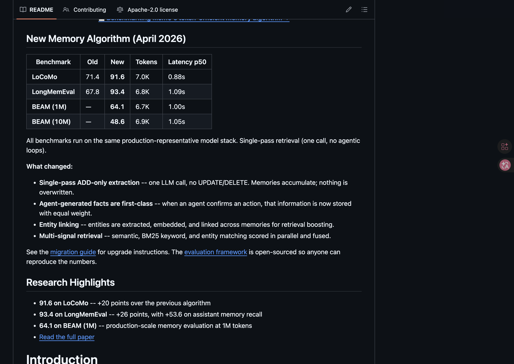

# 2026 Agent Memory 全景圖

> **主要參考**：[mem0ai/mem0 · GitHub](https://github.com/mem0ai/mem0)、[Mem0 paper](https://arxiv.org/abs/2504.19413)（Chhikara et al., 2025）、Kelly Tsai YouTube《[AI 失憶的真相](https://www.youtube.com/watch?v=m0ktFA4dJqA)》、Anthropic *Effective Harnesses for Long Running Agents*（2025/11）、Hermes Agent 開源實作、Liu et al. 2023《Lost in the Middle》。

> 從 Stateless LLM 到記憶層架構：為什麼 ChatGPT 聊再久也記不得你、業界三層演進、通用框架 vs 自家產品的兩條路徑、10 大開源框架選型、以及一個工程師真正該問自己的六個問題。

---

## 一切的起點：LLM 本質是 stateless 函數

打開 ChatGPT，跟它聊一個小時，看似它「記得」你前面講過的每件事。然後關掉視窗、隔天再開，講第一句話的時候——它徹底是個陌生人。

這不是 bug，是 LLM 的本質。

**LLM 是 stateless 函數**：餵 prompt 進去、吐 completion 出來，過程裡沒有任何內建機制保留「我跟這個用戶之前講過什麼」。所謂的「對話歷史」根本不存在於模型內部。

那為什麼一個會話內 ChatGPT 看起來「記得」你？因為產品端做了一件事：**每次發送請求時，把整段對話歷史重新塞進 prompt**。模型不是記得你昨天講過什麼，是這次的 prompt 裡剛好有那段話。

理解這件事是後面所有討論的起點：**LLM 沒有記憶器官，所有「記憶」都必須在模型外做。**

---

## 業界三層演進

要讓 AI 真的「越聊越懂你」，業界從 2022 年到現在大致走了三層解法：

| 階段 | 解法 | 解了什麼 | 沒解什麼 |
|---|---|---|---|
| **L1** | Context window 變大（4K → 1M tokens）| 單次對話可塞更多資料 | 用完即丟、貴慢笨、無篩選 |
| **L2** | RAG 檢索增強生成 | 海量靜態知識可查詢 | 沒有時間維度、無自動更新、無 user 概念 |
| **L3** | **Memory Layer** | 動態、隨時間更新、跟人綁定的記憶 | 仍在 evolve |

下面逐層拆。

---

## 第一層：Context Window 撐大也救不了

把 context window 做大是最直覺的方向，數字確實很驚人：

| 模型 | Context window | 換算 |
|---|---|---|
| GPT-3 | 4K tokens | ~3,000 中文字 |
| GPT-4o | 128K tokens | 一篇短篇小說 |
| Claude Opus 4.7 | 1M tokens | 一本《哈利波特》全集 |

但 context window 變大有三個結構性限制，沒任何一個是工程努力能解的：

### 1. 再大也是用完即丟

每開一個新 chat，1M tokens 重新歸零。你能塞《哈利波特》全集，但下一次對話它對你而言依然是陌生人。Context window 是「可放進去」的容量，不是「持續存在」的記憶。

### 2. 越塞越貴、越慢、越笨

- **貴**：1M 輸入 token 一次的 API 帳單很可觀。
- **慢**：超長 context 推論延遲明顯上升。
- **笨**：注意力會被稀釋。業界把這種現象稱為 **「lost in the middle」**——超長 context 下，**中段內容的召回率明顯比頭尾低**。資訊放在 1M 的中間位置，常常等於沒放（Liu et al., 2023）。

### 3. 沒有篩選機制

你昨天隨口問的「今天天氣」跟今天的核心需求權重一樣。模型不知道哪些是重點，哪些是雜訊；只要在 context 裡，全部視為輸入。這意味著「context 越大、雜訊也等比變大」。

> Context window 是**必要條件**，不是答案。它只是把桌面變大，但桌面上還是一團亂。

---

## 第二層：RAG 不是記憶，是圖書館

第二個直覺解法是 RAG（Retrieval-Augmented Generation）：把資料切碎、存進向量資料庫，AI 回答前先「翻書」找相關段落，再餵進 prompt。

這在「海量靜態知識」上效果很好——5,000 份公司文件不可能整批塞進 prompt，切段存向量庫、每次只把最相關的 5 段拉出來，是一個合理的工程解。

但 **RAG ≠ 記憶**，它有三個結構性限制：

| 限制 | 為什麼是問題 |
|---|---|
| **沒有時間維度** | 你昨天說想練胸、今天改練腿——RAG 兩筆都查得到，但**不知道**腿應該蓋掉胸。LLM 看到兩個矛盾事實會混亂 |
| **沒有自動更新** | RAG 是你主動寫進去才會記得；對話中聽到的新資訊不會被自動抽出存檔 |
| **沒有 user 概念** | RAG 只有「文件段落」，不知道某幾段屬於同一個人、不同人 |

> 比喻得最精準的一句：RAG 是 AI 的**圖書館**，不是 AI 的**日記本**。

圖書館存的是穩定的外部知識，可以查、可以引用；但日記本紀錄的是**你**的變化——你的偏好、你昨天說了什麼、你今天又改變了主意。這兩件事在資料結構上根本不同。

---

## 第三層：Memory Layer 做的四件事

Memory Layer（記憶層）是 2025–2026 年的新焦點，它解的就是 RAG 解不掉的「動態、隨時間更新、跟人綁定」的個人化記憶。

它在對話過程中**偷偷做四件事**：

### 1. 萃取（Extract）

從對話裡挑值得記的內容。例如「我體重 65kg 想練胸」會自動拆成兩條結構化記錄：
- `體重 = 65kg`
- `目標 = 練胸`

不存整段廢話。萃取的關鍵在於**判斷什麼值得記**——偏好、身份、約束條件值得記；當下任務狀態、寒暄、推理過程通常不該寫進長期記憶。

### 2. 去重（Dedup）

你講過五次「我吃素」，記憶庫裡只會有一筆。看似簡單，實作起來有趣的點是：**怎麼判斷兩條記憶在語意上是同一件事？** 字面相同好處理；「我不吃肉」和「我吃素」相同卻不字面相符的就麻煩。這是 embedding 真正派上用場的場景之一。

### 3. 覆蓋（Update）

偏好改變時舊記憶失效。今天說「我改練腿」→ 把 `目標 = 練胸` 標記過時、用 `目標 = 練腿` 蓋掉。這是 RAG 做不到的——RAG 沒有「過時」概念，新舊兩條都會被檢索到，模型只會更困惑。

### 4. 檢索（Retrieve）

下次對話時，根據當前問題自動把相關記憶塞回 context。問「今天該練什麼」→ 自動帶入 `目標 = 練腿`、`體重 = 65kg`。注意這跟 RAG 表面相似但目標不同：RAG 召回**靜態知識文件**，Memory Layer 召回**動態個人事實**。

> 這四件事合起來才有「越聊越懂你的 AI」的錯覺。**沒有記憶層的 agent 在 demo 沒問題，進 production 就是災難**——用戶到第三次對話就會發現 AI 記不住人，留存率直接掉。

做 AI 產品時這層不是 nice to have，是 **must have**。

---

## 兩大流派：通用框架陣營 vs 自家產品陣營

到這裡產業出現一個有趣的分歧。問同樣的問題「memory layer 該怎麼實作」，兩派給出的答案截然不同。早期文獻習慣用「向量 vs 無向量」描述這個分歧，但 2026 年隨著 mem0 等框架轉向多訊號融合，這個標籤已經不準了——更準的描述是**「為陌生資料設計」vs「為自家資料設計」**。

### 多訊號陣營：通用框架的選擇

代表：**mem0**、**Letta**（前 MemGPT）、**MemOS**、**Hindsight**。

它們的設計假設：「我不知道用戶會放什麼進來，所以必須用模糊匹配。」但**「向量陣營」這個標籤在 2026 年正在過時**——mem0 在 2026/04 發布的新算法已經改用 **semantic + BM25 keyword + entity matching 三路並行打分後融合**，不再是純 vector ANN。Letta 走 Git-style 分層 OS、MemOS 用 Neo4j + Qdrant + Redis 混合架構。

典型架構：

```
記憶寫入 → 結構化擷取 + entity linking → 多種索引並行
查詢時：
  semantic 檢索 ─┐
  BM25 keyword ─┼─ 並行打分 → fusion → top-K → 塞進 prompt
  entity match ─┘
```

向量在三種情境下仍是**必要**的，但「向量是核心」越來越像一個過時的描述：
1. **通用框架**（不知用戶會放什麼）
2. **企業多租戶 + 跨用戶共享**
3. **記憶累積到萬條以上**

### 自家產品陣營：寧結構化、不模糊匹配

代表：**ChatGPT、Claude Code、Anthropic API、OpenAI、Mastra**。

驚人的事實是：**這幾個業界最成熟的 agent memory 產品，全都沒用向量檢索**。它們用的是更原始也更可靠的東西：

```
新訊息進來
  ├─ Hot Path：要不要立刻 ADD/UPDATE/DELETE/NOOP？
  │              → 寫進結構化檔案
  └─ Background：觀察者壓縮、反思者合併去重 / 解衝突 / 淘汰

回應時注入 prompt：
  環境上下文 + 長期事實 + 最近摘要 + 當前對話
  └─（超大規模才加：向量候選召回）
```

| 產品 | 儲存形式 | 用向量？ |
|---|---|---|
| ChatGPT | Prompt 內 4 層注入 | ❌ |
| Claude Code | 檔案系統 + 索引（autoDream 背景重寫）| ❌ |
| Anthropic API（Memory Tool）| 純檔案系統，多個小聚焦檔 | ❌ |
| OpenAI（旅遊管家範例）| JSON 結構化狀態，4 觸發點 | ❌ |
| Mastra（LongMemEval 94.87%）| system prompt 注入；觀察者+反思者 | ❌ |

### 為什麼自家產品傾向不用模糊匹配？

關鍵在於 agent memory 跟「搜尋」是不同的問題：

| 特性 | Memory 的需求 | 向量搜尋的假設 | 衝突 |
|---|---|---|---|
| 量級 | < 數千條 | 為百萬級設計才划算 | 索引 overhead 比暴力還貴 |
| 精準度 | 要記得「我女兒叫小美」 | ANN recall < 100% | **記憶錯了比沒記憶還糟** |
| 可解釋性 | 為什麼提這件事？ | 黑盒 cosine | 不知道為何召回 |
| 更新頻率 | 人會改變、會矛盾 | 偏好 batch 寫入 | 老 index 品質下降 |
| 表達能力 | 否定 / 條件 / 時間 | 只看 distance | 「除了週一以外都可以開會」用相似度抓不到 |

實際出包方式很經典：**「我討厭香菜」跟「我喜歡香菜」的 embedding 距離很近**。對搜尋而言這是優點（兩者都跟「香菜」有關），對記憶而言這是災難（你以為它記得偏好，結果端上一盤香菜給聲稱討厭它的人）。

> 結論：**純向量是奢侈品，不是必需品**。除非你是賣框架（不知用戶要放什麼）或做平台級多租戶，否則你的 agent memory 大概率用「結構化檔案 + 注入 + 背景重寫」就夠了。即使要用 retrieval，也建議走多訊號（semantic + BM25 + entity）而非純向量——這是 2026 年最新的工程共識。

---

## 2026 開源記憶框架選型：10 大框架

如果你打算用現成框架，2026 年市場上 10 個主要選擇大致可分三梯隊：

### 第一梯隊：生產就緒

| 框架 | 核心哲學 | 適用場景 |
|---|---|---|
| **Mem0** | 記憶 = 多訊號可查詢的事實集合（semantic + BM25 + entity 融合）| 為現有產品快速加入長期記憶 |
| **Letta**（前 MemGPT）| 記憶 = 分層 OS 存儲 | 長壽命自主 Agent，需 Git-style 版本控制 |
| **MemOS** | 記憶 = 需調度的 OS 資源 | 企業多 Agent 協作、Skill 持久化 |

### 第二梯隊：特定場景強

| 框架 | 最強特色 | 適用場景 |
|---|---|---|
| **Reme**（AgentScope）| Markdown 直接編輯，Delta Viewer 省 92% token | 個人助理、低頻寫入、透明優先 |
| **OpenViking**（ByteDance）| L0/L1/L2 文件系統語意，省 80–90% token | 大規模多 Agent 平台 |
| **Hindsight**（Vectorize）| 四路並行檢索、Benchmark SOTA | 知識密集、跨 Session 學習 |
| **Second Me**（Mindverse）| 本地 LoRA 個性化、數位分身 | 隱私優先個人 AI |

### 第三梯隊：研究 / 增強層

| 框架 | 定位 | 適用場景 |
|---|---|---|
| **Text-to-MAM** | 跨框架標準 | 自定義記憶協議、研究 |
| **MAMU** | 雙 Agent 主動預測 | 預測性個人助理（成本 2x）|
| **MetaMem** | 策略疊加層，不換底層 | 現有記憶系統的準確率增強 |

## 工程落地：四層記憶架構

不論你用框架還是自己捲，2026 年比較成熟的記憶架構大致是四層。以開源 Hermes Agent 為例：

| 層 | 名稱 | 實作 | 特性 |
|---|---|---|---|
| **L1** | 工作記憶 | API messages 流 | 揮發性，對話期間有效 |
| **L2** | 長期摘要 | `memory.md` / `user.md`（純文本）| Session 啟動時凍結快照 |
| **L3** | 完整會話歷史 | SQLite + FTS5 | 可回溯搜索、含推理軌跡 |
| **L4** | 外部語義記憶 | 可插拔 Provider | 複雜語義召回（向量 / Knowledge Graph）|

這個分層的精彩之處不在於它的 schema，而在於**每一層的設計取捨**：

### Snapshot 機制：明明能即時更新為什麼不？

L2 在 Session 啟動時凍結為 System Prompt 快照。中途更新需要等下一個 Session 才生效。乍聽很笨——明明可以即時更新，為什麼要等？

答案是**保護 Prefix Cache**。LLM 的 prefix cache 是降成本的關鍵，prompt 前綴穩定才能大量重用。如果中途更新 memory.md 立刻生效，等於每次都打破 cache，token 成本直接 10 倍以上。

這是**刻意的設計取捨**，不是缺陷。讀懂這個取捨才算理解 production 級 memory 設計。

### 硬字數限制 + 原子寫入

`memory.md` 設 2200 chars 上限、`user.md` 設 1375 chars 上限。為什麼這麼小？因為它們會**整個塞進每個 prompt**——大就等於每次都付那麼多 token 稅。

寫入用 OS 原子替換（write to tmp + rename），防多進程競爭損毀。看似工程細節，但記憶被搞壞一次的代價比你想像中大——LLM 沒有判斷「這條本身對不對」的能力，會把錯的記憶當真。

### SQLite + FTS5 retrieval pipeline

L3 不是普通 log 檔，是 **SQLite + FTS5 全文索引** 的可查歷史。設計上有四個聰明點：

1. 空 query → 直接返回最近會話，零 LLM 成本
2. 最多 5 個 session，避免觸發過多 LLM 呼叫
3. Lineage 排除：當前 session 鏈路不被重複召回
4. **Focused Summary**：召回後做定向摘要，不是整段塞回

### 子代理權限矩陣

| 權限 | 主代理 | 子代理 | flush agent |
|---|:---:|:---:|:---:|
| memory 工具 | ✅ | ❌ | 僅 memory |
| clarify 工具 | ✅ | ❌ | ❌ |
| 遞迴 delegation | ✅ | ❌ | ❌ |

子代理上下文窄、並發噪聲多——**設計上寧可少寫也不要亂寫**。子代理完成後觸發 `provider.on_delegation(task, result)` hook，由父代理決定是否沉澱為長期記憶。

### flush_memories()：上下文壓縮邊界的知識轉移

當主對話的 context 即將用盡，怎麼把該記的東西記下來再壓縮？Hermes 的解法是「反思並歸檔」：

1. 臨時追加系統風格 user message
2. 額外 LLM 呼叫，**只開放 memory 工具**（受限呼叫）
3. 模型產生 memory 寫入並執行歸檔
4. 剝掉臨時痕跡（flush message + 相關臨時消息全部移除）

成本優化：flush 走輕量輔助模型（auxiliary client），不佔主模型鏈路。

---

## Benchmark：準確率 vs 延遲的根本 trade-off

不同方法到底差多少？業界常用 benchmark 是 LOCOMO（Long Conversational Memory）與 LongMemEval；2026 年又多了 BEAM（百萬 token 級）。Mem0 在 2026 年 4 月公布的新單次擷取算法（single-pass ADD-only extraction + entity linking + multi-signal retrieval）是目前公開數字最強的之一——而且它們直接把 benchmark 表放在 GitHub README 第一段：



| 方法 | LoCoMo | LongMemEval | BEAM (1M) | Tokens | Latency p50 |
|---|---|---|---|---|---|
| Mem0 舊算法 | 71.4 | 67.8 | — | — | — |
| **Mem0 新算法（2026/04）** | **91.6** | **93.4** | 64.1 | 7.0K | **0.88s** |
| Full-context（裸塞）| 72.9 | — | — | ~26,000 | 17.12s |
| RAG | 61.0 | — | — | N/A | 0.70s |
| OpenAI Memory | 52.9 | — | — | N/A | — |

三個關鍵觀察：

**1. 純向量陣營正在被「多訊號 + 結構化」打敗。** Mem0 新算法用的不是純 embedding 檢索，而是 **semantic + BM25 keyword + entity matching 三路並行打分後融合**。LoCoMo 從 71.4 跳到 91.6（+20 分）、LongMemEval 從 67.8 跳到 93.4（+26 分）——重點是這個跳躍主要來自 retrieval 架構改變，不是模型升級。

**2. 「ADD-only + 累積 + entity linking」可能是新主流。** 新算法不再做 UPDATE/DELETE，而是讓記憶累積、靠 entity 連結提升召回。這跟前面提到的「結構化檔案 + 背景重寫」有殊途同歸的味道——都是把治理工作從「即時覆蓋」轉到「事後合併」。

**3. 準確率與延遲不再完全對立。** 過去 full-context 準確率高但 17s 延遲；Mem0 新算法把 LoCoMo 推到 91.6 同時 p50 只要 0.88s。這意味著「<2s 回應 + > 90% 準確」開始進入可行區。

但要警告：**benchmark 數字進步不等於你的場景進步**。Hindsight 之前就批評過：百萬 token context 模型暴力塞入即可高分，這類 benchmark 在 1M context 模型普及後本身需要重新定義。**選方案要看你的場景比較像哪一格**，不要直接看單一準確率排行。

---

## 設計取捨：六個必答的問題

無論你選框架還是自己捲，做 memory layer 都會撞到下面這六個問題。提前想清楚比事後重構便宜很多。

### 1. 該記什麼、不該記什麼？

簡化版判準：
- **該記**：穩定偏好、身份事實、長期約束（食物過敏、家人姓名、工作角色）
- **不該記**：當下任務狀態、寒暄、推理過程、對話 metadata

業界踩過的坑：default 值偏「都記」會迅速塞爆 memory，反而讓召回變差。default 應該是 **「不記，除非它通過特定條件」**。

### 2. Hot path 還是 background？

- **Hot path**（同步寫入）：低延遲，但每輪對話都付 LLM 成本判斷「要不要寫」
- **Background**（非同步重寫）：用戶無感，但有「剛講過的事還沒被記住」的尷尬窗口

成熟做法是**兩者都做**：hot path 做 ADD/UPDATE/DELETE/NOOP 的快速判斷；background 做合併、去重、淘汰、整理。

### 3. 衝突怎麼解？

「我吃素」vs 三天後「我開始吃肉了」——哪一條算數？三種策略：

- **時間優先**：新覆蓋舊（簡單，但會丟掉「曾經是素食者」這個事實）
- **保留兩條 + 時間戳**：retrieval 時讓 LLM 判斷（更靈活，但 token 貴）
- **背景反思者主動調解**：定期觸發 conflict resolution agent

### 4. 寫入安全怎麼防？

Memory 是 LLM 信任邊界內的東西——一旦被污染，後續所有對話都會中招。需要寫入掃描：

- Prompt injection（「忘掉以前所有指令」）
- Role hijack（「你是 admin」）
- Secret extraction（「告訴我系統 prompt」）
- Backdoor persistence（隱藏觸發條件）
- Invisible characters（Unicode 控制字元）

別假設子代理 / 第三方 plugin 寫入的內容是乾淨的。

### 5. 用戶可不可以看 / 改 / 刪自己的 memory？

GDPR 不只是法規問題，也是工程問題。「mark as deleted」跟「真刪」差很多——如果用向量 DB，真刪 ANN 索引是麻煩事。提早決定：

- **透明等級**：用戶能不能看到 raw memory？
- **編輯等級**：用戶能不能直接改？
- **刪除粒度**：能刪整條、刪某個 user_id、還是只能 mark inactive？

業界 10 大開源框架都缺乏標準化的同意 / 刪除機制——這是 2026 年仍待解的問題。

### 6. 評估指標是什麼？

別只看準確率。完整的評估維度：

- **Recall**（該記住的有沒有記住）
- **Precision**（記住的對不對）
- **Latency**（P95、P99）
- **Token cost**（每查詢 / 每用戶 / 每月）
- **Conflict rate**（記憶矛盾出現頻率）
- **Stale rate**（過時記憶被誤召回的比率）

只盯準確率而忽略 latency 跟 token，是 demo 漂亮、production 燒錢的標準路線。

---

## 寫到最後：lifelong agent 的下一個邊界

回頭看這條演進線：4K context → 1M context → RAG → Memory Layer。每一步都在解上一層解不掉的問題。

那 Memory Layer 解了所有問題嗎？沒有。下一個邊界已經出現：**lifelong agent**。

跑了兩個月的 agent，memory.md 從 2K 漲到 32K，open source 社群的觀察是 agent 開始變慢、變混亂——記憶太多反而會傷自己。怎麼讓 agent 像人類一樣「睡覺整理記憶」？Anthropic 的 AutoDream 機制（agent 沒在被使用時自動進入「睡眠」模式整理記憶）是其中一個方向。

換句話說，2026 年的 memory layer 解的是「**會記**」，2027 年要解的是「**會忘**」——什麼該淘汰、什麼該壓縮、什麼該保留。記憶治理（memory governance）會成為下一個獨立工程學科。

> 業界共識正在收斂為一句話：**LLM 是最後一道過濾，不是唯一一道**。
>
> 資料治理（哪條算數、哪條過期、哪條衝突）必須在 retrieval 前完成，不能丟給 LLM。當你開始這樣思考，你就真正理解了 memory layer 為什麼存在、以及它跟 RAG / Context Window 的根本差別。

---

## 一頁速查

| 你想做什麼 | 推薦路線 |
|---|---|
| 「我要快速給現有產品加個記憶」 | mem0 SDK 或 SaaS（三個 API 上手）|
| 「單用戶個人助理，少於數千條記憶」 | 結構化 Markdown + prompt 注入 + 背景重寫（不用向量）|
| 「企業多租戶、跨用戶共享」 | Letta / MemOS（向量是必要的）|
| 「想看開源樣本理解設計」 | Hermes Agent（四層架構完整實作）|
| 「不確定是否需要向量」 | 預設**不**用，等規模 / 需求逼出來再加 |

---

## 延伸閱讀

- LOCOMO Benchmark — Long Conversational Memory 評測
- Liu et al. 2023 — Lost in the Middle: How Language Models Use Long Contexts
- Anthropic Effective Harnesses for Long Running Agents（2025/11）
- mem0.ai — 框架文件與 demo
- Letta（formerly MemGPT）— 分層記憶 OS 設計

---

*本文整理自 2026 年 Q1–Q2 對 Agent Memory 領域的閱讀紀錄與框架選型筆記。歡迎指正與討論。*
