# 該用 mem0 還是自捲記憶層？

> **主要參考**：[mem0ai/mem0 · GitHub](https://github.com/mem0ai/mem0)（55.2k stars）、[Mem0 paper](https://arxiv.org/abs/2504.19413)（Chhikara et al., 2025）、[app.mem0.ai dashboard](https://app.mem0.ai/) 實機操作（2026/05）、Anthropic *Effective Harnesses for Long Running Agents*（2025/11）、Hermes Agent 四層記憶開源實作。

> 一個 AI 工程師繞不開的選擇題。網路上講 mem0 的文章一面倒在 demo「三行 code 接好記憶」，但真正讓人糾結的問題從來不是「會不會用」，是「**該不該用**」。本篇不賣 mem0、也不貶 mem0，只把選擇背後的代價攤開講。

> 這是 [2026 Agent Memory 全景圖](./2026-05-09-article-2026-agent-memory-landscape.md) 的續篇——前一篇是大地圖，這一篇是決策樹。

---

## 為什麼這是個真實的選擇題

如果你看過 mem0 的官方 demo，會覺得這個選擇沒有懸念：`pip install mem0ai`、寫 20 行程式碼，記憶層就上線了。免費 tier 給你 10K Add / 1K Retrieval。LoCoMo benchmark 91.6 分、p50 延遲 0.88 秒。你還在猶豫什麼？

但對照一個**讓人不舒服的事實**：

> 業界最成熟的 agent 產品——ChatGPT、Claude Code、Anthropic API、OpenAI、Mastra——它們的 agent memory **沒有一個用 mem0 或類似框架**。全部是自捲。

這意味著兩件事：

1. 自捲記憶層在某些場景下是**正確答案**，不是 NIH 症候群。
2. mem0（以及 Letta、MemOS、Reme 等）做的是**「賣給不知道用戶要放什麼的第三方」的通用框架**，跟「為自己產品做的記憶系統」需求結構不同。

所以這個選擇題真正該問的是：**你的 case 比較像 ChatGPT，還是比較像把 GitHub 的 README 推銷給開發者用的工具？**

---

## 先把 mem0 是什麼講清楚

避免討論失焦，先快速校對 2026/05 的 mem0 樣貌（細節可參考 [上一篇文章](./2026-05-09-article-2026-agent-memory-landscape.md)）：

- **GitHub**：55.2k stars、Apache 2.0
- **架構**：2026/04 推出新算法——single-pass ADD-only extraction + entity linking + multi-signal retrieval（semantic + BM25 + entity matching 三路並行融合）
- **Benchmark**：LoCoMo 91.6、LongMemEval 93.4、p50 0.88s（官方數字）
- **整合**：Library / Self-Hosted Server / Cloud SaaS / CLI / MCP / Agent Skills（Claude Code、Codex、Cursor、Windsurf 直接掛）
- **使用樣貌**：

```python
from mem0 import Memory
memory = Memory()
relevant = memory.search(query=msg, filters={"user_id": "alice"}, top_k=3)
memory.add(messages, user_id="alice")
```


關鍵理解：mem0 不只是一個 SDK，是一個**有自家後端 / 評估方法 / 升級節奏的活產品**。你選 mem0 等於選了一條跟著它走的路。從 repo 結構就能看出端倪——它把每個 IDE plugin（`.claude-plugin/`、`.cursor-plugin/`）、CLI、評估框架、自家 dashboard（`openmemory/`）都當成 first-class 物件並排維護，這是平台型產品的擺法，不是工具型產品的擺法。

---

## Dashboard 實機巡禮：mem0 真正提供什麼

光看文件容易把 mem0 想成「一個雲端版 SQLite」，但實際進 dashboard 走一圈，會發現它的產品面比想像中複雜——也比想像中**有產品意圖**。以下是 2026/05 實際操作截圖，搭配對選型有意義的觀察。

### 1. Install Mem0：四種整合心智模型

mem0 把整合方式拆成四種「使用者心智」，這個分類本身就是個產品設計觀察：

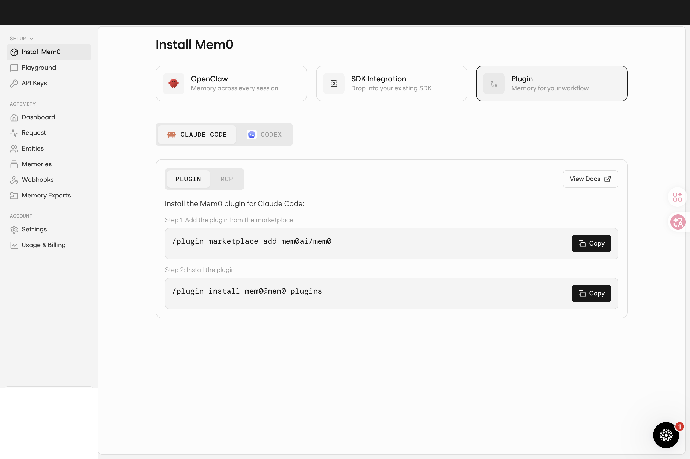

**Plugin 模式**：兩條 slash command（`/plugin marketplace add mem0ai/mem0` + `/plugin install mem0@mem0-plugins`）裝完。這是「我有 IDE 但不想改任何 code」的路線，目標用戶是 Claude Code、Codex 重度使用者。

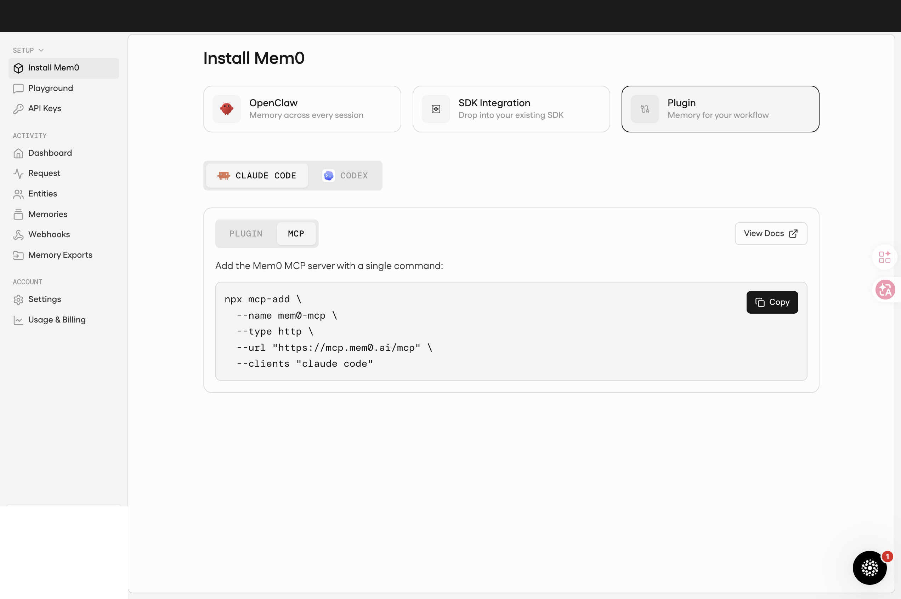

**MCP 模式**：一行 `npx mcp-add` 把 mem0 接成 MCP server，協議標準化、可被任何 MCP client 共用。這是 mem0 押注 2026 年 MCP 成為新整合標準的證據。

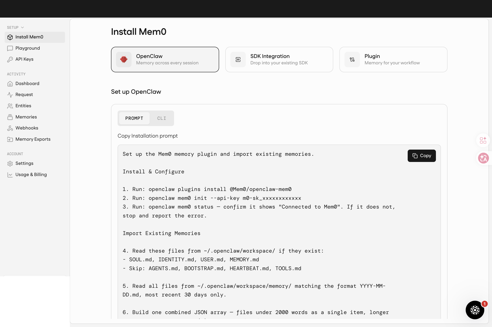

**OpenClaw 模式**：最有意思的一個——它把整合步驟寫成一段 **prompt** 給 AI 跑（Run `openclaw plugins install`、Run `openclaw mem0 init --api-key`、讀 `~/.openclaw/workspace/` 既有記憶 import...）。等於把「整合 mem0」這件事本身當成 agent 的 task。這是非常 2026 年的產品哲學：**設定流程也是 agent 工作**。

> 啟示：你選 mem0 時不只在選 SDK，是在選「四種整合者心智模型中你最像哪一種」。如果你的產品是有自己 IDE/agent 的，Plugin 模式很順；如果你想做 MCP-first，MCP 模式很合適；如果你做 agent 工具鏈，OpenClaw 模式才是它們希望你用的。

### 2. Dashboard：六個核心指標

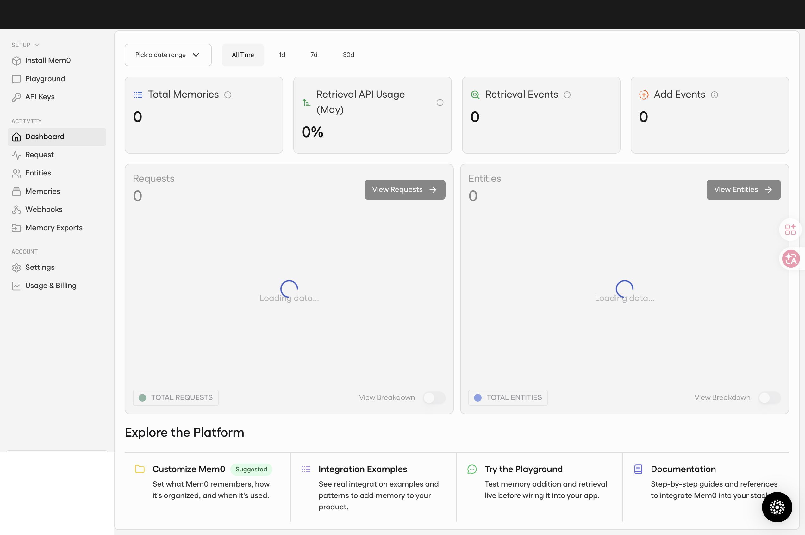

主 dashboard 的六個指標（Total Memories / Retrieval API Usage / Retrieval Events / Add Events / Requests / Entities）大致對應到「你在 mem0 上的記憶系統健康狀態」。**關鍵觀察**：mem0 把 Add 跟 Retrieval 視為兩個獨立計量單位（這也是它計費的雙軸），而不是「總請求數」——這直接影響你的成本預估。

### 3. Request：API call 級的事件流

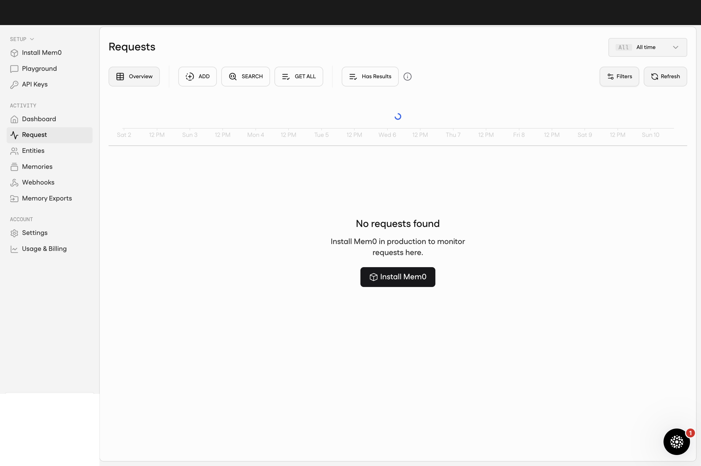

這頁列出每筆打到 mem0 的 API call（add / search / update / delete）的時間、entity、輸入 / 輸出片段、status、latency。像 Stripe Dashboard 的 Events log 或 OpenAI Console 的 Logs。

**mem0 預期你會用它做什麼：**
- **用戶投訴 debug**：「AI 記錯了」→ 翻 Request 看上次 search 召回了哪幾條、為什麼導出錯結論
- **計費對帳**：帳單突然跳一級 → 看是哪天哪個 user / agent 突然爆量
- **整合除錯**：剛接好 SDK，幾筆 add 失敗 → 看 status code 與錯誤訊息
- **Compliance audit**：「6 個月前我們有沒有處理過 Alice 的某條記憶」

→ **這是 mem0 對「黑盒焦慮」的解藥**。沒有 Request 頁，記憶系統就是個黑洞——進得去出不來，永遠不知道為什麼。**自捲時也要做的對應**：把每筆 add/search/update 寫進 SQLite 一張 events 表，欄位至少含 timestamp / entity / op / input_hash / output_hash / latency_ms。

### 4. Entities：四個 first-class 類型（最有意思的觀察）

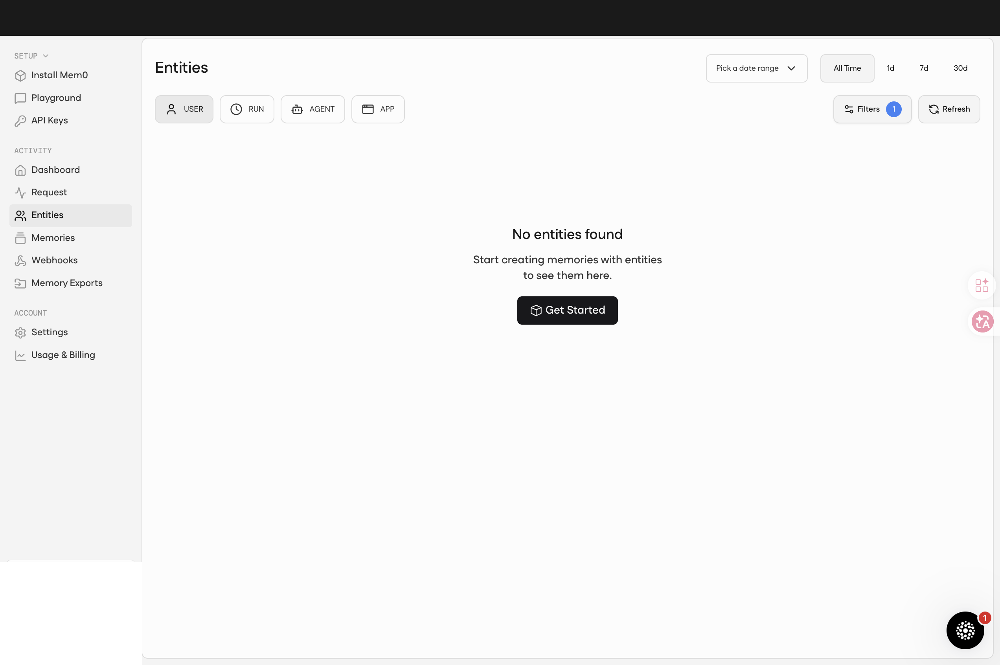

這個地方值得花時間看。大多數記憶框架只有 `user_id` 一個 namespace；mem0 把 entity 拆成 **USER / RUN / AGENT / APP** 四個類型。意思是：

- **USER**：終端用戶（Alice、Bob）
- **RUN**：一次 session / 對話實例
- **AGENT**：哪個 agent 在記這條（你可能有多個 agent 共用記憶池）
- **APP**：哪個產品 / surface（手機、網頁、Slack bot）

**mem0 預期你會用它做什麼：**
- **GDPR 「請刪除 Alice 全部資料」**：一鍵 delete entity → 連帶刪除所有 USER=alice 的記憶與索引
- **多 agent 系統 debug**：「為什麼研究助手忽然講起行程的事？」→ 檢查是不是 AGENT entity 沒做好隔離
- **跨 surface fan-out**：用戶在網頁版說「我吃素」，希望手機版也記得 → APP 軸共用 namespace 一鍵解
- **A/B 對照實驗**：建一個 RUN=experiment-A 跑新 prompt、一個 RUN=experiment-B 跑舊的，比結果

→ 對自捲派的啟示：**如果你的記憶 schema 只有 `user_id`，你已經欠了一個技術債**。多 agent / 多 surface / 跨 session 的場景遲早要這四個 axis；mem0 直接把它做成第一公民。**自捲時也要做的對應**：schema 直接給四個欄位（`user_id`、`run_id`、`agent_id`、`app_id`），全部 nullable + 加複合索引。今天用不到沒關係，明天加就不用 migration。

### 5. Memories：人能看的 raw 列表

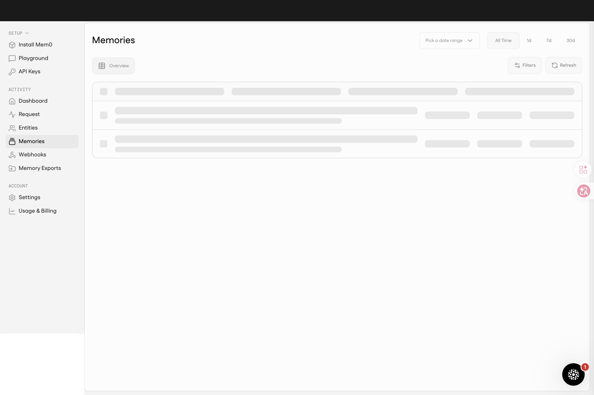

Memories 頁本身是個列表＋日期 filter（1d / 7d / 30d / All Time），可看每條記憶的內容、entity、建立時間、來源訊息，可手動編輯、刪除。

**mem0 預期你會用它做什麼：**
- **產品上線初期人工 review**：每天看一次「mem0 萃取了什麼」→ 發現它記了一堆雜訊（寒暄、無關話題）→ 回頭調 prompt / filter
- **用戶要求刪除特定記憶**：找到那條手動刪（GDPR Right to Erasure 的最低成本實作）
- **訓練自家 prompt 的素材**：看哪些萃取結果好、哪些差，回饋到自家 system instruction
- **記憶健康度 monitoring**：發現某 user 累積到上千條 → 觸發摘要 / 淘汰流程

注意「1d / 7d / 30d」filter 是 first-class——意味著**時間是 mem0 的核心維度**，而不是事後 metadata。

→ 啟示：**Memories 頁是「mem0 行為的肉眼觀察介面」**。對中量產品（千用戶級）很實用，超過萬用戶就不能靠人眼，要轉去看 metric。**自捲時也要做的對應**：給自己一個 `/admin/memories?user_id=X&since=7d` 列表頁；不需要漂亮，能 grep 能刪就行。

### 6. Webhooks：四個生命週期事件

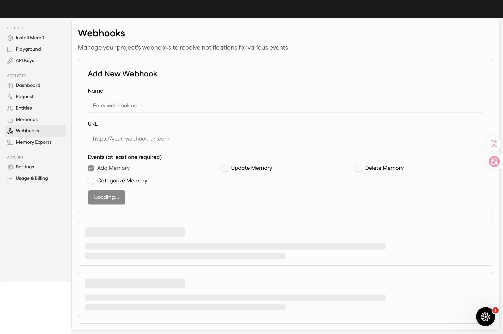

雖然 2026/04 新算法「ADD-only」是內部不做 UPDATE/DELETE，但**對外提供的 Webhook 事件還是有四個**：Add Memory / Update Memory / Delete Memory / Categorize Memory。mem0 內部有兩層：核心算法 ADD-only（給效能與準確度），外部表現仍提供完整 CRUD 抽象（給開發者熟悉的心智模型）。**這是漂亮的 API 設計取捨**。

**mem0 預期你會用它做什麼：**
- **同步到自家資料庫**：mem0 記了「Alice 體重 65kg」→ Webhook → 你寫進自家 user_profile 表（保持單一真實來源在你家）
- **觸發 UI 更新**：Slack bot 跟用戶聊到一半學到新偏好 → Webhook → 推播「我剛記下你愛吃辣」（讓記憶過程透明化）
- **審計記錄**：所有 memory 變動 → 寫進你的 audit log → 滿足金融 / 醫療合規
- **Categorize 事件特殊用法**：mem0 自動把記憶分類後通知你 → 你做「按類別分權限」（健康類給家庭醫師可見、工作類給同事可見）

→ **Webhook 是 mem0「可組合化」的關鍵**。沒它你只能輪詢；有了它 mem0 變成你 event-driven 架構的一個節點。**自捲時也要做的對應**：別只暴露同步 API；給自己一個內部 event bus（哪怕只是 in-memory pub/sub），讓觀察者 / 反思者可以掛 hook 上去。

### 7. Memory Exports：合規 + 遷移 + 下游整合三合一

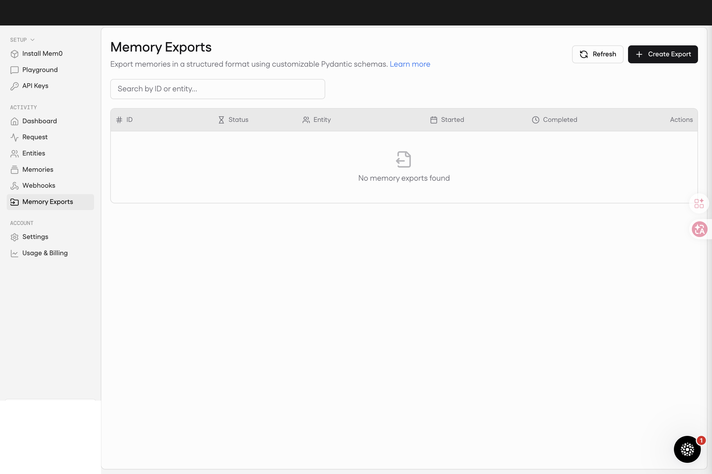

這個功能值得單獨點出，因為它直接回應前文「lock-in 風險」。Memory Exports 讓你**用自定義 Pydantic schema 匯出記憶**——不是 raw JSON dump，是按你定義的結構化格式輸出。

**mem0 預期你會用它做什麼：**
- **GDPR 資料可攜權**：用戶要求拿走全部記憶 → 定義 `user-bundle` schema → export → 給用戶 ZIP
- **遷移到別的記憶系統**：定義跟新系統相容的 schema → export → import（lock-in 從「鎖死」降到「中度黏著」）
- **餵給 BI / 數據倉**：定義 OLAP-friendly schema → 定期 export 到 Snowflake / BigQuery 做留存分析
- **生成 fine-tuning 樣本**：把記憶 + 對應 search context export 成訓練資料，餵自家小模型

→ 對遷移風險的影響：mem0 不會綁死你的 raw 資料（可以匯出），但**匯出的「萃取結果 + entity 連結」是它幫你產生的**。entity linking 那層仍要在新系統重建。**自捲時也要做的對應**：第一天就想好「export schema 長什麼樣子」——不只是 dump 整張表，是定義「對外承諾的資料合約」。Pydantic schema 是漂亮的工具，但 SQL view 也行。

### 8. API Keys：建立後即雜湊，看不見原值

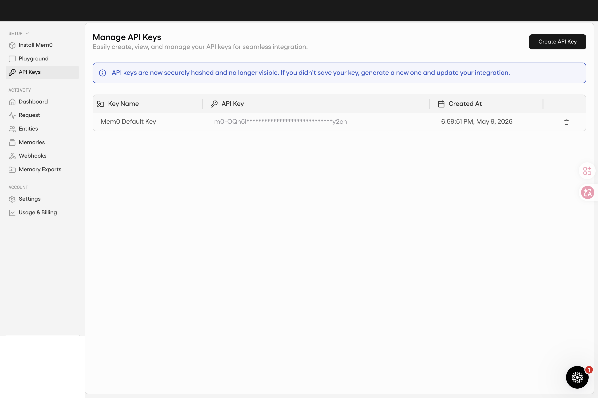

「API keys are now securely hashed and no longer visible. If you didn't save your key, generate a new one and update your integration.」這是 2026 年安全產品的標準作法（GitHub PAT、Stripe Secret Key 都這樣）——**值得記下來**：你的記憶系統如果暴露 API Key，做這個處理是必要的。

### 9. Playground：邊打字邊看 mem0 反應

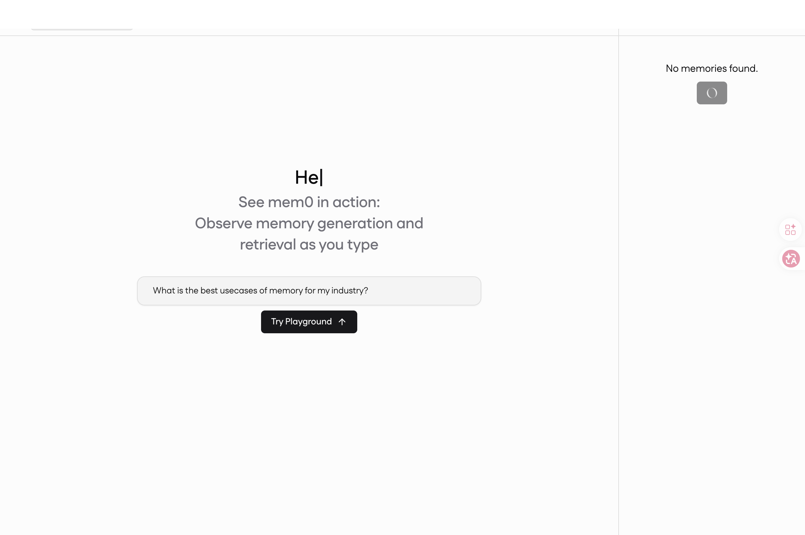

Playground 的設計訊息很明確：**「See mem0 in action: Observe memory generation and retrieval as you type」**——它要你在打字的同時看到記憶被萃取、被檢索的過程。這是一種 Glass Box（玻璃箱）哲學：跟某些「黑盒記憶」框架（你只看得到結果不知道為什麼）相反。

→ 啟示：你自捲時要不要也做這樣一個觀察介面？**對 debug 跟產品迭代意義巨大**——尤其是用戶投訴「AI 記錯了」時，你需要知道為什麼。

### 10. 定價：5 個 tier 的真實數字

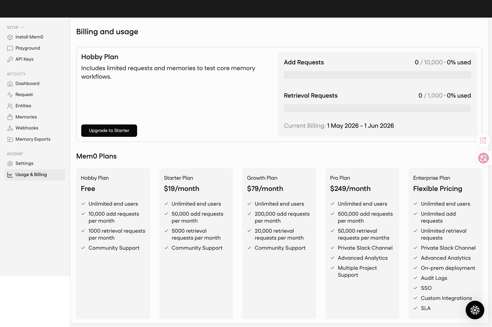

| Tier | 價格 | Add Requests | Retrieval Requests | 額外 |
|---|---|---|---|---|
| **Hobby** | Free | 10K/月 | 1K/月 | Community Support |
| **Starter** | $19/月 | 50K/月 | 5K/月 | Community Support |
| **Growth** | $79/月 | 200K/月 | 20K/月 | Community Support |
| **Pro** | $249/月 | 500K/月 | 50K/月 | Private Slack、Advanced Analytics、Multiple Project |
| **Enterprise** | Flexible | Unlimited | Unlimited | + on-prem、SSO、Audit Logs、Custom Integrations、SLA |

關鍵觀察：

1. **每個 plan 都 Unlimited end users**——mem0 不按用戶數收費，按 Add / Retrieval 次數收費。這對「多用戶 SaaS」場景很友善（用戶數不限），對「重度查詢」場景則要算清楚（每筆查詢都計）。
2. **Hobby tier 真實可用**：10K Add / 1K Retrieval 對個人小工具或 demo 通常夠。
3. **Pro 才有 Multiple Project**：如果你預期會做多產品共用 mem0，要 budget $249/月起跳。
4. **on-prem 只在 Enterprise**：合規敏感場景一律要走 Enterprise 對話。

對成本敏感者：以 1000 用戶 × 每天 5 次 Add + 10 次 Retrieval 計算，月使用約 150K Add / 300K Retrieval——這直接超過 Pro tier 的 50K Retrieval 上限，要進 Enterprise。**真實規模化會比直覺貴**。

### 11. GitHub README：官方放出的核心數字


最後是這張：mem0 在 GitHub 直接把 benchmark 對比表放在 README 開頭。LoCoMo 從 71.4 跳到 91.6、LongMemEval 從 67.8 跳到 93.4——**+20 ~ +26 分的單次架構升級**是異常大的躍升，這也是它們敢這樣高調放在 README 的底氣。

但放這張圖其實是要提醒：**Benchmark 進步是真的、不等於你的場景進步**。你的 use case 可能根本用不到「跨 session 長對話召回」這一塊，91.6 分對你不重要。

---

## 「自捲」到底自捲到哪一層？

「自捲」這個詞容易讓人誤以為要從零做 embedding、訓練模型。實際上業界自捲記憶系統有非常標準的套路（這套套路 Anthropic、OpenAI、ChatGPT 大同小異）：

```
新訊息進來
  ├─ Hot Path：判斷 ADD/UPDATE/DELETE/NOOP → 寫進結構化檔案（JSON/Markdown）
  └─ Background：觀察者壓縮、反思者合併去重 / 解衝突 / 淘汰

回應時注入 prompt：
  環境上下文 + 長期事實 + 最近摘要 + 當前對話
  └─（超大規模才加：向量候選召回）
```

具體到開源樣本，Hermes Agent 的四層記憶是現成模板：

| 層 | 實作 | 你要寫的 code |
|---|---|---|
| L1 工作記憶 | API messages 流 | LLM 客戶端已有 |
| L2 長期摘要 | `memory.md` / `user.md` 純文本 | ~200 行（含原子寫入、字數限制、安全掃描）|
| L3 完整歷史 | SQLite + FTS5 | ~300 行（含 trigger、focused summary）|
| L4 外部語義 | 可選 Provider | 需要時再加（多數 case 不需要）|

換句話說，「自捲」**不是什麼大工程**——是 500–1000 行 Python（或 TypeScript）+ SQLite 一個檔案。如果你已經在寫 agent，多花 2–3 週把這層補上是現實的。

---

## 真正的選型維度（六個）

把選擇拆開看，本質是六個維度的 trade-off：

### 1. 上線速度

- **mem0**：1 天到 1 週（含整合測試）
- **自捲**：2–6 週（含評估與調校）

如果你的 release window 是「下個月要 demo」，這就是決定性差異。

### 2. 規模天花板

- **mem0**：Cloud SaaS 規模化你不用煩；Self-hosted 看你的 Postgres / Qdrant 能力
- **自捲**：天花板是你自己的工程力。SQLite + FTS5 撐到單用戶數萬條記憶沒問題；要做百萬用戶 × 千條記憶就要自己上 vector DB

對 99% 的早期產品來說，自捲的天花板都還沒到。

### 3. 客製化空間

這個維度 mem0 通常會輸：

| 場景 | mem0 是否好客製 |
|---|---|
| 「我要記憶帶時間衰減」 | 看它有沒有 expose；通常等版本 |
| 「我的 entity schema 是公司獨特的」 | 受限於它的 entity linker |
| 「我要用自家 embedding 模型」 | 通常可以但要按它的 spec |
| 「我要記憶在某些情境隱形（不召回）」 | 客製空間小 |

自捲在這些場景的代價是「你要自己想清楚 + 自己 debug」，但**不會被框架卡死**。

### 4. 成本結構

兩種完全不同的成本結構：

**mem0 路線（Cloud）**：
- Hobby：Free，10K Add / 1K Retrieval（夠 demo / 小型私用）
- Starter：$19/月，50K Add / 5K Retrieval
- Growth：$79/月，200K Add / 20K Retrieval
- Pro：$249/月，500K Add / 50K Retrieval + Private Slack + Multi-Project
- Enterprise：Flexible，Unlimited + on-prem + SSO + Audit Logs + SLA
- LLM 成本另計（mem0 內部 LLM 呼叫由你帳號付）

**自捲路線**：
- 一次性開發成本：2–6 週工程時間
- 月維護：低（除非你選用向量 DB）
- LLM 成本：你完全控制（包括「要不要在 background 跑壓縮」這類決定）

關鍵：**自捲的成本可以做到很細**——mem0 預設可能在 hot path 多跑一次 LLM 判斷該不該 ADD，自捲你可以決定週末才整理。

### 5. 鎖定風險（Lock-in）

mem0 的 lock-in 是兩層：

- **API 層**：`memory.search(...)` 是它的接口，遷出時要改 code
- **資料層**：mem0 對你的訊息做了萃取／entity linking／index 化——把 raw 資料 export 出來容易，但「**萃取出來的事實 + entity 關聯**」要遷到別的系統會丟資訊

不過 mem0 提供了 **Memory Exports**（用自定義 Pydantic schema 結構化匯出），這把資料層的 lock-in 從「完全鎖死」降到「中度黏著」——你可以把記憶按你定義的格式拉出來。但 entity linking 那層仍要在新系統重建。

自捲的 lock-in 永遠是 0，但這個 0 的代價是前面五個維度都你扛。

### 6. 治理控制度

對 enterprise / 隱私敏感場景：

- **mem0 Cloud**：用戶記憶經過你的代碼但**也經過 mem0 的服務**。GDPR / SOC2 / ISO 看 mem0 的合規等級
- **mem0 Self-Hosted**：資料留在自家，但程式碼是它的——升級節奏跟著它
- **自捲**：完全自主，符合什麼就符合什麼，缺什麼也只能自己補

如果你是醫療、金融、軍事——這個維度可能直接淘汰前兩個。

---

## 該用 mem0 的四種場景

### Case A：早期產品 / MVP / 黑客松

你還在驗證「用戶要不要這個記憶功能」。先用 mem0 把記憶層跑起來，**省下的 4 週用來打磨 UX 與內容**。記憶差一點沒關係，Demo Day 之後再說。

### Case B：多用戶 SaaS / B2C agent

你的目標用戶數 > 1000、每用戶記憶可能上萬條、查詢混合語意 + keyword + entity。這正好是 mem0 新算法被設計來解的場景，自捲到這個量級的開發成本與 mem0 SaaS 的 cost 相比通常划不來。

### Case C：跨產品共享記憶

你有多個 surface（網頁、app、Slack bot、Claude Code plugin），希望它們共享同一個 user 的記憶。mem0 的 entity 四軸設計（USER / RUN / AGENT / APP）+ Agent Skills + MCP 整合幾乎是現成解——APP 軸正是為「跨 surface」設計的。自捲要做這層 fan-out 成本不低。

### Case D：團隊裡沒人想 own retrieval pipeline

工程現實：retrieval 很容易做出 80 分、要做到 95 分需要長期 own 一個人。如果團隊沒這個人 / 不想培養，mem0 / Letta / MemOS 是合理選擇——讓專業團隊處理 retrieval、你專心做 agent 本體。

---

## 該自捲的四種場景

### Case A：單用戶 / 個人助理 / 結構固定

你的 agent 是給單一用戶（或小團隊）用的，記憶結構可預期（行事曆、任務、偏好）。這正是 ChatGPT 4 層注入 / Claude Code 檔案系統 + autoDream 的設計目標——**你的 case 跟它們很像**，沒理由用為「不知用戶要放什麼」設計的通用框架。

關鍵理解：**單用戶通常 < 數千條記憶**，這個量級向量檢索的索引 overhead 比暴力遍歷還貴。

### Case B：隱私 / 資料主權嚴格

醫療、法律、金融、家庭生活、未成年資料——只要 raw 資料不能離開你的控制範圍，mem0 Cloud 直接出局；mem0 Self-Hosted 可以但你要負責補它的合規缺口。自捲反而是最簡單的合規路線（資料什麼都沒動）。

### Case C：對 retrieval 有特殊需求

例如：
- 「記憶必須帶可解釋的 trace（用戶會問為什麼）」
- 「記憶有強時間維度（昨天的事 vs 半年前的事權重不同）」
- 「記憶有否定 / 條件邏輯（除了週一以外都可以）」

這些需求 mem0 不是做不到，但要繞它的 abstraction。自捲反而比較直接。

### Case D：你已經有現成基礎設施可以借

- 已經有 Postgres / SQLite / Redis：寫個 schema 就解決
- 已經有 FTS / OpenSearch：直接拿來用
- 已經有自家 embedding pipeline：再加一層 query 即可

很多時候自捲的「真實成本」其實只是「把現有系統再用一次」。

---

## 中間路線：用 mem0，但不全用

最務實的選擇通常不在兩端，而在中間。三種混合策略：

### 策略 1：mem0 當第 4 層

把 [向量搜尋只當第 4 層] 的概念套進來：

```
1. 常駐 prompt（Markdown 短檔）        ← 自捲，全控制
2. 結構化按需讀檔（JSON/SQLite）       ← 自捲
3. SQL / 全文檢索                      ← 自捲（用 FTS5）
4. mem0 search（語意 + entity 融合）   ← mem0 上場
```

前三層自己捲，只有需要「跨記憶模糊召回」時才打 mem0。這樣你享受 mem0 的 retrieval 品質，但保留自己對「該記什麼」的完整控制。

### 策略 2：用 mem0 OSS，wrap 自己的接口

`pip install mem0ai`（不用 SaaS）→ 包一層 `class MyMemory` adapter → 上線。優點：

- 短期享受 mem0 的成熟功能
- 中期可以替換掉 mem0 不影響上層 code
- 不付 SaaS 費用、資料留自家

### 策略 3：mem0 SaaS 跑 prototype，6 個月後自捲

最常見也最實用的路線：上線階段用 SaaS（省工程），等規模穩定、需求清楚再自捲。**前提**：第一天就把 abstraction 做好（不直接 import `mem0` 到 business logic 層）。

---

## 真實成本對照（半量化）

| 維度 | mem0 SaaS | mem0 Self-Hosted | 自捲 |
|---|---|---|---|
| 開發時間 | 1 週 | 1–2 週 | 3–6 週 |
| 月維運成本（千用戶級）| $50–500 | $100–300（infra）| $50（DB only）|
| Latency p50 | 0.88s | 1–1.5s | 0.1–0.5s（無向量）/ 1–2s（有向量）|
| Benchmark（LoCoMo）| 91.6 | 91.6 | 沒人測（個案而定）|
| Lock-in | 高 | 中 | 0 |
| 客製成本 | 高 | 中 | 0 |
| 合規負擔 | mem0 扛 | 你扛 + 程式碼是它的 | 你全扛 |

> 注意：Benchmark 不是越高越好。Hindsight 等競品已批評 LOCOMO 在百萬 token context 模型普及後失去區分力——**你的場景能不能用上 mem0 的 91.6 分**才是真議題。

---

## 兩個常見的錯誤判斷

### 錯誤 1：「我的 case 簡單，不需要框架」

典型故事：
1. 第一週：自己手寫 50 行記憶層，beta 上線。
2. 第三個月：用戶反映「AI 記不住東西」。
3. 第六個月：發現自己手寫那層在 100 條以上記憶就開始亂，但已經有 800 個用戶的記憶綁定到舊 schema。
4. 第八個月：含淚遷移到 mem0，遷移成本是當初省下時間的 10 倍。

教訓：**簡單的 case 是個快樂的時間段，不是穩態**。如果你預期產品會成長，第一天就要決定「成長到 X 規模時換什麼」。

### 錯誤 2：「先用 mem0 上線，之後再換」

典型故事：
1. 用 mem0 SDK 直接寫 business logic，到處 `memory.add(...)`、`memory.search(...)`。
2. 半年後團隊決定換到自捲，發現程式碼裡 200 處要改、entity schema 要重做、舊用戶記憶遷移要清理 mem0 的萃取結果。
3. 換不成，留下「我們本來想換但太貴」。

教訓：**「以後再換」幾乎從未實現**。要保留遷移可能性，第一天就把 abstraction 做好——`memory.search()` 不該直接 import `mem0`。

---

## 決策樹

```
你的 agent 主要服務誰？
├── 單用戶 / 小團隊（< 100 用戶）
│   └── 你的 raw 資料能不能離開你的控制？
│       ├── 不能 → 自捲（Hermes 模板，500–1000 行）
│       └── 能 → mem0 OSS Self-Hosted（次選）/ 自捲（首選）
│
├── 多用戶 SaaS（100–10k 用戶）
│   └── 你有沒有人 own retrieval pipeline？
│       ├── 沒有 → mem0 SaaS（最快）
│       └── 有  → 中間路線（mem0 當第 4 層 / 用 OSS 包一層）
│
└── 平台級（> 10k 用戶 / 跨多產品）
    └── 看記憶的隱私敏感度
        ├── 高（醫療 / 金融）→ mem0 Self-Hosted + 客製合規 / 自捲（看資源）
        └── 中或低 → mem0 SaaS（規模化最便宜）
```

---

## 三句話總結

1. **mem0 的 91.6 LoCoMo 是真的，但對 99% 早期產品而言，「能不能用上 91.6 分」比「準確率多高」更值得問。**
2. **「自捲」不是從零開始；是用 500–1000 行 code 套標準四層架構（Hermes 模板）。** 不要把它想像成寫一個搜尋引擎。
3. **最大的選型錯誤不是選 mem0 還是自捲，是「沒做 abstraction 直接綁死」。** 第一天就把 `memory` 當作可替換的 interface，後面選哪邊都不會綁住自己。

---

## 延伸閱讀

- [2026 Agent Memory 全景圖](./2026-05-09-article-2026-agent-memory-landscape.md) — 本系列上一篇
- mem0 GitHub：[mem0ai/mem0](https://github.com/mem0ai/mem0)
- mem0 paper：[Chhikara et al. 2025, arXiv:2504.19413](https://arxiv.org/abs/2504.19413)
- Letta（前 MemGPT）：分層 OS 模式的代表
- Anthropic 的 *Effective Harnesses for Long Running Agents*（2025/11）— 自家產品為什麼自捲

---

*本文不接受 mem0 / Letta / 任何框架的贊助。觀點純為個人選型筆記整理。*
