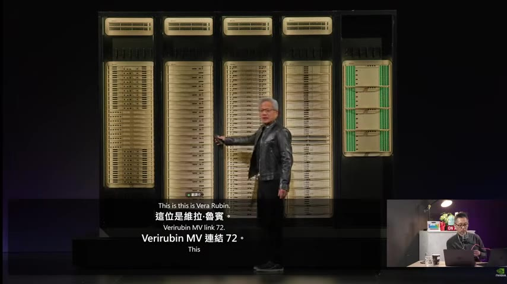
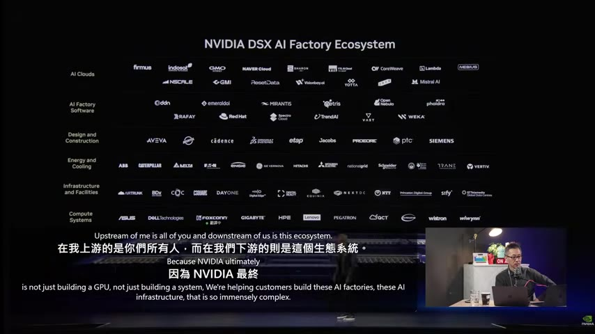
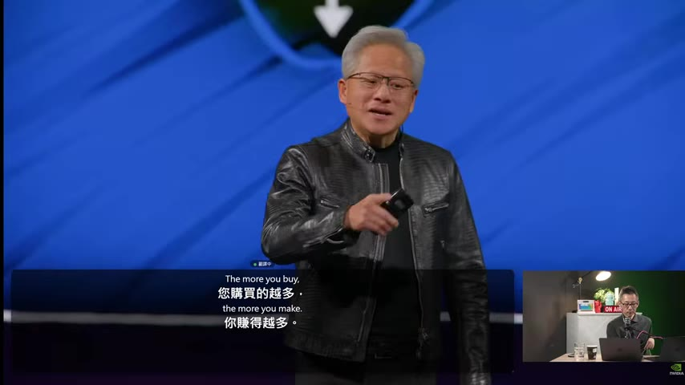
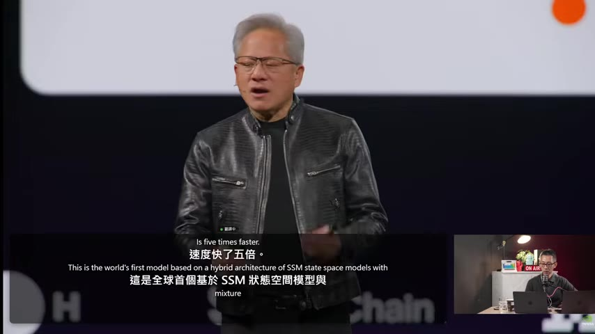
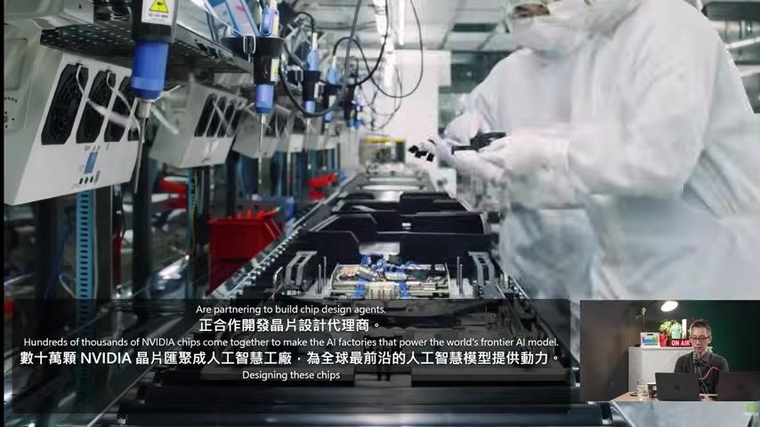
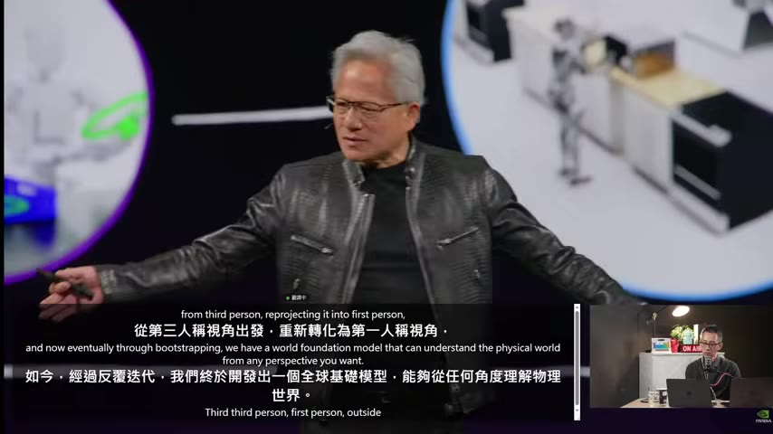
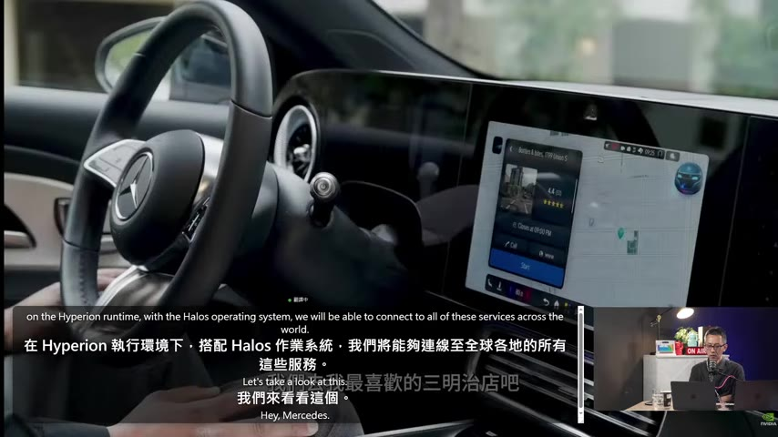
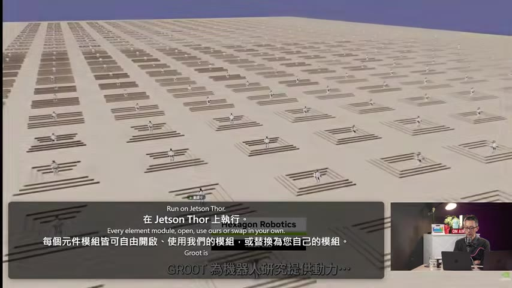
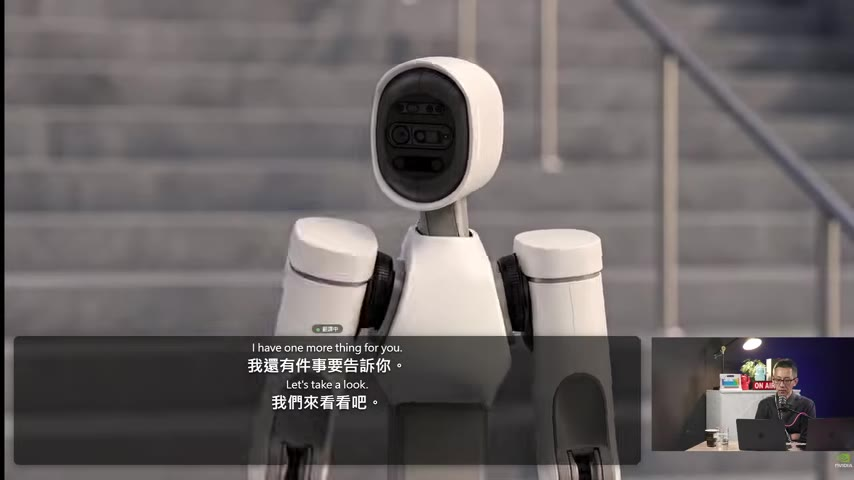

# NVIDIA GTC Taipei 2026 黃仁勳主題演講重點整理

> **來源**：YouTube — [PanSci 泛科學 · NVIDIA GTC Taipei 黃仁勳演講即時中文翻譯](https://www.youtube.com/watch?v=U1S8tSCx3Lg)（02:45:44，2026-06-01 發布）

> ⚠️ 本文字幕為 Whisper ASR 自動轉錄、且影片本身是即時 AI 中文口譯，部分專有名詞與譯名為機器產物，已在摘要中還原為正確術語（例：「電子工具」=PC、「磁磁電池」=電晶體、「機械人物」=機器人、「代理人員/工程器」=agent / agentic 工具鏈、「通道」=throughput 吞吐、「後裔」=revenue 營收、「華人心」=黃仁勳）。黃仁勳演講約自 [28:00] 開始、[2:18] 結束。

## TL;DR
- **主軸：Agentic AI 是新的運算典範。** 一個 agent = 模型（大腦）＋ Harness（身體）＋ 工具＋技能＋ Runtime，本質是「拆解式、分散式、異質運算」，這正是 NVIDIA 設計新一代系統的理由。
- **硬體：Vera Rubin 已全面量產。** 不是單一晶片，而是整櫃系統（Vera CPU＋Rubin GPU＋NVLink 72＋BlueField 儲存安全＋Spectrum-X 光電網路），是公司史上最大工程；台灣 150+ 家供應鏈夥伴共同打造（extreme co-design）。
- **新賽道一：Vera CPU。** 史上第一顆「為 agent、不為人類」設計的 CPU，主打單線程效能與能效，直接對打 x86（Intel / AMD）。
- **新賽道二：把 PC 重新發明。** 與微軟合作推出 RTX Spark / N1X（聯發科合作）/ DGX Station 全新 Windows AI 機種，提出「家用個人 AI 超級電腦」願景；明言「未來有桌機、筆電、工作站，但沒有手機」。
- **新賽道三：Physical AI（實體 AI）。** Cosmos 3 世界基礎模型 + 用算力生成資料（computed data）解決實體資料稀缺；延伸到自駕（Drive Alpamayo 2）與人形機器人（Isaac GR00T）。
- **開源策略：** Nemotron 3 Ultra（自稱史上最強開源模型）＋ OpenShell ＋ Agent Toolkit，讓每家軟體 / SaaS 公司都能打造自己的超級 agent。

## 重點摘要

### 1. Agentic AI 是新的運算典範 ([31:00]、[44:46])
黃仁勳開場以 GitHub 數據（pull request、AI 編碼量呈指數陡升）說明「有用、可獲利的 AI 已經到來」。核心論點：**Agent = 模型 + Harness + 工具 + 技能 + Runtime**。
- 模型像大腦（負責思考、context 理解、推理、規劃），每次思考就點亮一整櫃 Grace Blackwell / NVLink 72。
- Harness 像身體（CPU 編排、DPU 安全）；工具在 CPU / GPU / LLM 上跑。
- 最難的是**記憶**：KV cache、compaction（不只是壓縮，還要懂得檢索結構化／非結構化資料、建立 ontology）。這會徹底革新儲存系統。
- 結論：agent 是「拆解式、分散式、異質運算」，和過去「一包軟體跑在 OS 上的 binary」完全不同——這就是要重新設計整個系統的理由。
- 反駁「Agentic AI 來了、軟體公司會倒」的說法：**正好相反，agent 越多、用的工具越多**，軟體只要能被 agent 取用反而更興盛。

### 2. CUDA-X 函式庫長出「技能」給 agent 用 ([40:00]、[44:33])
NVIDIA 的「寶藏」是 CUDA-X 函式庫（cuDSS 稀疏解、cuLitho、AIQ deep research、Aerial AI-RAN、Warp 可微分物理、Parabricks 基因體…）。現在這些函式庫會附上 **skills**，讓 AI 讀了就知道怎麼用、用得比人還好。

### 3. Vera Rubin：為 agentic 時代打造、已全面量產 ([48:42]、[1:05:12]、[1:11:13])
- Vera Rubin **不是一顆晶片，是端到端整櫃系統**：Rubin GPU + NVLink 72 + Vera CPU 編排 + 革命性儲存 + ConnectX-9 + BlueField 安全處理器（資料於靜態／傳輸／使用中全程加密，confidential computing）。
- 全公司 4 萬名工程師投入，稱「公司史上最具野心的專案」。
- 供應鏈規模是 Grace Blackwell 的兩倍；組裝一櫃從 2 小時縮短到 **5 分鐘**，且無線纜（resiliency at scale）。
- 7 顆新晶片、TSMC 3nm、COWOS-R/L 封裝、HBM4（美光 / SK 海力士 / 三星）；單板 6 兆電晶體、超過 1.8 萬顆元件。
- 提到 **Grok 3 LPX**（256 顆 LPU / 16 trays、40 PB/s SRAM 頻寬，主打最高吞吐 + 最低延遲）；主持人補充「NVIDIA 前陣子才把它併購」（⚠️ 此併購說法出自主持人，待查證）。

### 4. AI Factory / DSX 藍圖、DSX OS 與台灣生態系 ([51:00]、[55:02])
- **DSX = NVIDIA 的「工廠」藍圖**（對比 RTX=GPU、DGX=系統）：從晶片、機櫃、網路、電力、散熱到電網，端到端一起設計，因為「compute is revenue（算力即營收）」。
- **DSX OS / DSX Sim**：先在 Omniverse 數位分身裡規劃佈局、模擬電力散熱、驗證整合，再落地。
- **DSX Max LPS**：同樣電力預算下安全多部署 GPU（今天 AI 工廠普遍過度配置電力達 40%），等於多賺數十億；45°C 熱液冷卻更省水電；動態電力配置回收閒置瓦數。
- **DSX Flex**：讀取即時電網訊號、動態調整工廠用電，反過來「讓電網更強韌」，而非拖垮電網。2030 前將有 100GW 的 AI 工廠上線。
- 一張「**NVIDIA DSX AI Factory Ecosystem**」投影片把台灣與全球夥伴全納入（AI Clouds、AI Factory Software、Design & Construction、Energy & Cooling、Infrastructure、Compute Systems 六層，含華碩、Dell、Foxconn、技嘉、和碩、Cadence、Siemens、Vertiv…）。

### 5. AI 工廠經濟學：買越多賺越多、TCO ([1:00:00]、[1:04:17])
- 每 GW 從 50–60 億美元、很快到 80–100 億美元規模；越快建好工廠、越快開始產生營收。
- 強調架構彈性與生態系豐富度決定資產壽命：軟體每幾個月一變（CNN → Transformer → MoE → agentic），架構不夠彈性曲線就撐不久。NVIDIA CUDA 生態讓資產壽命長、**TCO 低**。
- 金句：**「The more you buy, the more you make（您買得越多，賺得越多）」**，算力需求極高、且是當前的瓶頸。

### 6. Vera CPU：為 agent 而非人類打造的 CPU ([1:16:21]、[1:24:31]、[1:30:00])
- 過去所有 CPU 都為「人類使用者」設計；Vera 是**第一顆為機器（agent）設計**的 CPU。
- 一個 Vera Rubin 機櫃內有兩種 CPU：一種編排 GPU / 管理 KV cache；另一種是 Grace BlueField，負責安全與儲存（AI 工廠經濟學的關鍵在儲存）。
- 四大設計目標：**單線程效能世界級、每秒指令數最高、頻寬最高、能效最佳**。88 個 Olympus core、chiplet 設計、NVLink chip-to-chip 3.6 TB/s。
- 實測：SQL 提速 **3 倍**、紐約證交所（NYSE）即時量化交易提速 **6 倍**；對比最高階 x86「實在不見了」。
- 明言是要直接和 Intel / AMD 對沖；將出貨「數百萬顆 Vera」，台灣 ODM / OEM 量產，早期採用者是 agent 公司——一個過去不存在的新市場。

### 7. 開源策略：Agent Toolkit、OpenShell、Nemotron 3 Ultra ([1:33:30]、[1:40:30])
- 企業要打造 agent 需要四樣東西：**模型、Harness、工具/技能、Runtime**。NVIDIA Agent Toolkit 一次提供。
- **OpenShell**：把 agent「從龍蝦變寄居蟹」——給它一個殼，提供權限、保護身份與安全，可跑 Claude Code、Codex 等任何 agent；Red Hat、Canonical、Microsoft 都支援。
- **Nemotron 3 Ultra**：下一代開源模型，全球首個基於 **SSM（狀態空間模型）混合架構**，速度快 5 倍，且連訓練資料一併開源。黃仁勳要打破「開源 AI 都是中國模型較強」的印象（投影片對比中國開源模型）。
- 反駁「開源會破壞 SaaS 市場」：相反，開源讓 Cadence、CrowdStrike、Palantir、SAP、ServiceNow 等都能打造自己的超級 agent，創造更大機會。

### 8. Cadence 合作：AI 晶片設計 agent ([1:36:00])
最愛的應用場景——晶片設計。NVIDIA × Cadence 打造「晶片設計超級工程師」：以 Nemotron 為底、結合 Cadence / Jasper 工具與 ChipStack、Codex agent，自動寫 / 跑 / 改 RTL 並驗證，把過去要「數週」的工作壓到「數小時」，測試流程提速 40 倍以上。

### 9. 把 PC 重新發明：RTX Spark + 微軟 ([1:44:30]、[1:48:33]、[1:56:00])
- 40 年前 PC 革命始於台灣；今天 NVIDIA × 微軟「重新發明電腦」，為 agentic 時代打造全新 Windows AI 機種。
- **RTX Spark**：Blackwell RTX GPU（6144 CUDA cores、1 petaflop AI）+ 20-core Grace CPU（與聯發科合作的 N1X，128GB 統一記憶體、TSMC 3nm、700 億電晶體），是「Agent 的 Windows 平台」，100% CUDA、跑遍所有 NVIDIA 應用（含遊戲 Forza、007）。
- **DGX Station 工作站**：768GB 記憶體、20 petaflops、8 TB/s，可在桌上跑百萬參數級模型 / 本地 agent。
- 願景：**家用個人 AI 超級電腦**——24 小時常駐、連接全屋裝置與相機，越用越聰明（Nemotron 3→4→5…）；比喻成家裡的「R2D2 / C3PO」。
- 產品線涵蓋桌機、筆電、工作站，每代都更新；金句：**「未來有桌機、筆電、工作站，但沒有手機。」**
- （此段為手持實機展示與口述，場景穩定、無可用投影片截圖。）

### 10. Physical AI：Cosmos 3 世界基礎模型 ([2:02:00]、[2:04:38])
- 最大瓶頸是**資料**：實體世界的影片多為第三人稱、且實體資料無法窮舉。
- **Cosmos 3**：物理智能（Physical AI）的世界基礎模型，可從任何視角（第一 / 第三人稱、內 / 外）理解物理世界，能理解、生成、模仿、甚至當自己的 policy。
- 用 **computed data（算力生成資料）** 取代稀缺的真實資料——需要對自家世界模型有極高信心；同樣開源模型與資料（呼應 Nemotron 策略）。
- 可對照 Google DeepThink（Gemini）、李飛飛、楊立昆等做世界模型的陣營如何看待。

### 11. 自駕：Drive Alpamayo 2 + Hyperion + Halos ([2:08:33]、[2:09:32])
- **Drive Alpamayo 2**：自駕的開源模型；全球約 97% 車廠與 NVIDIA 合作，多家已訂購 / 打造 NVIDIA Hyperion 車輛。
- 搭配 **Halos** 安全作業系統，可連線全球服務。
- 現場 Mercedes 示範「會思考、會一直碎念路況」的**自動思考車**（demo 中車輛持續口述轉向、避讓決策）。

### 12. 人形機器人：Isaac GR00T 參考平台 ([2:11:03]、[2:12:27]、[2:14:48])
- **NVIDIA Isaac GR00T**：人形 / 機器人的開發平台（模型、資料、訓練、Runtime、OS 全包），如同 PC / DGX / 雲 / 自駕之於各自領域，現在用來「量產機器人」。
- 流程：Isaac Lab 建環境 → Isaac Teleop 蒐集示範 → Omniverse + Cosmos 生成合成資料、把一次示範擴成上千訓練場景（Isaac Lab Arena）→ 在 Jetson Thor 上執行；每個模組都可開源或替換。
- 發表**參考機器人 GR00T**（全身約 31 自由度、每隻手 25 自由度、約 6 呎 150 磅，由 Hexagon Robotics 製造）。
- 機器人生態合作含小米、宇樹（Unitree）等。

### 13. 結尾：agentic pattern 無所不在 + One More Thing ([2:17:24]、[2:18:42])
- 同一套 agentic 運算模式未來會跑在 PC、機器人、衛星、基地台、工廠——雲端、地端、邊緣皆然；「我們對個人電腦的想像很可能會改變」。
- Vera 的訂單預期成為「公司史上最快、最成功的產品發表」。
- 「One more thing」收尾：GR00T 人形機器人登場（之後接唱跳表演）。

## 延伸思考與存疑

- **最值得記住的框架**：「Agent = 模型 + Harness + 工具/技能 + Runtime」這套拆解，把 agent 講成基礎設施層的問題；OpenShell「給 agent 一個殼、管權限與身份」、Vera CPU「為 agent 而非人類設計」、Cosmos 3「用算力生成資料取代真實資料」三個論點都值得單獨追蹤。
- **待查 / 存疑**：
  - 「NVIDIA 併購 Grok/Groq LPX」為主持人說法，需查證官方稿或新聞。
  - 「Nemotron 3 Ultra 是史上最強開源模型」「Vera CPU vs x86 提速 3–6 倍」均為廠商宣稱，待第三方驗證。
  - 字幕由 Whisper 轉錄（影片無原始字幕）；Vera CPU（[1:16]–[1:32]）與 RTX Spark / PC（[1:44]–[2:01]）兩段場景過於穩定、未抽出可用截圖，故以文字補足。
