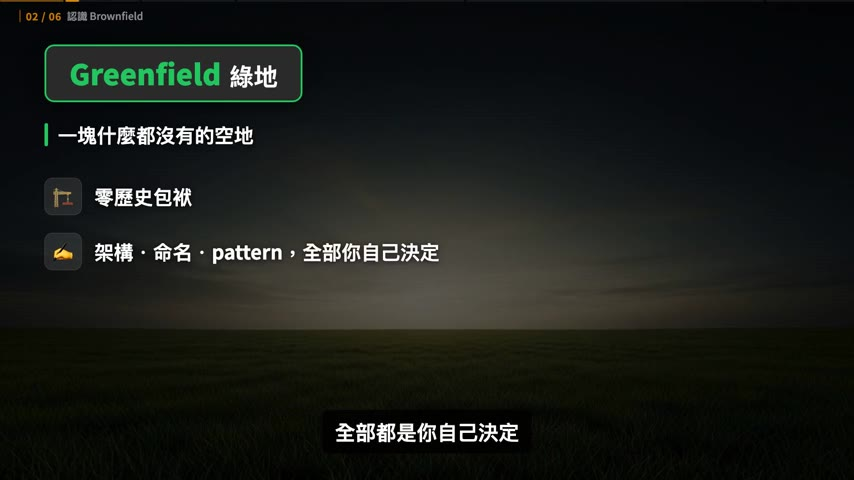
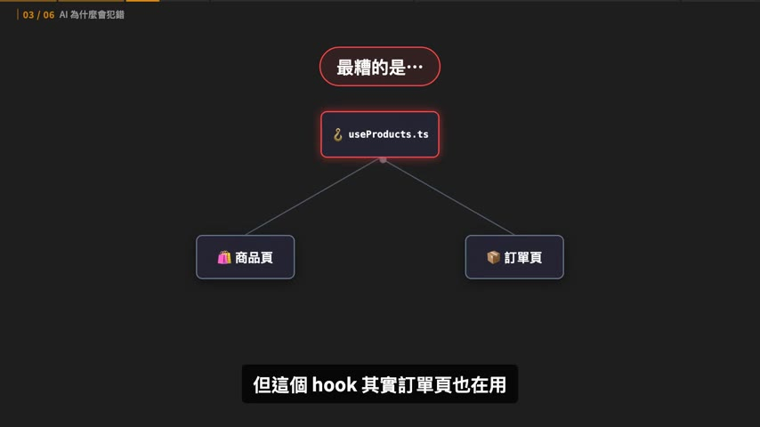
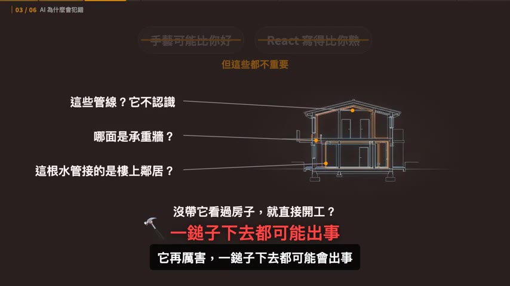
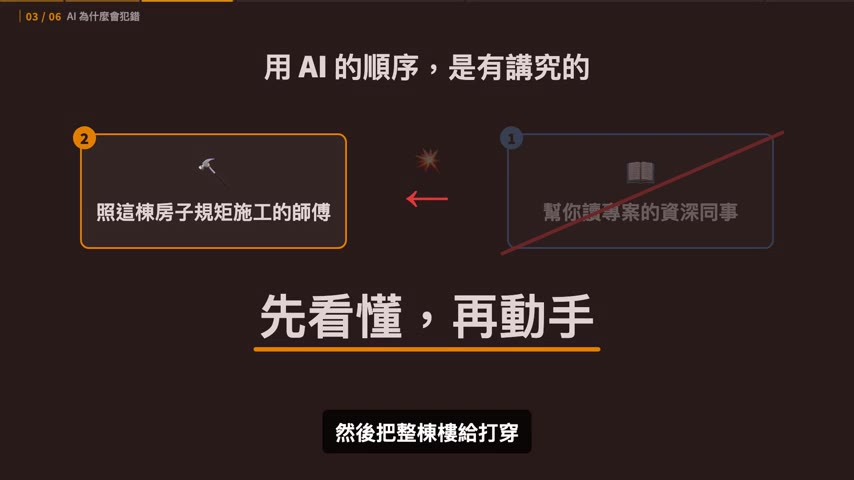
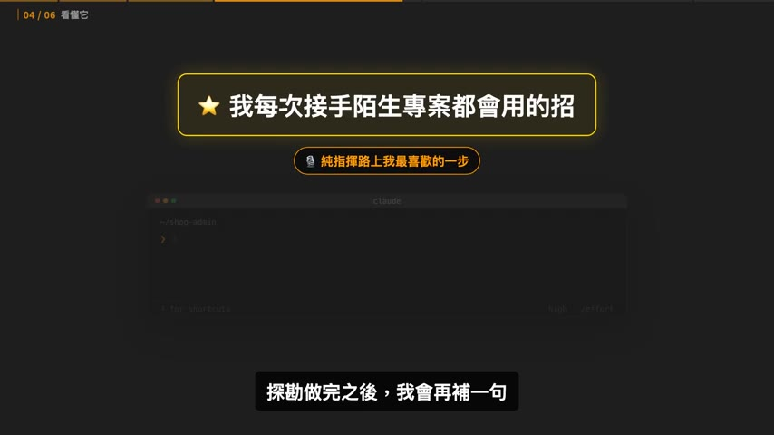
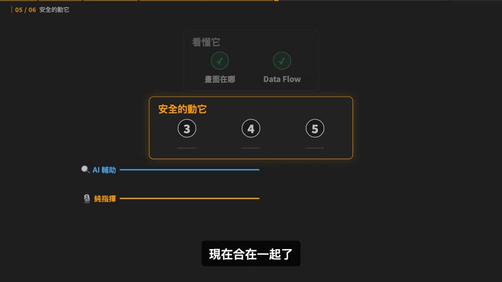
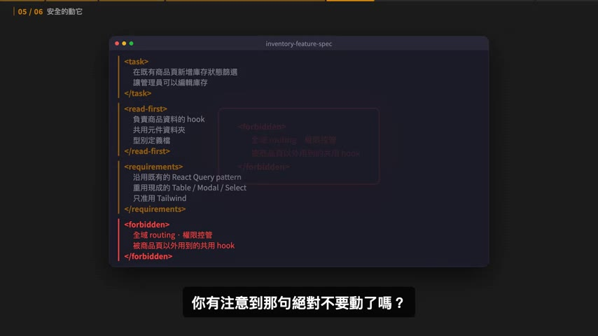

# AI 改 code 一直改 A 壞 B？你缺的是這五個步驟

> **來源**：YouTube — [Gary Chen · AI 改 code 一直改 A 壞 B？你缺的是這五個步驟](https://www.youtube.com/watch?v=CMs8YMU6_RM)（00:15:54，2026-07-18 發布）
>
> 同頻道系列的實作篇。理論骨架在 [Day 1：Agent = Model + Harness](../2026-07-28-yt-google-vibe-coding-agentic-engineering-day1/summary.md)；這支是把 context engineering 落到「接手陌生 codebase」這個具體場景。

## TL;DR

- 核心診斷：**問題不是 AI 不夠強，是你把順序搞反了**。網路教學教的都是 Greenfield（空地蓋新房），你每天面對的是 Brownfield（在別人住的房子裡拆牆改管）。
- **Greenfield 不會永遠是 Greenfield** —— vibe coding 狂寫一個月而沒有意識地維持架構，那個專案已經是 Brownfield 了，因為裡面大部分的 code 你根本沒讀過。
- 鐵律是 **先看懂，再動手**。流程分兩階段五步：前兩步「看懂它」（畫面長在哪、data flow 怎麼走），後三步「安全地動它」（帶規則的規格、小步 review、回歸驗證）。
- 前兩步是**勞力活可以外包**（AI 輔助 vs 純指揮 agent 兩條路），後兩步是**決策活沒有外包版**——「起草跟拍板是兩回事，改壞了被 QA 找麻煩的是你」。
- 最反直覺也最實用的一句：**在 Brownfield 裡，Clean Code 不是你覺得漂亮的寫法，而是跟前人一致的寫法。** guardrail 第一條永遠是「照著這個專案原本的樣子寫」。

## 重點摘要

### 1. 兩種人，同一個困境 ([00:00] – [01:07])

作者開場點名兩種讀者，收斂到同一個病灶：

- **Vibe coder** — 用 AI 寫 side project，前三週爽到不行，功能一個一個長出來；第四週只想改一個小地方，改完另一個頁面直接掛掉。於是認定 AI 還不行，放棄那個想很久的產品。
- **科班工程師** — 終於願意試 AI 輔助，請它進到自己負責的 codebase，結果一樣改 A 壞 B 或程式碼不夠漂亮，於是把 AI 打回冷宮，認定模型能力不夠強。

> 問題從來都不是 AI 不夠強，而是你用它的方法錯了。

### 2. Greenfield vs Brownfield ([01:13] – [02:36])



| | Greenfield（綠地） | Brownfield（棕地） |
|---|---|---|
| 狀態 | 一塊什麼都沒有的空地 | 已經蓋滿東西、而且**有人住在裡面**的房子 |
| 包袱 | 零歷史包袱 | 既有 pattern、沒解掉的 bug、牽一髮動全身的水管電線 |
| 決定權 | 架構、命名、pattern 全部你自己決定 | 得遵守前人的規矩 |
| AI 表現 | 最好發揮——你叫它怎麼蓋它就怎麼蓋 | 容易出事 |

作者指出「用 AI 三十分鐘做一個 App」那類影片講的**全部都是 Greenfield**，這是水土不服的根源。

而最關鍵的一句提醒：

> **Greenfield 不會永遠是 Greenfield。** Vibe Coding 狂寫一個月後，如果過程中沒有有意識地維持乾淨架構，那個專案就已經變成 Brownfield 了——因為裡面大部分的 code 你根本沒讀過。

所以不管是進公司接手別人的專案，還是自己 vibe code 了一個月，遲早都會面對同一件事：**一棟已經住了人、還不能停水停電的房子，而你必須進去把廚房改一下。**

### 3. AI 為什麼會犯錯：一個具體的爆炸案例 ([02:37] – [03:36])

假設你說「幫我加庫存狀態的篩選跟編輯功能」，AI 幾秒生出一大段 code，畫面看起來也沒錯，你開心送出 PR。隔天 QA 說**訂單頁掛了**。

這句話在 Greenfield 完全沒問題，但在 Brownfield 等於「把一個從沒進過你家的裝潢師傅一個人丟進廚房，叫他直接搞個流理台出來」，完全沒先講你家的設計風格。於是 AI 自己看著辦：

- 不知道專案已有一套 **React Query pattern** 在管 API → 自己發明了一套新寫法
- 不知道專案已有共用的 **Table 元件** → 又自己重刻一個
- 最糟的是：為了拿商品資料去改了 `useProducts` hook，**但這個 hook 訂單頁也在用**



它改了資料格式，商品頁修好了，訂單頁卻爆了。

> AI 的每一步看起來都很合理，但它是在一個完全不認識的房子裡憑感覺做事。表面上你省了時間，實際上你是在別人的專案裡埋地雷。



作者的定調很到位：AI 是一個**很會蓋房子、但從來沒看過你這棟房子的師傅**。它的手藝可能比你好、React 寫得可能比你熟，但這些都不重要——重要的是它不認識管線、不知道哪面是承重牆、不知道哪根水管接的是樓上鄰居。

### 4. 鐵律：先看懂，再動手 ([03:59] – [04:24])



在 Brownfield 裡用 AI 的順序是有講究的，而且**絕對不能反**：

1. 先把它當成**幫你讀專案的資深同事**
2. 等你們兩個都把房子看懂了，再把它當成**照這棟房子的規矩幫你施工的師傅**

> 大多數人犯的錯就是把順序反過來，甚至直接跳過「看懂」這一步，一上來就要 AI 動手，結果它只能憑空臆測，然後把整棟樓給打穿。

### 5. 先選一條路：AI 輔助 vs 純指揮 ([04:26] – [05:09])

同一套流程有兩種走法，取決於你對 AI 的熟練度與信任度，**沒有標準答案**：

| | AI 輔助開發 | 純指揮 agent |
|---|---|---|
| 主導權 | 在你手上 | 交給 agent |
| 做法 | 自己開瀏覽器、自己翻檔案、自己把 code 貼給 AI | 用 Claude Code / Cursor 這類讀得到整個專案的 coding agent，只負責出一張嘴 |
| AI 的角色 | 你手上的**放大鏡**，幫你看得更快更清楚，但真正走進每個房間的人是你 | 自己去探勘、自己去讀，把報告交回來給你驗收 |
| 適合誰 | 主要用網頁版 AI，或對 AI 寫的 code 還沒那麼放心 | 已有 agent 工具且信任度較高 |

### 階段一：看懂它

#### 第 1 步 — 搞清楚這塊畫面長在哪個檔案 ([05:19] – [06:42])

**AI 輔助的土炮但 100% 準確的方法**：打開瀏覽器開發者工具 → 對著要改的那塊畫面右鍵「檢查」→ 找出一個獨特特徵（特殊 class name、按鈕文字、測試標籤）→ 拿這個特徵回編輯器**全域搜尋** → 馬上定位出是哪個檔案在渲染。

找到檔案後丟給 AI，指令長這樣：

> 這是負責商品頁的檔案。幫我分析這個畫面的結構：它引入了哪些子元件、各自負責渲染什麼？有沒有哪些看起來是全站共用而不是這頁專屬的元件？**只分析，不要修改任何 code。**

**純指揮的做法**直接一句話：

> 畫面上商品列表這一塊是哪個檔案在渲染的？幫我找出來，分析它的元件結構，標出哪些子元件是全站共用的。**這個階段只做分析就好，不要改任何 code。**

作者特別點出兩條路的指令**都有「只分析，不要改」**，因為這個階段的重點在探索。

> 這一步的價值，是直接把你那個「我怕改壞」的恐懼，變成一張看得見的地圖。

你會清楚知道自己站在這棟房子的哪個房間，以及哪些元件是全站共用的資產——**這些資產以後可以重複用，但絕對不能亂改**。

#### 第 2 步 — 搞清楚 data flow ([06:42] – [08:40])

> 前端最容易出事的地方，從來都不是畫面，而是**資料**。

**AI 輔助的做法**：先打開 `package.json` 看用哪套狀態管理（Redux / Zustand / React Query）→ 去找對應的 store 或 hooks 資料夾 → 回到畫面元件找觸發資料變動的動作（`dispatch`、`mutate`、`setState`）→ 把畫面元件跟狀態檔案一起丟給 AI：

> 我會給你商品頁的檔案還有這個 hook 檔案。請用白話文解釋這條 data flow：商品列表的資料是從哪個 API 來的？是用哪套工具在管？當管理員編輯庫存時，資料是怎麼從畫面流回 server 的？請把中間經過的 function 依序列出來。

**這裡有一件必做的事**：請 AI 特別標出**這個 hook 有沒有被商品頁以外的地方用到**。注意網頁版 AI 看不到整個專案，所以要先在編輯器全域搜尋這個 hook，把搜到的檔案一起貼給它才答得出來。純指揮的話 agent 讀得到整個 codebase，這題直接就能答。

**作者自己每次接手陌生專案都會用的招**（他說是純指揮這條路上他最喜歡的一步）：



探勘做完之後再補一句：

> 把你剛剛探勘到的結果做成一頁 HTML。這個專案的頁面結構、共用元件、還有 data flow，畫成一張架構導覽圖，我要直接用瀏覽器打開來看。

幾分鐘後你就拿到一張地圖：哪些元件是共用的、資料從哪流到哪、**哪一根水管後面接著別的頁面**，一目了然。這一頁 HTML 就是這棟房子的建築藍圖。

### 階段二：安全地動它

#### 兩條路在這裡合流 ([08:44] – [09:18])



作者對「為什麼合流」的解釋是這支影片我覺得最有見識的一段：

> 前面兩步的本質是**勞力活**——讀 code、找檔案、追資料流。勞力活可以外包，你對 AI 的信任多一點就外包多一點。
> 但接下來兩步的本質是**決策活**——決定什麼東西絕對不准動、決定一段改動夠不夠格進這個 codebase。
> **決策活沒有外包版。** 不是 agent 做不到，它可以幫你起草，但**起草跟拍板是兩回事**。改壞了之後被 QA 找麻煩的是你，隔天踩到地雷的也是你，不是它。

#### 第 3 步 — 給帶著既有規則的需求，不是空需求 ([09:18] – [10:24])

這是 Brownfield 跟 Greenfield **差最多的地方**。不能只說「幫我加一個庫存篩選」，要把前半場學到的規矩全部寫進去變成它的邊界。

影片給的規格長這樣（截圖是實際的 XML 標籤結構，可以直接拿來當模板）：



```xml
<task>
  在既有商品頁新增庫存狀態篩選
  讓管理員可以編輯庫存
</task>

<read-first>
  負責商品資料的 hook
  共用元件資料夾
  型別定義檔
</read-first>

<requirements>
  沿用既有的 React Query pattern
  重用現成的 Table / Modal / Select
  只准用 Tailwind
</requirements>

<forbidden>
  全域 routing、權限控管
  被商品頁以外用到的共用 hook
</forbidden>
```

> 那句「絕對不要動」，就是把你前半場看懂的東西變成 AI 的 **guardrail**，也是整套流程裡最關鍵的一步。

**接著是我認為全片最值得記的一段澄清**：

> 在 Brownfield 裡，所謂的 **Clean Code 不是你自己覺得很漂亮的寫法，而是跟前人一致的寫法**。
> 所以你給 AI 的 guardrails 中，第一條永遠是「照著這個專案原本的樣子寫」。
> **沿用前人的 coding style，本身就是最高優先的 Clean Code。**

#### 第 4 步 — 拆小步，每一步親自 review ([10:24] – [11:41])

規格給對了也不代表 AI 第一次就寫對，所以不要讓它一次生出整個功能。順序大概是：

1. 先叫它**只提出元件結構跟資料流的規劃**，先不要寫 code
2. 確認方向對了，再讓它**只去改那個商品資料的 hook**，加上庫存篩選的參數
3. 改完、你也 review 完，再讓它做**篩選的畫面**
4. 最後才做**編輯庫存的彈出視窗**

> 一次只做一小塊，每一塊都在你的眼皮子底下進行。

**Brownfield 專屬的 review 重點**（跟 Greenfield 不一樣，不是只看有沒有 bug）：

- 這段改動有沒有偏離專案既有的寫法？
- 命名習慣、資料夾結構、抓資料放的位置，跟前人一不一致？
- 有沒有偷偷改到共用的檔案？
- 有沒有重複造輪子，自己又刻了一個其實早就存在的元件？

可以把初審交給 AI：

> 用資深前端工程師的角度幫我 review 這段改動。它有沒有偏離專案既有的 React Query 寫法？有沒有動到共用元件？有沒有漏掉 loading 跟 error 的狀態處理？

但作者立刻加了限制：

> AI 的 review 是**初審**，終審永遠是你。在 production 環境下，除非你已經很熟悉這套 codebase，或者這套 codebase 已經有很好的 **harness 跟 context 管理**，否則重要決策建議都先不要外包給 agent。

#### 第 5 步 — 客觀證明你沒弄壞別人的東西 ([11:41] – [14:14])

這一步回答從影片開頭就纏著你的恐懼。勞力活回來了，所以兩條路又分岔。拆三個部分：

**① 先跑專案本來就有的測試**

> 很多人完全忘記專案裡其實早就有一整套的測試。這是你最快、最省力確認有沒有壞到既有功能的方法。

- AI 輔助：動手前自己跑一次確認綠燈，動完手再跑一次。
- 純指揮：「動手前先跑一次專案既有的測試跟我回報結果，之後每完成一小塊改動就再跑一次」——**讓跑測試變成 agent 的固定動作**。
- 如果專案根本沒測試，現在就是叫 AI 補幾條關鍵測試的最好時機。

**② 看懂別人的 error log（Brownfield 的經典坑）**

很多專案有自己一套包裝過的 **custom error logging**：包裝過的 logger、一組統一的 error code、或固定要送去某個後台的格式。

> 在公司裡這種東西叫做**部落知識**——老鳥都懂，但沒有寫在任何文件裡。

而且這不只是公司的事：**AI 幫你生 side project 時常常也順手建了一套 error handling，你根本不知道它存在**，結果你後來隨手寫的 `console.error` 根本沒進到那個系統裡。

問法：

> 這個專案有自己的錯誤紀錄機制，讀一下負責這件事的 logger 檔案，然後告訴我三件事：第一，錯誤最後被送到哪裡？第二，一筆 log 長什麼樣子？第三，有沒有規定一定要帶哪些欄位？然後示範一次，如果我這次的庫存編輯功能要沿用同一套 logging，我該怎麼寫。

> 重點在於：**你的錯誤處理要說專案本來的語言。** 隨手丟一個 `console.error`，這筆錯誤上線後根本不會被任何人看到；照既有格式帶上對的 errorCode 跟 metadata，它就會乖乖出現在該出現的地方，之後 debug 才找得到線索。

**③ 回歸檢查（regression）** — 直接對付「訂單頁掛掉」事件的一招

- AI 輔助：前半場已經讓 AI 標出那個 hook 還被誰用到，現在拿著那份清單一個一個回頭驗。
- 純指揮：

> 我動了商品資料的 hook，列出專案裡所有用到它的地方，逐一確認我的改動有沒有改變它原本的行為。回傳的型別、參數、預設值有沒有變？如果既有的測試有覆蓋到這些地方，告訴我該跑哪幾個。

> 這一句話，就是你跟「改 A 壞 B」這件事的正式和解。

### 6. 完整走一遍與收尾 ([14:15] – 結尾)

同一個需求、同一個 AI，差別只在於**這次是先看懂再動手，而不是閉著眼睛把整包 code 直接丟給它**：

1. 先分清楚這是 Brownfield，知道自己在別人的房子裡改廚房
2. 選好路（自己拿放大鏡逐間看房，或指揮 agent 畫建築藍圖），拿到那張地圖，標出那根危險的共用水管
3. 把既有規矩**包含 coding style** 全部寫成規格跟 guardrail
4. 讓 AI 一小塊一小塊寫，每一塊用資深的眼光親自 review
5. 用既有測試、看懂的 log、還有回歸檢查，**客觀證明**這次沒弄壞任何人的東西

**兩個前瞻觀察：**

> AI 越強，前面那些分岔的步驟會越來越往「純指揮」那邊收斂。總有一天不會再有人手動貼檔案給 AI。

> 身為 AI 原生工作者，很重要的能力之一就是：被丟進一棟完全陌生的專案裡時，你要知道自己**現在需要 agent 幫你探索並帶著你理解**，而不是直接擼起袖子幹活。

最後他回扣到系列的主線：

> 但如果你在開啟一個新專案時就已經有很好的 **harness 跟 context 管理**，那其實這些問題都不存在，真的只需要出一張嘴就好了。
> 有能力搭建一個專案的架構、還有做好很重要的 context 管理，我覺得是 **vibe coder 晉升 agentic engineer 的關鍵里程碑之一**。

## 與同系列其他集的接點

- **這支是 Day 1 那套理論的落地版。** Day 1 說「context engineering 是幫新員工做入職簡報」，這支就是那份入職簡報在「接手陌生 codebase」場景下的具體長相：先做架構探勘 → 產出建築藍圖 → 把藍圖轉成 guardrail。
- **`<forbidden>` 區塊就是 Day 1 harness 六大件裡的 guardrails**，而 `<read-first>` 是 static context 的最小可行版本。這支影片實際上示範了怎麼**臨時**組出一份 harness，而不需要先建好一份完整的 rule file。
- **第 5 步的三段驗證與 loop engineering 的 verifiable goal 完全對得上**：既有測試（機器可檢查）→ log 格式（可驗證）→ regression 清單（可枚舉）。反過來看，這支影片提供了「怎麼在 Brownfield 裡找到可驗證條件」的答案，正好補上那些只講方法論、沒講怎麼落地的內容的缺口。
- **決策活沒有外包版** 這個切分，和「不要讓 agent 球員兼裁判」是同一個原則的不同切面。
