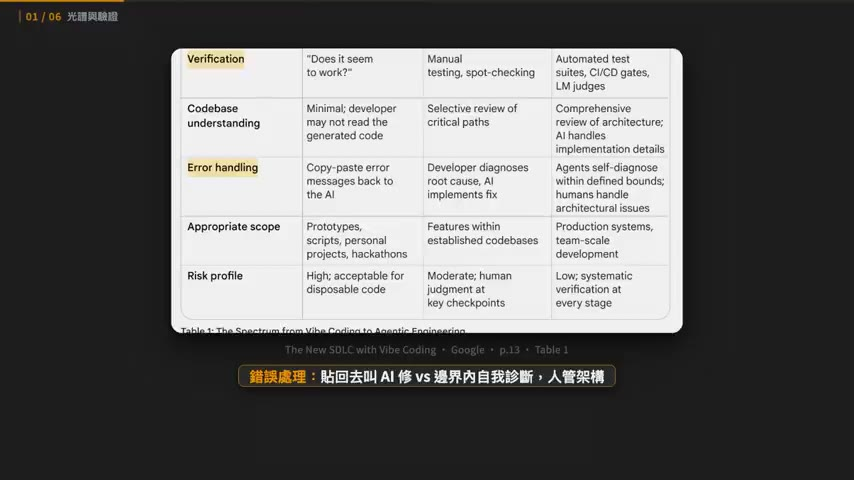
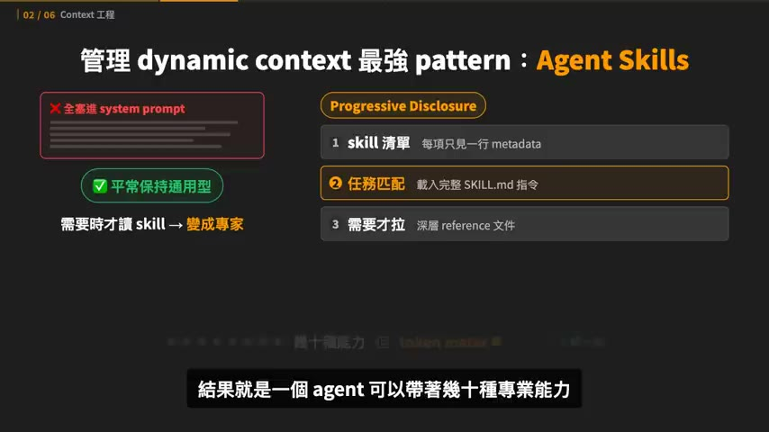
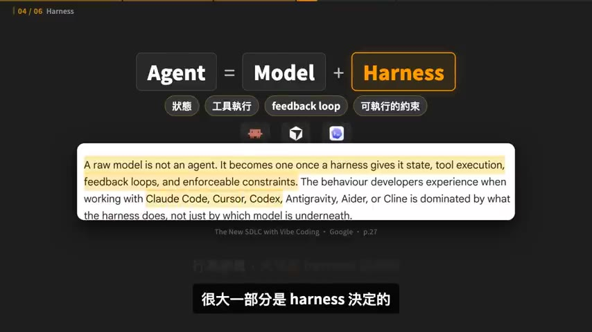
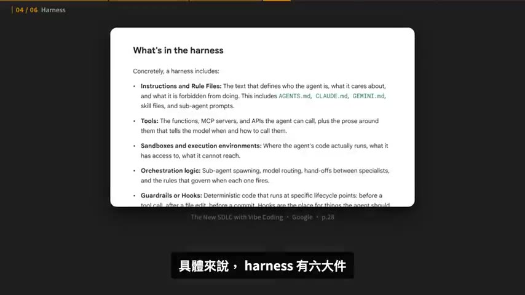
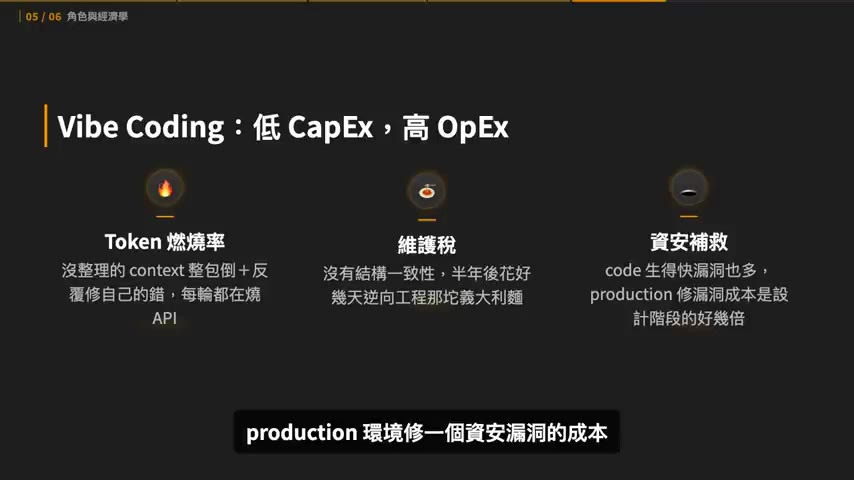
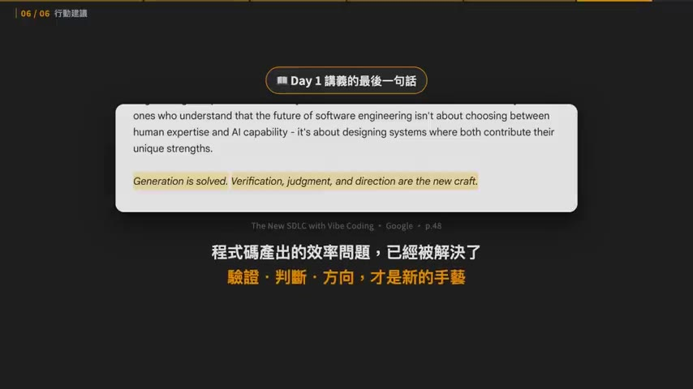

# 15 分鐘看完 Google Vibe Coding/Agentic Engineering 開發課 Day 1

> **來源**：YouTube — [Gary Chen · 15 分鐘看完 Google Vibe Coding/Agentic Engineering 開發課 Day 1](https://www.youtube.com/watch?v=GzHfE50N8x4)（00:15:57，2026-07-10 發布）
>
> 影片講義本體：Google《**The New SDLC with Vibe Coding**》，共 51 頁（Day 1 講義）。截圖引用頁碼 p.13 / p.27 / p.28 / p.48。

## TL;DR

- Vibe coding 與 agentic engineering **不是二選一的開關，是一條光譜**；判斷標準不是「你用不用 AI」，而是 **AI 輸出周圍有多少結構、驗證與人類判斷**。
- 分水嶺是驗證，而驗證有兩種：**tests** 驗確定性、**evals** 驗非確定性（路徑對不對、工具選得對不對、品質達不達標）。Google 講得很死——**沒有這兩個，prompt 寫得再精緻都還是 vibe coding**。
- 比 prompt engineering 更關鍵的是 **context engineering**：六種 context（instructions / knowledge / memory / examples / tools / guardrails）切成 static 與 dynamic 兩類，而「哪些放 static、哪些放 dynamic」本身就是**要被 review、被版控的架構決策**。
- **Agent = Model + Harness**。大部分 agent 失敗是 configuration 問題，不是選錯模型。兩個實證：Terminal Bench 2.0 有團隊完全不換 model 只改 harness，從 30 名外拉進前 5；LangChain 只調 system prompt / tools / middleware 加了 13.7 分。
- Token 經濟學：vibe coding 是**低 CapEx、高 OpEx**（token 燃燒率、維護稅、資安補救三項複利成長）；agentic engineering 前期投工程時間換每個 feature 的邊際成本大幅下降。**Context engineering 不只是技術，是財務槓桿。**

## 重點摘要

### 1. 光譜，不是開關 ([00:51] – [02:47])

詞源梳理得很清楚：2025 年 2 月 Karpathy 發文定義 vibe coding（完全順著感覺走、不看 code、錯誤訊息直接貼給 AI 修）；這詞爆紅後被濫用到什麼都能講，反而什麼都說不清楚，於是 2026 年初 Karpathy 又補了 **agentic engineering** 來描述有紀律的那一端。

Google 課程的第一個核心主張：這兩者是**一條光譜上的三個位置** — vibe coding → structured AI-assisted coding → agentic engineering。

講義 Table 1 的對照表（p.13）：

| 維度 | Vibe Coding | Agentic Engineering |
|------|-------------|---------------------|
| Intent 規格化程度 | 隨口的自然語言 prompt | 正式 spec、架構文件、memory files |
| 驗證方式 | 「看起來會動」 | 自動化測試 + CI/CD gates + LM judges |
| 錯誤處理 | 錯誤訊息貼回去叫 AI 修 | agent 在你定義好的邊界內自我診斷，人只處理架構層級問題 |
| 適用範圍 | prototype、腳本、個人專案、hackathon | production 系統、團隊規模開發 |
| 風險輪廓 | 高（可丟棄的 code 才可接受） | 低（每個階段都有系統性驗證） |

站哪個位置沒有對錯，看使用場景與出錯風險：週末做 prototype 純 vibe coding 完全合理，跑壞就重來；但處理金流的 production API 就必須 agentic engineering。作者的說法很生動——「你跟 CTO 說我們在 vibe coding 付款系統，他臉可能都綠了」。

**兩端最大的分水嶺是驗證，而驗證有兩種：**

- **tests** — 驗確定性：這個 function 給這個輸入就該吐這個輸出。
- **evals** — 驗非確定性：agent 走的路徑對不對、工具選得對不對、最後產出有沒有到品質標準。

### 2. Context engineering：六種 context 與 static/dynamic 邊界 ([03:11] – [05:46])

類比很好用：context engineering 就是**幫新員工做入職簡報**。關鍵問句是「一個新加入團隊的工程師需要知道什麼才能有效貢獻？我又要怎麼把這些知識編成 AI 能用的形式？」

**六種 context：**

| 類型 | 作用 |
|------|------|
| instructions | 定義 agent 的角色和邊界 |
| knowledge | 領域知識 |
| memory | 短期與長期狀態 |
| examples | 行為示範 |
| tools | 能呼叫的工具定義 |
| guardrails | 硬性約束 |

再切成兩類：

- **Static context** — 每次都一定載入：系統指令、rule files（`AGENTS.md`、`CLAUDE.md`）。好處是可靠，agent 不用自己找；壞處是**貴**，不管什麼問題都要載入而載入就燒 token。
- **Dynamic context** — 按需載入：skills、RAG 撈回來的文件、工具執行結果。好處是便宜、可擴展，需要才付錢；風險是**該去抓的時候沒去抓**。

> 這條 static/dynamic 邊界本身就是一個關鍵架構決策，要像 code 一樣被 review、被版控。

管理 dynamic context 最強的 pattern 是 **Agent Skills**，機制是 **progressive disclosure** 三層：

1. agent 啟動時只看到每個 skill 的**一行 metadata**
2. 任務匹配到才載入完整 `SKILL.md` 指令
3. 需要深層參考資料才去拉 reference 文件

結果是一個 agent 可以帶著幾十種專業能力，但只為正在用的那一個付 token 成本。

作者補了兩點 skill 實務：

- **Skills 有複利效應** — 做一個每天用的 skill，用到產出不如預期就回頭改，一個月後會比一開始好用非常多。不要想一步到位，要持續迭代。
- **Skills 要 agent 友善、人類可維護** — 一個任務可能調用好幾份 skills，產出走歪時你要有能力找出是哪一份「老鼠屎 skill」把 agent 帶歪了。所以不要寫一份一萬行的 skill，你連看都看不完。

### 3. 新 SDLC 與工廠模型 ([05:46] – [07:59])

AI 壓縮 SDLC，但**壓得很不均勻**：implementation 從幾週變幾小時，但需求訪談、架構決策、驗證品質大多還是人的速度。所以不是舊流程被加速，而是誕生了一個新流程——階段之間的邊界變模糊、迭代週期從週變分鐘、**spec 的品質變成新的瓶頸**。

各階段變化：

- **需求** — 以前是文件在部門間傳；現在是人跟 AI 的對話。訪談還是要人親自談，但一談完 AI 幾分鐘就能生出 spec 和初版 prototype。
- **架構** — 最頑固的人類階段。架構決策本質是 trade-off（一致性還是可用性、自己做還是買現成），依賴商業脈絡，AI 抓不到全貌。AI 擅長的是**架構定案之後的執行**。
- **實作** — 兩個看似衝突的數據：業界調查說生產力提升 25–39%，但 METR 研究發現資深工程師用 AI 做某些任務**反而慢 19%**（時間花在驗證與修正 AI 產出）。作者的解讀是兩者不衝突，同時說明 AI 不是消滅實作，而是把實作從「寫」變成「review、引導、驗證」。
- **維護（最被低估）** — 以前那種只有原作者看得懂、沒人敢動的 legacy code，現在 agent 可以讀懂整個 codebase、理解 pattern、在尊重既有架構的前提下動手改。框架遷移、更新過時 API、現代化測試，這些以前風險太高沒人想碰的事現在可以著手。

**Factory model（工廠模型）**：把開發流程想成一座工廠，你是工廠經理。經理不親手組裝零件，他設計產線、把關品質，產品是產線自己跑出來的。

> 開發者的主要產出不再是程式碼，而是**產出程式碼的系統**。

這個系統包含：spec + context、負責實作的 agents、驗證正確性的測試與品質關卡、把失敗導回去修正的 feedback loops、約束行為的 guardrails。而你給 agent 的是 **success criteria，不是 step-by-step 指令**，然後讓它自己迭代。

### 4. Agent = Model + Harness ([07:59] – [10:41])

這是全片最核心的一段。錯誤觀念是把 model 當成系統本身——新 model 出來就覺得 agent 變聰明，用舊 model 就覺得變笨，model 變成一切好壞的解釋。這觀念**會讓你把時間投資在錯的地方**。

一顆 raw model 不是 agent；要有 harness 給它**狀態、工具執行能力、feedback loop、可執行的約束**，它才變成 agent。你用 Claude Code、Cursor、Codex 感受到的行為差異，很大一部分是 harness 決定的，不只是底下那顆 model。

延續前面的比喻：context engineering 是新員工入職簡報，**harness engineering 是整間公司的運作方式**——IT 基礎設施、工作流程規範、門禁、績效評估系統全算在內，入職簡報只是其中一環。

**Harness 六大件（講義 p.28）：**

| # | 元件 | 內容 |
|---|------|------|
| 1 | **rule files** | 定義 agent 是誰、在乎什麼、什麼絕對不能做（`AGENTS.md`、`CLAUDE.md`、`GEMINI.md`、skill files、sub-agent prompts） |
| 2 | **tools** | 能呼叫的 function、MCP servers，加上「什麼時候該用哪個」的說明 |
| 3 | **sandbox** | code 在哪裡跑、能摸到什麼、摸不到什麼 |
| 4 | **orchestration** | sub-agent 調度、model 之間的路由、專家之間的交接規則 |
| 5 | **hooks** | 在生命週期固定點跑的**確定性 code**，例如 commit 前自動擋掉硬編碼密碼。hooks 放的是「agent 不該忘卻常常忘」的事 |
| 6 | **observability** | logs、traces、evals、成本監控。沒這層你不知道 agent 是做得好還是在偷偷浪費你的錢亂做一通 |

**兩個實證案例：**

- **Terminal Bench 2.0**（很硬的 coding agent benchmark）：某團隊完全不換 model，只改 harness，成績從 30 名以外拉進**前 5 名**。
- **LangChain 實驗**：同一顆 model，只調 system prompt、tools 跟 middleware，加了 **13.7 分**。

> 大部分 agent 失敗都是因為 configuration。出包時第一反應是怪 model、打開排行榜想換一顆，但真正原因通常是**缺一個工具、一條規則寫得太模糊、少一個 guardrail、或 context 塞滿了雜訊**。

作者給的日常習慣（我覺得是這集最可直接執行的一條）：**agent 出包時不要修完 bug 就走，多花五分鐘回頭問「我的 rules / workflows / skills 哪裡可以改，讓這種錯不再發生？」，把答案寫回 harness。** 每跑一輪系統就更可靠一點，錯誤從成本變成資產。

收在一個很有力的論點：**model 你控制不了，harness 是你唯一能控制、也最值得投資的地方**——這片 harness 是你跟你團隊的地盤，不是 model 廠商的。

### 5. 人的兩種角色：Conductor 與 Orchestrator ([10:41] – [11:46])

| 模式 | 運作方式 | 適合場景 |
|------|----------|---------|
| **Conductor**（指揮家） | 在 IDE 裡看著 code 一行一行出現，隨時下指令、隨時修正，每一步都在掌控裡 | 複雜邏輯、棘手 debug、不熟的 codebase（這些情境你需要理解每一個改動） |
| **Orchestrator** | 定義目標後指派任務給 agents，它們在背景平行跑（可能同時處理 codebase 不同部分），你隔一段時間回來 review 給方向 | 定義明確的任務、bug fix、照既有 pattern 做的功能、codebase 遷移、測試生成 |

人會在兩個模式間流動切換。Orchestrator 模式需要四種技能：**specification**（把任務定義到 agent 不會誤解）、**decomposition**（把大任務拆成一個 session 能消化的大小）、**evaluation**（快速判斷產出過不過關）、**system design**（設計約束、測試、feedback loop 讓 agents 保持高產）。

### 6. Token 經濟學：CapEx vs OpEx ([11:46] – [13:16])

用財務概念回答「建 harness、寫 evals 的時間成本真的值得嗎」。

**Vibe coding：低 CapEx、高 OpEx。** 前期投資趨近於零（一個月訂閱費、幾句 prompt 就開工），但藏著三個**會複利成長**的營運成本：

1. **Token 燃燒率** — 沒整理的 context 整包倒進去，然後反覆叫 model 修它自己沒被驗證過的錯。這個低成功率迴圈每一輪都在燒 API 費用。
2. **維護稅** — 沒有結構一致性的 AI code，半年後出 bug，工程師要花好幾天逆向工程那坨義大利麵。
3. **資安補救** — code 生得快漏洞也多，production 修一個資安漏洞的成本是設計階段抓到的好幾倍。

**Agentic engineering 把帳反過來：** 前期投工程時間（設計 API schema、建測試套件、整理 context），CapEx 高，但**每個功能的邊際成本大幅下降**——因為 AI 是在一座治理好的工廠裡跑，產出天生結構就是對的、預先測過的、符合公司標準的。

> Context engineering 不只是技術，它是財務槓桿。

機制講得很直白：LLM 按送進去的每個 token 收費，把 10 萬 token 的 repo 整包塞進每個 prompt 從 token 效率來說很不友善。而一份精準的文件、提示詞或任何 context 會直接拉高 **first-pass 成功率**，第一次就做對等於省掉整條 trial-and-error 的錢。**你不能決定模型的費用，但可以用比較少的 token 完成一樣的任務。**

### 7. 行動建議 ([13:16] – [15:16])

**個人開發者：**

1. 開始建立並維護自己的 `AGENTS.md` / `CLAUDE.md`——**十行就可以開始**（技術棧、慣例、硬規則、workflow）。然後 agent 每做一次你不想再看到的事，就加一條規則。
2. **測試跟 evals 在生 code 之前寫**——它們是你跟 AI 之間的合約。一份好的測試套件比任何自然語言 prompt 都更能精確傳達意圖。
3. 要上線的 code 每一行都要 review，對「看起來很聰明」的東西保持懷疑，檢查 import 的套件是不是真的存在。
4. 基本功不能忘——debug 方法、系統設計原則都要留著，因為 **AI 是放大你的專業，不是替代它**。

**帶團隊的主管 / 規劃 AI 轉型：**

1. 把 AI 開發當成**工程投資**，不是生產力功能。導入 coding agent 卻不配套 evals、observability 跟架構標準，只會產出有速度沒品質的 code，技術債堆得比誰都快。
2. 把 **harness 當成團隊共用資產**——system prompt、skill 庫、eval 套件都要像 code 一樣被版控、被 review、有人負責維護。這些東西建一次，之後每個專案都在複利。
3. 人跟 agent 的混合團隊會是常態。招募和培養人才的重心會**從實作能力移到判斷力**——會寫最多 code 的工程師不再是最有價值的，能把 agent 指揮得好的才是。

講義最後一句（p.48）：

> **Generation is solved. Verification, judgment, and direction are the new craft.**
> 程式碼產出的效率問題已經被解決了；驗證、判斷、方向，才是新的手藝活。

作者自己的收尾：model 每幾個月換一代你永遠追不完，但你為工作流打造的 harness（rules、skills、evals）是存在 version control 裡、會複利的資產；model 越換越強，你的系統跟著水漲船高。

### 課程五天結構 ([15:16])

| Day | 主題 |
|-----|------|
| 1 | Vibe coding 光譜、context engineering、Agent = Model + Harness、token 經濟學 ← 本片 |
| 2 | agent 工具、MCP、A2A |
| 3 | skills、記憶、context 優化 |
| 4 | security 與 evaluation |
| 5 | spec-driven 的 production level 開發 |

## 存疑與待查證

影片講得很順，但幾個關鍵數字都沒給出處，引用前值得回頭查原文：

- **METR「資深工程師慢 19%」** — 值得找原始研究。作者把它跟「生產力提升 25–39%」並列說「不衝突」，但兩個數據的受測族群、任務類型、熟悉度條件差很多，直接並列有點粗。引用前要看原始 methodology。
- **Terminal Bench 2.0「不換 model 只改 harness，30 名外 → 前 5」** — 沒說是哪個團隊、改了什麼。這是全片最有說服力的數字，但也最需要驗證。
- **LangChain「加 13.7 分」** — 同上，需要原始 blog／論文出處，也要確認 13.7 分是哪個 benchmark 的絕對分數。
- **「業界調查生產力提升 25–39%」** — 沒指明是哪份調查。
- Karpathy 補 `agentic engineering` 一詞的時間（影片說 2026 年初）與原始貼文出處未標，需要查證。
