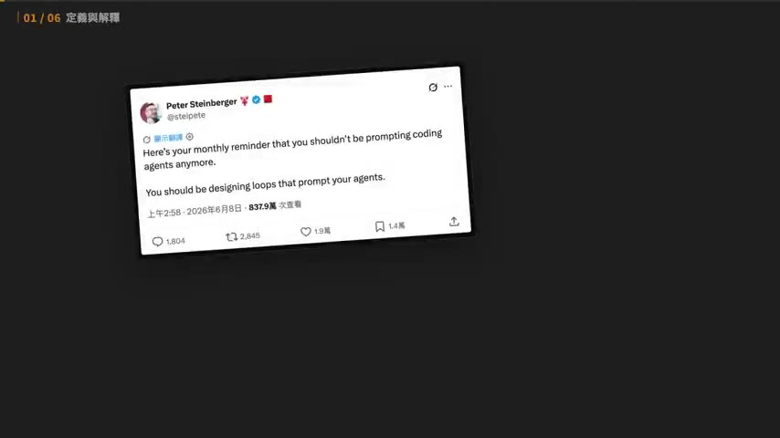
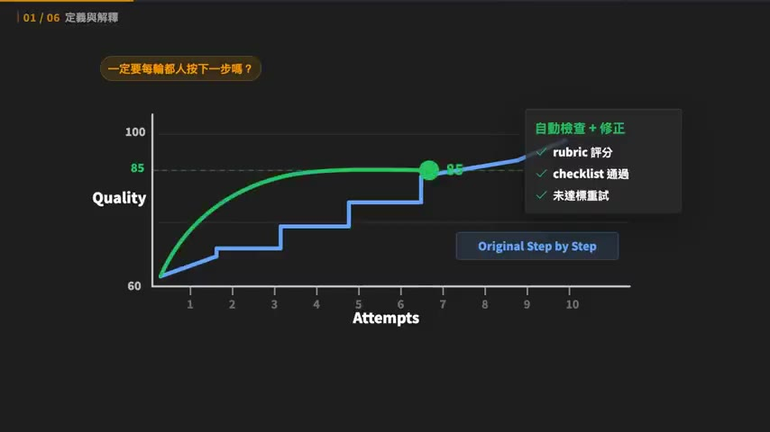
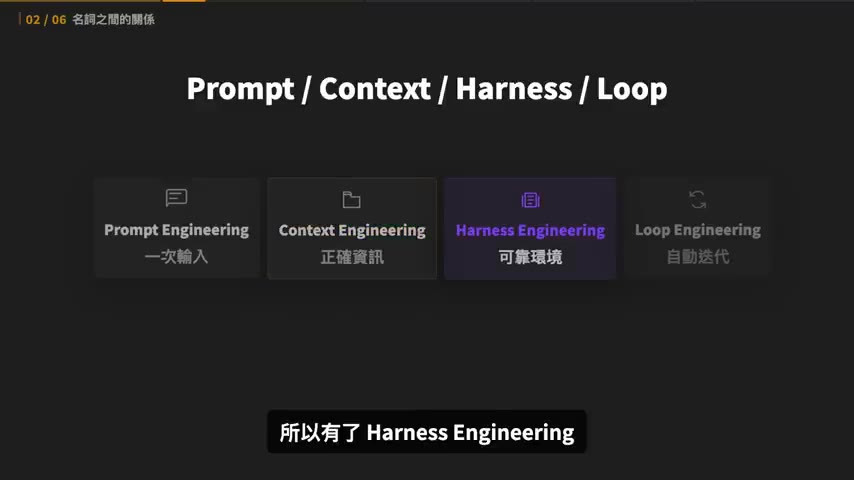
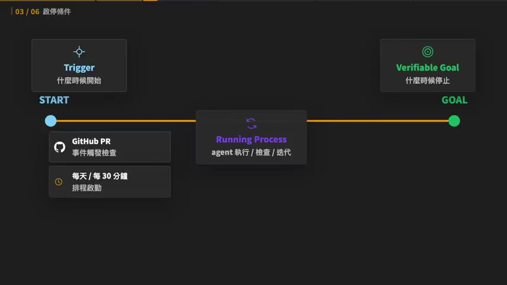
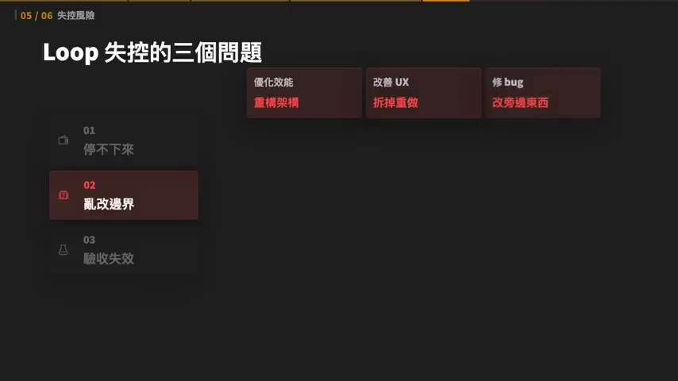
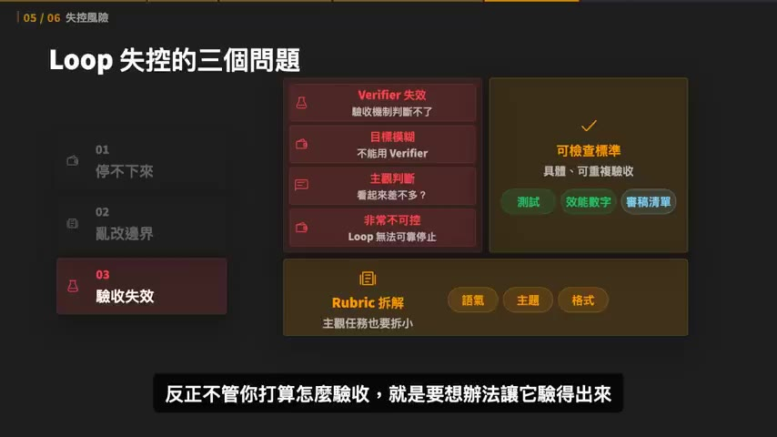
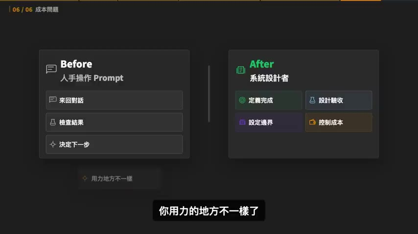

# Loop Engineering 解析，大神都不寫 prompt 了？

> **來源**：YouTube — [Gary Chen · Loop Engineering 解析，大神都不寫 prompt 了？](https://www.youtube.com/watch?v=kGYFSDd-ZVY)（00:13:06，2026-07-01 發布）
>
> 同頻道 Google AI 課系列的延伸主題，可與 [Day 1：Agent = Model + Harness](../2026-07-28-yt-google-vibe-coding-agentic-engineering-day1/summary.md) 對照——本片講的 Loop Engineering 正好接在 Harness Engineering 之後。

## TL;DR

- 三個人在 2026 年 6 月幾乎同時講同一件事：**不要再替 coding agent 寫 prompt，要設計 loop 讓 loop 去 prompt agent**。Addy Osmani 把它整理成 **Loop Engineering** 框架。
- 本質是把 **human in the loop 變成 agent in the loop**——不是取消審核，而是**把人提供 feedback 的邏輯標準化**，交給 agent 自行 review 並迭代。
- 一個 loop 由兩個問題定義：**Trigger**（什麼時候開始）與 **Verifiable Goal**（什麼時候停止）。後者是實作卡點所在，主觀任務要靠 **rubric 分級評分**或**二元檢查清單**轉成可驗證條件。
- Loop 失控有三種：停不下來（token 黑洞）、亂改邊界、Verifier 失效。三條規則對應：**hard stop**、**明確定義邊界**、**驗收標準要可機器檢查**。額外一條：**產出與檢查要分開**，同一個 agent 自產自評就是球員兼裁判。
- 作者的立場很明確且反潮流：**大多數人現在不需要 loop**。他自己仍偏好 human in the loop——更準、更有效率、更便宜。判斷三準則：會不會重複發生、完成標準清不清楚、token 帳單扛不扛得住。

## 重點摘要

### 1. 三個人同時說了同一句話 ([00:00] – [00:39])

2026 年 6 月初，OpenClaw 創辦人 **Peter Steinberger** 發了則 X 貼文：

> Here's your monthly reminder that you shouldn't be prompting coding agents anymore.
> You should be designing loops that prompt your agents.

差不多同一時間，Claude Code 負責人 **Boris Cherny** 也說自己不再給 Claude 寫提示詞，工作已經變成**寫 loop，讓 loop 來做這個工作**。接著 Google Engineering Lead **Addy Osmani** 發長文把這件事整理成一個框架，叫 **Loop Engineering**。

### 2. 定義：審核權從人手上部分讓出 ([00:40] – [02:29])

**過去的做法**：你打字說「幫我修這個 bug」→ AI 修一版回你 → 你看完發現測試還是壞的 → 你說「這裡不對」→ 它再修 → 你再看。**審核與給修改意見的是你本人。**

**Loop Engineering 的做法**：agent 自己改程式、自己跑測試、自己讀錯誤、自己再改，直到測試過，或連續幾次沒有進展就停下來回報。你不用每一輪都自己來，而是**一開始就講清楚**：目標是什麼、可以用哪些工具、怎麼驗證、什麼狀況算完成、什麼狀況要停下來找人。

作者舉的例子很好懂，而且不需要任何工程設定——**一句完整的 prompt 就能構成一個 loop**：

> 幫我做十張 YouTube 封面圖。評分標準四個：能不能讓觀眾一眼看懂影片在講什麼、能不能勾起好奇心、視覺對比夠不夠強、跟影片內容符不符合。做完之後用這四個標準幫每一張打分，把沒過關的挑出來重做一版，改完再用同一套標準重新打分。這樣跑兩輪，最後把分數最高的三張發給我。

這一句話其實包含了 loop 的四個步驟：**觀察 → 執行 → 驗收 → 修正**。

核心論證我覺得說得最漂亮的是這段：跟 AI 協作本來就不是一次做到完美，品質是從 60 分慢慢修到 100 分的。既然來回修改本來就會發生，**為什麼一定要每一輪都由人坐在螢幕前按「下一步」？** 有些檢查和修正先讓 agent 自己跑幾輪，雖然不保證一次到 100 分，但可以讓 agent **第一次交到你手上的版本是從 85 分開始**。

> 差別在於：以前這個「執行 → 觀察 → 再執行 → 迭代」的 loop 由**你**推動；Loop Engineering 強調的是由**使用者設計** loop，然後讓 **agent 自己推動**。

### 3. 四個名詞的關係 ([02:29] – [03:42])

| 名詞 | 一句話 | 強調什麼 |
|------|--------|---------|
| **Prompt Engineering** | 一次輸入 | 跟 AI 溝通的技巧——要做什麼、語氣、格式、限制、輸出長什麼樣，講越清楚結果越符合期望 |
| **Context Engineering** | 正確資訊 | 在對的時機給到不多不少的資訊，讓 AI 有足夠背景知識 |
| **Harness Engineering** | 可靠環境 | 設定規矩和邊界。「你是老闆，不能只叫員工努力，還要給他辦公室、工具、流程和權限」 |
| **Loop Engineering** | 自動迭代 | 把 **human in the loop 變成 agent in the loop** |

Loop Engineering 的關鍵動作不是「不審核了」，而是**人把自己提供 feedback 的邏輯標準化、講清楚**，讓 agent 能自行 review 並迭代。

### 4. Trigger 與 Verifiable Goal ([03:42] – [05:37])

一個 loop 的形成只由兩個問題決定：**什麼時候開始、什麼時候停止**，分別對應兩個名詞。

**Trigger（觸發機制）** 有三種形態：

- **事件** — GitHub 上有人開 PR，agent 自動開始檢查
- **排程** — 每天早上跑一次資料整理、每 30 分鐘檢查一次任務狀態
- **手動** — 你今天覺得這件事值得跑，就按下去

**Verifiable Goal（可驗證的目標）** 決定停止，可拆成兩個問題：**什麼叫做完成？AI 要怎麼檢查自己完成了？**

coding 任務比較好處理，判斷很乾脆、機器可檢查：所有測試通過、TypeScript 沒報錯、lint 沒違規、build 成功。但很多任務沒那麼乾淨——**叫 AI 寫一篇文章，什麼叫寫好了？叫它改一個產品頁，什麼叫改好了？**

> 把抽象概念變成清楚標準，是大多數人實作時最常遇到的卡點。

作者給了兩種把主觀變可驗證的方法：

**① Rubric 評分** — 先選定幾個面向（風格人設、語法用詞、內容主題），再替每個面向寫出**分級定義**。以「風格人設」為例：

| 分數 | 定義 |
|------|------|
| 5 | 完全符合設定的人設，用詞語氣一致 |
| 3 | 有點像但偶爾會出戲 |
| 1 | 根本沒有你的風格在裡面 |

關鍵是**每個分數都要定義清楚評分標準**，AI 才有依據可循，而不是隨意給分。

**② 二元檢查清單** — 把品質拆成一串 yes/no 問題：開頭三句有沒有抓住重點？有沒有冗詞贅字？專有名詞有沒有用錯？這種方式**比打分數更穩定**，也更容易判斷有沒有過關。

不論用哪一種，最後都要**收斂成一個明確的完成條件**：例如「三個面向的 rubric 都達到 4 分以上」或「檢查清單全部通過」。

### 5. 什麼任務值得做成 loop ([05:37] – [07:41])

這一段是全片最有價值、也最少見的部分——作者花了不少篇幅在**勸退**。

他先講一個通用原則：每次 AI 圈出現新詞，很多人會立刻把它用到所有地方，尤其看到高手展示四五個 agents 同時跑、一個 manager agent 指揮一堆 helper agents，整套看起來像一間 24 小時不睡覺的小公司，就很容易心動。

> 對於所有新功能，我建議的方式都是：先去了解這個功能運作的底層邏輯，然後再思考自己的工作流有沒有可以套用的地方。**通常一半以上的功能對我們來說都沒有用武之地**——因為這些功能的需求來源大多來自 OpenAI 跟 Anthropic 的工程師，而這些人幾乎是世界上最頂尖的人才。他們用得到的東西，我們不一定用得到。絕對不要盲目跟風。

**三個判斷準則：**

1. **會不會重複發生** — 一次性任務直接寫普通 prompt 就好（臨時查一個錯誤訊息、改一段小文案，沒必要為它設計一整套 loop）。Loop 對「**會反覆發生、每次流程差不多但細節又不完全一樣**」的任務才有價值。
2. **完成標準清不清楚**（最關鍵） — 你要能講出「什麼叫這件事做完了」。可以是「把網站部署到指定網域，並確保載入時間低於兩秒」或「修復所有 CI 錯誤直到狀態變回綠色」。抽象或主觀的東西就用 rubric / yes-no 方法。
3. **token 花費扛不扛得住** — Loop 不是免費的。每跑一輪 AI 要讀東西、想下一步、呼叫工具，可能還要請 reviewer 檢查。原本手動 prompt 三次就能解決的事，做成 loop 跑了二十輪還沒停——「這個帳單會非常有教育意義，教育你下次不要這樣」。

**額外一種適用情境**：想快速做 demo，核心 feature 的驗收標準很清楚（例如「做一個網站讓用戶能搜到最新新聞」），其他細節先不追求完美。用 loop 把主功能跑出來，細節再由人接手。

> 普通人學 Loop Engineering，第一步不是馬上自己搞一個，而是**怎麼判斷哪些需求可以用上、有沒有想清楚最後的目標**。

作者也直接表明自己的偏好：**比起 agentic loop，他仍更喜歡 human in the loop**——大多數人其實不需要 AI 不眠不休跑 27 小時，加上成本問題，「如果我像 OpenAI、Anthropic 的工程師一樣有接近無上限的 token 預算，我也會一直用，但一般人都沒有」。**human in the loop 往往更準、更有效率、也更便宜。**

### 6. Loop 失控的三個問題與三條規則 ([07:57] – [10:11])

根本難點：**人很難一次把所有偏好、細節、例外狀況都講完**，所以讓 agent 自己迭代一整個晚上，一個不小心可能偏到十萬八千里遠。

**① 停不下來 → 規則：一定要有 hard stop**

你說「幫我把這個 app 優化一下」，它改了一點、跑一下、看起來還能再優化，再改一點、又覺得還能再改。因為你沒告訴它什麼是「優化」——是前端視覺還是後端回覆速度？沒定義終點就變成 **token 黑洞**。

硬性停止條件要包含：最多跑幾輪、最多跑多久、最多花多少 token、三輪都沒進展就停下來回報。

> 這些限制聽起來保守，但它們正是 loop 不失控的關鍵。

**② 亂改邊界 → 規則：要定義邊界**

- 你說「優化效能」，它可能開始重構一堆本來不該碰的架構
- 你說「改善 UX」，它可能順手把元件拆掉重做
- 你說「修 bug」，它可能為了讓測試過而改掉一堆旁邊的東西

所以不能只說「測試要過」，還要說：**不能刪測試、不能改公開 API、不能動資料庫 schema、不能碰某些核心檔案**。

**③ Verifier 失效 → 規則：驗收標準要盡量變成可以檢查的東西**

目標模糊到不能用 Verifier，agent 就只能用很主觀的方式判斷——「這樣改完後看起來是不是差不多了」——非常不可控。測試、效能數字、審稿清單都比「看起來不錯」具體；真的很主觀的任務也要拆成 rubric（語氣是否符合、主題有沒有偏、格式有沒有對）。

**但作者補了一個很重要的警告**：

> 不是有分數就代表客觀。如果你叫 AI 做任務，然後 AI 自己評分，那就是**球員兼裁判**。

比較好的做法是**把產出跟檢查分開**——一個 agent 負責產出，另一個 agent 負責檢查；或乾脆在關鍵節點保留 human in the loop。否則從指標上看測試過了，實際上產品沒變好反而更糟。

> 總結：Loop Engineering 的核心不是讓 AI 自己跑，而是**你能不能把一個模糊意圖，翻譯成 AI 可以執行、可以驗收、可以停止、而且不會鑽漏洞的條件**。

### 7. 成本，與「工作往上移」 ([10:40] – 結尾)

Loop 很迷人，會讓人覺得按一下按鈕事情就自己往前走，但每一次自動往前走背後都有成本：讀 context、呼叫工具、跑測試、解讀錯誤、重試；再加 reviewer agent、subagent、多輪驗證，成本就不斷疊加。

連 Addy Osmani 自己都說 **Loop Engineering 目前還處於早期階段**，他保持謹慎態度，必須非常注意 token 成本。

**作者的建議是從小任務開始**：範圍小、目標清楚、工具有限、停止條件明確。例如：

- 每天整理一次固定資料夾
- 針對某個測試項目進行修復
- 針對一篇文章跑固定的品質檢查 checklist

這些小任務不會讓成本失控，但足以讓你體驗 loop 的精髓——怎麼定義目標、怎麼設計驗收、怎麼控制權限、怎麼讓 AI 在正確的地方停下來。

> Loop 把人的工作往上移。以前你是 **prompt 操作者**，一輪一輪跟 AI 對話、看它做了什麼、再決定下一步；現在你更像是 **系統設計者**，要定義目標、設計驗證、設定邊界、控制成本。**你用力的地方不一樣了。**

再往更高階推，可能會走向 **Software Factory（軟體工廠）**——工程師不再只是寫一段程式，而是在設計一套可以生產、測試、修正、部署軟體的系統。但作者認為「回到現在，這對一般人來說確實太遙遠了」。

收尾的立場很清楚：

> 大多數人並不需要一個 agent 不眠不休幫你跑 27 小時，而是**當 agent 說他做完的時候，你不用再來回調整，可以直接把成果發給老闆**。
>
> 不論這個觀念有沒有出現，做一個好 loop 的能力也是現在 AI 工作者的必備條件：讓 AI 知道什麼時候開始、知道什麼叫完成、知道哪些事情不能做、知道失敗時要停下。
>
> 最新的方法不一定是最好的方法，能解決你問題的方法才是好方法。

## 與同系列其他集的接點

- **Harness → Loop 是同一條路的下一段。** Day 1 講 `Agent = Model + Harness`（harness 六大件裡的 orchestration、hooks 就是 loop 的基礎設施）；本片的 Loop Engineering 是在 harness 之上再加一層自動迭代。四層關係圖（Prompt / Context / Harness / Loop）一張圖說完這兩年的名詞演進。
- **Software Factory 就是 Day 1 的 factory model。** 兩支影片用了幾乎相同的比喻（「開發者的產出不再是程式碼，而是產出程式碼的系統」），但本片對它的態度保守得多——明確說「對一般人太遙遠」。
- **Verifiable Goal 就是 Day 1 說的 evals。** Day 1 講「沒有 tests + evals，prompt 再精緻都還是 vibe coding」；本片把 evals 具體化成 rubric 與二元清單兩種可操作手法。**這是這支影片相對 Day 1 最有增量的部分。**
- 「球員兼裁判」的警告和 [Day 2+3](../2026-07-28-yt-google-ai-course-day2-3-mcp-a2a-skills/summary.md) 的 Red Team、Shadow Mode 是同一個譜系——**產出與驗證必須分離**。
