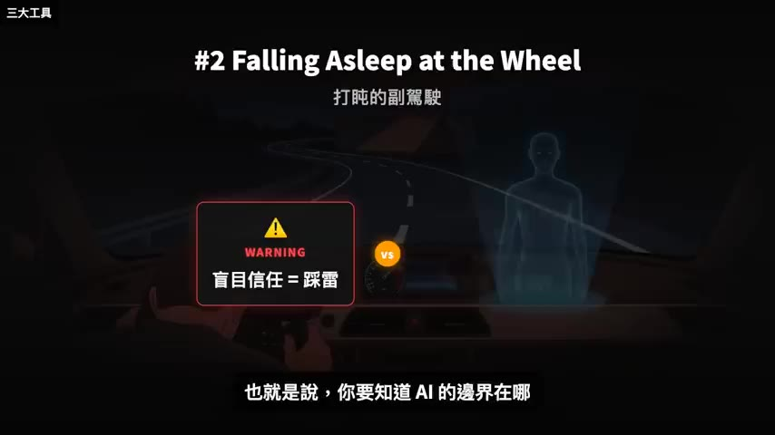
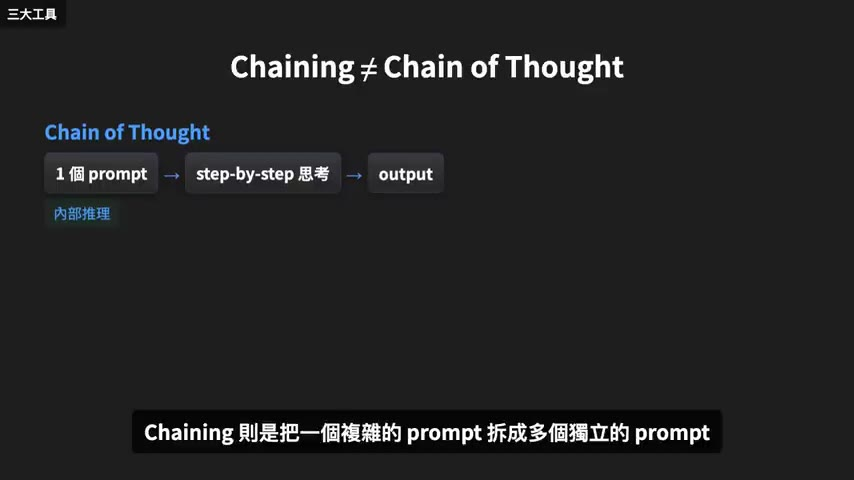
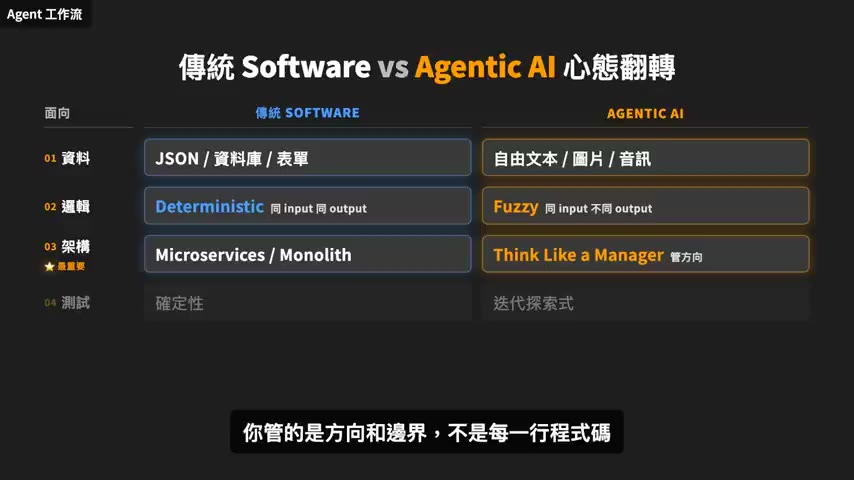
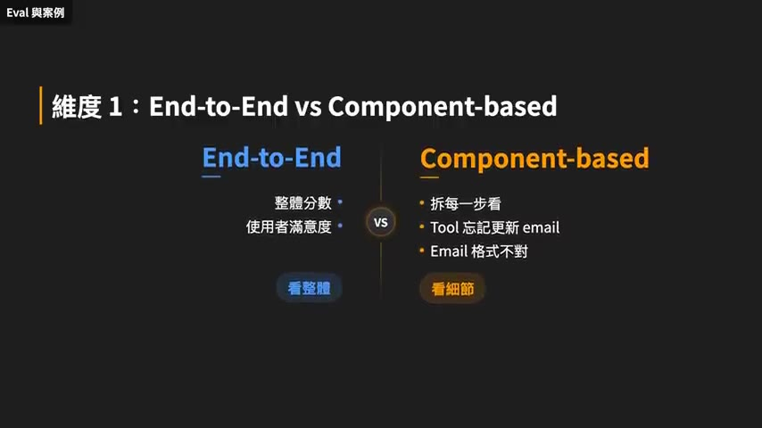
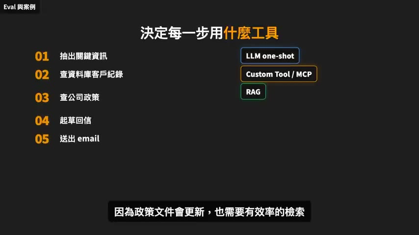
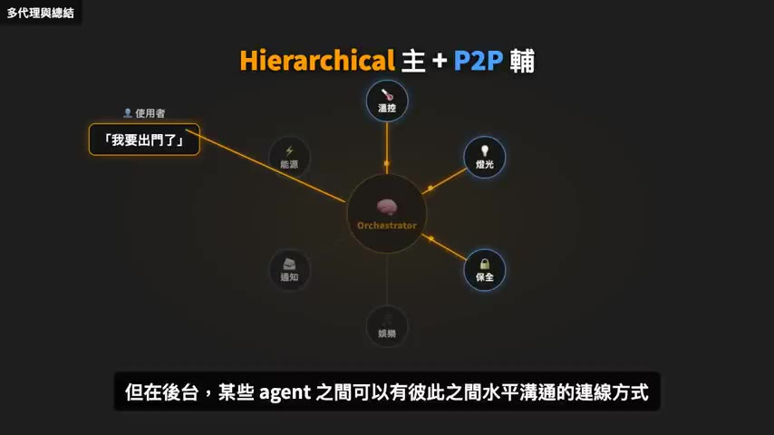
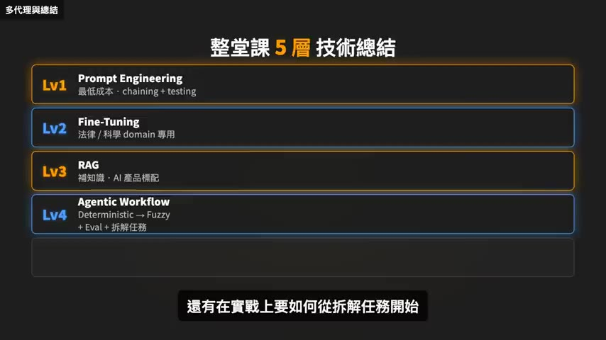

# 一部影片看完 Stanford AI 系統課程，從 LLM 到 Agentic Workflow

> **來源**：YouTube — [Gary Chen · 一部影片看完 Stanford AI 系統課程，從 LLM 到 Agentic Workflow](https://www.youtube.com/watch?v=eKW9ITaltWw)（00:27:23，2026-05-04 發布）
>
> 原始教材為 Stanford「Beyond LLM」課程（約 2 小時），本片是二手濃縮。
>
> 同頻道系列中最早、也最偏「全景地圖」的一支（2026-05 上傳，早於 Google 課程系列兩個月）。
> 與 [Google Day 1](../2026-07-28-yt-google-vibe-coding-agentic-engineering-day1/summary.md)、[Day 2+3](../2026-07-28-yt-google-ai-course-day2-3-mcp-a2a-skills/summary.md)、[Loop Engineering](../2026-07-28-yt-loop-engineering/summary.md) 有大量重疊但**視角不同**：
> Google 系列從「開發者怎麼工作」切入，這支從「AI 系統怎麼設計」切入。

## TL;DR

- 主軸是一張**縱軸 vs 橫軸**的地圖：橫軸（換更強 base model）是 OpenAI/Anthropic 在做的事，你施力的地方是縱軸——在現有 LLM 上疊工程技術（Augmenting LLM）。整堂課講的都是縱軸。
- 強化單一 LLM 有三件工具，優先序明確：**Prompt Engineering（最低成本，重點在 chaining）→ RAG（AI 產品標配）**，而 **Fine-Tuning 教授的立場是「能不做就不做」**，只有法律／科學那種需要重複高精度的 domain 才值得。
- 進到系統設計要先**翻轉工程心態**：資料從結構化變自由文本、邏輯從 deterministic 變 fuzzy、架構從精確控制每一步變 **think like a manager**、測試從確定性變迭代探索式。落地第一原則是「**能 deterministic 解的就 deterministic 解，剩下 fuzzy 的部分加護欄**」。
- Eval 是 production agentic 系統的命脈，框架是**三個維度交叉**：End-to-End vs Component-based、Objective vs Subjective、Quantitative vs Qualitative。核心操作原則是「**先人工掃出問題，再設計自動化 eval**；模型跟 prompt 一次只動一個變因」。
- Multi-agent 的存在理由只有兩個：**平行處理**（主要）與**可復用性**（次要）。一個 agent 能解決就不要硬上。而 agent 之間互相呼叫，本質上就是把 agent 當 tool，也就是 MCP 的心智模型。

## 重點摘要

### 1. 縱軸與橫軸：你能施力的地方 ([00:58] – [03:32])

LLM 要變強有兩條路：

- **橫軸** — 換更強的 base model（GPT-4 → GPT-5）。這是 OpenAI 跟 Anthropic 在做的事，一般人沒有能力也沒有金錢訓練自己的 LLM。
- **縱軸** — 在現有 LLM 上疊各種工程技術，又叫 **Augmenting LLM**。**這整堂課講的都是縱軸。**

教授整理的 base model 四個限制：

| 限制 | 說明 |
|------|------|
| 缺乏 domain knowledge | 你的公司資料、內部文件、產品規格 base model 都不知道。課堂例子：學生做自動化農業設備要判斷作物病害，這種 dataset 市面上根本找不到 |
| 資訊落後 | 模型不可能每幾個月重訓一次，新詞、新事件、新公司通通不認識 |
| 控制很難 | LLM 是機率性輸出，同樣 prompt 兩次結果可能不同。**教授說連 OpenAI 跟 xAI 這種資金最多、人才最齊的團隊都還沒辦法把 LLM 完全控制好**，更何況一般公司 |
| 長 context 表現退步 | 主流 context window 已到 100 萬 token（十幾本書），但仍有 **lost in the middle** 現象 |

作者用的 lost in the middle 例子很具體：把「Gary 午餐吃了一顆蘋果」這種小細節藏進公司過去一年的會議記錄裡，再問模型「Gary 午餐吃了什麼」，雖然現況已顯著改善，但有時候還是答不出來。

### 2. Prompt Engineering：重點是 chaining，不是修辭 ([03:32] – [06:47])

教授的立場：**他不認為 prompt engineer 會是一個職業**，因為提示詞工程應該是每個工程師都該會的基本技能。「你不會靠 prompt engineering 當飯吃，但這個技能會讓你在職涯裡用一輩子，就像九九乘法表一樣是基本功。」

**BCG 的實驗**（顧問分三組：無 AI／可用 ChatGPT／可用 ChatGPT 且受過提示詞訓練），三個發現：

1. **The Jagged Frontier（鋸齒邊界）** — AI 不是在所有任務上都表現得好。有些任務搭配 AI 顯著加分，有些反而扯後腿。
2. **Falling asleep at the wheel（在方向盤前打瞌睡）** — 當你不知道任務剛好是 AI 不擅長的，卻太信任它把產出直接送出，**結果比沒用 AI 還慘**。

3. **Centaurs vs Cyborgs（兩種使用模式）**：

| | Centaur（半人馬） | Cyborg（生化人） |
|---|---|---|
| 模式 | 分工委派型 | 高頻來回型 |
| 做法 | 丟一個長 prompt 叫 AI 做整份簡報，自己去做別的事 | 跟模型一句一句對話協作 |
| 誰在用 | 企業自動化 workflow | 學生 |
| 適合 | 重複性高、流程清楚的任務 | 需要判斷、創意、來回校正的任務 |

> 兩者沒有好壞之分，實務上兩種都會用，**重點是要有意識地切換**。

**一個好 prompt 的三要素**：給誰看、產出格式、重點是什麼。「請幫我總結這篇文章」很爛（什麼資訊都沒給）；「請將這份再生能源論文整理成 5 個重點摘要，並聚焦在其背後的政策意涵上」立刻讓模型知道對象是政策制定者、長度 5 點、重點在政策意涵。

**但教授說最常用、最重要的技巧是 Prompt Chaining**，而且特別澄清它跟 Chain of Thought 不一樣：

- **Chain of Thought** — 1 個 prompt，叫模型 step-by-step 思考（內部推理）
- **Chaining** — 把一個複雜 prompt 拆成多個獨立 prompt，前一個的 output 餵給下一個

客訴回信的例子：單一 prompt「讀這封投訴信，寫一封專業的回應」是個黑盒子，產出有問題你不知道該調哪裡。拆成三個（抽出客戶在抱怨什麼 → 用抽出的問題起草大綱 → 用大綱寫完整回信），每一步都能獨立測試、獨立 debug。

> Chaining 不只讓模型表現更好，也讓你得到 **observability**——能觀察 LLM 在做什麼、哪個流程出了問題。

### 3. Fine-Tuning：能不做就不做 ([06:47] – [07:52])

教授的立場很直接，四個理由：

1. **要大量優質數據** — 需要大量高品質、標注好的資料，成本對一般人太高
2. **容易 overfit** — 在特定任務變很強，但通用問題反而答不出來，失去 base model 原本的廣度
3. **時效性差（最傷的點）** — 你花兩個月 fine-tune 完上線，下個月新一代 base model 出來直接打贏你
4. **prompt engineering 通常能達到一樣效果且成本低很多** — 而且**換 base model 時 prompt 大多是 portable 的，fine-tuned 模型不行**

值得做的少數情境：法律、科學那種需要重複高精度輸出的領域，或 base model 在某個 domain 上表現吃力。

### 4. RAG：把模型鎖在你的資料範圍內 ([07:52] – [10:50])

教授給的答案是：domain knowledge 塞不進 prompt、fine-tuning 成本效益又對不起來時，就用 RAG。（作者補充這是 AI 工程師面試最常考的題目之一，常被要求「用 5 歲小孩聽得懂的方式解釋」。）

**標準流程**（以藥物副作用這種高準確度醫療場景為例）：

1. 所有資料／文件用 **embedding 模型**轉成向量，存進 **vector database**
2. 使用者問題用**同一個** embedding 模型轉成向量
3. 用距離 metric 找出語意最相近的 documents
4. documents + system prompt + user query 組成最終 prompt 餵給 LLM

關鍵在於**這不是關鍵字比對而是語意比對**——就算文件裡寫的是「不良反應」而不是「副作用」，一樣找得到。

**Prompt template 的鎖定寫法**：

> 根據以下 documents 回答使用者的問題。如果 documents 裡沒有答案，就說「我不知道」。

> 這樣設計是為了把模型鎖在你提供的資料範圍內，避免它自由發揮、憑空捏造。

還可以要求模型附上來源（第幾頁、第幾章、第幾行加超連結），讓使用者自行回溯驗證。

**Chunking**：一種藥的文件可能 50 頁，整份直接轉向量會遺失細節。最基本是切成固定大小片段各自轉向量；更進階是**多層次存儲**——同時保留整篇、每章、每段的向量，retrieval 時先找到相關章節再往下鑽到精確段落。

**「長 context 會不會取代 RAG？」** 教授的回答是「**理論上對，實務上錯**」：

- **Latency** — 每次問問題模型都要把整個 Google Drive 重讀一次，沒人等得了
- 類比：搜尋引擎也是靠預先建好的索引快速定位，不可能每次 query 都把整個網路重爬一遍
- RAG 除了準確度，還有**檢索效率**與**可即時更新**的優勢

### 5. 工程心態的四個翻轉 ([12:35] – [14:58])

先講命名：**agentic workflow 這個詞來自吳恩達**（Coursera 共同創辦人、Google Brain 創始負責人、前百度首席科學家）。他用這個詞是因為「AI Agent」已經被用到爛掉——有人寫個長 prompt 叫 agent，有人做複雜 multi-agent 系統也叫 agent，這詞什麼都能套反而什麼都說不清楚。

> **RAG 是工具，Agent 是使用 RAG 這個工具的系統。**

退貨的例子講得很清楚：RAG 只能丟政策文件給你；agent 則是用 RAG retrieve 政策、主動問訂單編號、用 tool 查訂單、確認退費、告訴你 3–5 個工作天會處理。

| 面向 | 傳統 Software | Agentic AI |
|------|--------------|-----------|
| 資料 | JSON / 資料庫 / 表單，格式固定邊界清楚 | 自由文本 / 圖片 / 音訊，沒有固定格式 |
| 邏輯 | **Deterministic** — 同 input 永遠同 output，可預測可重現 | **Fuzzy** — 同 input 不同時間可能不同 output |
| 架構心態（最重要） | Microservices / Monolith — 精確控制每一步執行路徑 | **Think like a manager** — 給目標和限制讓它自己決定怎麼完成，你管方向和邊界不是每一行程式碼 |
| 測試 | 確定性，跑一百次結果一樣 | 迭代探索式，沒辦法窮舉所有情況 |

**由此導出第一個落地原則**：

> 能 deterministic 解的問題，就 deterministic 解；剩下 fuzzy 的部分，加上護欄。

教授自己的例子（skills assessment 評分系統）：選擇題、配對題、拖拉題用 deterministic 算分（有標準答案）；語音題、語音加 coding 的混合題型沒有標準答案，只能讓 LLM 做 **fuzzy scoring**——判斷這個人有沒有真的理解概念、表達是否清晰、邏輯有沒有跑掉。

但 fuzzy 一定會犯錯，在考試評分這種高風險場景不可接受，所以他們設計了 **Appeal feature**：受測者可以對 agent 的判分提出申訴，由真人介入審查糾正。

> 這就是護欄的具體形式——**不是試圖讓 AI 零錯誤，而是在它出錯的時候有人接得住。**

### 6. 打造一個 agent 的三要素與三層自主性 ([15:00] – [17:46])

教授用「訂機票去巴黎」當範例，整理出**三個核心要素**：

1. **Prompts** — 告訴 AI 它的角色是什麼、能做什麼、不能做什麼
2. **Context Management** — 管理 agent 在每個當下看得到的資訊。本質上只做一件事：**把對的資訊在對的時間提供給 agent**。Memory 分兩層：
   - **Working memory** — 高頻要快的（使用者名字、這次目的地是巴黎）
   - **Archival memory** — 低頻可以慢的（使用者過去五年的訂房紀錄），需要時再撈
3. **Tools** — 分兩種：**做事的**（Flight Search、Hotel Booking、Payment）與**查資料的**（去 CRM 撈客戶資料、去資料庫查訂單）

**agent 自主性的三層**：

| 層級 | 做法 | 評價 |
|------|------|------|
| **Hardcoded steps** | 步驟全寫死：先識別意圖 → lookup history → 呼叫 API，照順序走 | 安全可預測，但很僵硬，遇到預期外情況就卡住 |
| **Hardcoded tools，agent 自己決定步驟** | 給它一組工具，告訴它「你是 travel agent，這些是你能用的工具，怎麼用你決定」 | **目前最常見的 production setup，也是教授推薦的起點** |
| **Fully autonomous** | agent 自己決定步驟甚至自己創工具（給 code editor、web search，叫它自己寫 code） | 能力最強風險最高。「如果 agent 判斷錯誤，自己訂了 100 張機票，你就完蛋了」 |

**MCP** 的定位：傳統做法要替每個 API 單獨寫串接邏輯、教 LLM 這個 API 怎麼用；MCP 在中間放一個協議層，agent 只需要跟 MCP server 溝通。教授的比喻是**通用插頭**——以前每個國家插座規格不一樣要帶一堆轉接頭，有了 MCP 插一個就全通。

教授對 MCP 更大的想像是 **agent-to-agent communication**：把別人做好的 agent 當作一種工具，讓自己的 agent 去呼叫它，就像現在呼叫 API 一樣。這是 multi-agent 系統的基礎。

### 7. Eval 框架：三個維度交叉 ([17:46] – [20:46])

> Eval 是 production agentic 系統的**命脈**。

| 維度 | 兩端 | 說明 |
|------|------|------|
| **1** | End-to-End vs Component-based | E2E 看整體（使用者滿不滿意）；Component 拆開每一步看（這個 tool 老是忘記更新 email、送 email 那步格式不對）。**光看整體你知道哪裡壞但不知道為什麼壞；光看 component 你可能修了細節但整體體驗還是差——兩個都要做** |
| **2** | Objective vs Subjective | Objective 可自動驗證（使用者說 order ID 是 X，LLM 寫進 DB 變成 Y，寫個 Python script 自動對齊）；Subjective 沒有標準答案（語氣好不好、夠不夠有同理心），靠人工評分或另一個 LLM 當評審 |
| **3** | Quantitative vs Qualitative | Quantitative 是數字（改地址成功率幾趴、每環節延遲多久）；Qualitative 是感覺（在哪裡幻覺、語氣哪裡不對、使用者哪一步卡住）。**Qualitative 要人工一筆一筆看，沒有捷徑** |

**LLM-as-Judge 的四種主流玩法**（可混用）：

1. **Pair-wise comparison** — 給 judge 兩個答案問哪個比較好
2. **Single-answer grading** — 直接打 1–5 分
3. **Reference-guided pair-wise** — 多給一個標準答案做對比，讓評分更有依據
4. **Rubric-based** — 自訂評分標準（5 分 = 100 字以內含三個重點且第一句是 overview；0 分 = 答非所問冗長失焦）

**實際跑一個 subjective eval 的四步**（以 travel agent 禮貌度為例）：

1. **Error analysis** — 從一千個使用者裡抽二十個對話**人工讀**，你可能發現 LLM 講話超短、有點機車、沒同理心。**這步不能省**，要先知道問題長什麼樣才能設計出對的 eval
2. **設計 eval** — 用 LLM-as-Judge 加自己寫的禮貌度 rubric，把第一步發現的問題翻譯成評分標準
3. **A/B test 模型** — 固定 prompt，把底層模型換掉，跑同一批對話看哪個禮貌度最高
4. **A/B test prompt** — 固定模型，把 `act like a travel agent` 改成 `act like a helpful travel agent`，看一個詞的差距影響多大

> 核心原則只有一個：**先人工掃出問題，再設計自動化 eval**；而且模型跟 prompt 這兩個變因**一次只動一個**。

### 8. Case study：客服 agent 從零到上線 ([20:46] – [23:34])

題目：使用者說「我要改 A127 訂單的地址，因為我搬家到建國南路了」。

課堂上一個學生的回答讓教授很喜歡：**「我會先去客服旁邊坐一到兩天，看他們實際怎麼處理這種請求。」** 因為你要先理解人怎麼做這件事，才知道怎麼讓 AI 做。

這就是第一步 **task decomposition**。觀察後會發現客服處理一個改地址請求其實走五步，而每一步用什麼工具是分開決定的：

| # | 步驟 | 工具 | 為什麼 |
|---|------|------|--------|
| 1 | 抽出關鍵資訊（intent、order ID、新地址） | LLM one-shot | 單純一次 API 呼叫就能解決 |
| 2 | 查資料庫客戶紀錄 | Custom tool 或 MCP server | 要實際存取系統 |
| 3 | 查公司政策（能不能改地址？是否已出貨？） | RAG | 政策文件會更新，也需要有效率的檢索，不能讓客戶等太久 |
| 4 | 起草回信 | LLM | 根據前幾步收集到的資訊 |
| 5 | 送出 email | email 寄送工具 | — |

> 做這些判斷的方式很簡單：**先問自己哪些步驟是 fuzzy、哪些是 deterministic**，再決定每一步用 LLM one-shot、RAG、tool 還是其他。
> 這就是 AI Builder 真實在做的工作——知道每個工具、每種技術的能力和限制，然後炒出一盤你需要的菜。

最後把 eval 三維度全部用上：E2E 看最終回覆正確性與滿意度；Component 看抽資訊準度、API 錯誤率、政策遵守率；Objective 自動驗證 order ID 與退費政策；Subjective 靠人工加 LLM-as-Judge 看禮貌與同理心；Quantitative 看成功率與 latency；Qualitative 看哪裡有幻覺、語氣不一致、使用者在哪步困惑。

**整條流程收斂成三步**：先把大任務拆解成小任務 → 再設計工作流程 → 最後建立評估系統確保產出穩定。

### 9. Multi-Agent：兩個理由與兩種拓撲 ([23:34] – [25:39])

**存在理由只有兩個：**

- **平行處理（主要）** — 訂機票時「找航班、找飯店、查天氣」完全可以同時進行，一個 agent 只能一件一件做
- **可復用性（次要）** — 公司裡的 design agent 可以給行銷團隊用也可以給產品團隊用

> 但做產品時要先問自己**真的有需要嗎**？一個 agent 就能解決的任務硬上 multi-agent 反而增加複雜度。**工程設計能簡單就簡單，不要 over design。**

**兩種互動模式**（以智慧家庭為例：溫控、燈光、保全、娛樂、通知、能源管理 + 一個 Orchestrator）：

- **Hierarchical** — 使用者只跟 orchestrator 講話，由它派工，指揮鏈清楚
- **Flat** — agent 之間直接互通，沒有中間人

教授建議**以 hierarchical 為主**——從使用者角度你不想同時跟五個 agent 講話，你只想跟一個 assistant 說「我要出門了」，它自己去協調燈光、保全、溫控。但**在後台某些 agent 之間可以有水平連線**（例如溫控 agent 直接跟能源管理 agent 互通），省掉每次都過 orchestrator 的溝通成本。

> 當你讓 agent 之間互相溝通，本質上就是 MCP protocol——**你把 agent 當作 tool，就跟把 API 當作 tool 一樣**。這個心態一旦想通，設計就清楚了：每個 agent 對外暴露一組 tool-like 介面，其他 agent 像呼叫工具一樣呼叫它。結構乾淨、容易 debug、也支援平行處理。

### 10. 五層技術總結 ([25:39] – 結尾)

| 層 | 技術 | 一句話 |
|---|------|--------|
| Lv1 | **Prompt Engineering** | 最低成本，重點放在 chaining 跟 testing |
| Lv2 | **Fine-Tuning** | 除非法律／科學那種需要重複高精度的 domain，或興趣使然，否則別沒事找事去調模型 |
| Lv3 | **RAG** | 幫模型補足知識的標準解法，做 AI 產品基本上一定會碰到 |
| Lv4 | **Agentic Workflow** | 從強化單一 LLM 進到系統設計；重點是心態從 deterministic engineering 轉到 fuzzy engineering，以及對應的 evaluation 系統 |
| Lv5 | **Multi-Agent** | 把每個 agent 都當成工具，彼此協作提升速度與復用性 |

> 有了這樣的認知，你就不會盲目跟風——看到別人在做 multi-agent 就跟著做，看到別人講 fine-tuning 覺得很帥就去玩自己的模型。

作者最後給的行動建議：**從實作中學習**。看看生活或工作上有什麼痛點，從痛點出發思考解決方法，過程中就會發現自己需要學會哪些技術，也就能有效率地規劃學習路線。

## 與同系列其他集的接點

這是系列裡**最完整的一張技術地圖**，而且時間上最早（2026-05）。Google 課程系列（Day 1 / Day 2+3）講的是「開發者怎麼工作」，這支講的是「AI 系統怎麼設計」——兩者互補而非重複：

| 概念 | 本片（Stanford） | Google 系列 |
|------|-----------------|------------|
| MCP | 通用插頭，agent-to-agent 的基礎 | Day 2+3 講得更細（MCP vs A2A 的單向/雙向差異、安全紅線） |
| Eval | **三維度交叉框架 + LLM-as-Judge 四玩法 + 四步操作流程** | Day 2+3 是四道防線（Evals as Unit Tests / Golden Dataset / Red Team / Shadow Mode） |
| Context 管理 | 三要素之一，Working / Archival memory 二分 | Day 1 是六種 context + static/dynamic 二分 |
| 心態轉變 | deterministic → fuzzy engineering | Day 1 是 factory model、你是工廠經理 |
| 拆任務 | task decomposition + 每步選工具 | Loop Engineering 的 Verifiable Goal；Brownfield 五步的分段 review |

**兩處明顯的觀點衝突，值得注意：**

1. **Fine-tuning 的立場**——本片教授說「能不做就不做」，理由包含「新一代 base model 出來直接打贏你」。這和 Google 系列完全不衝突（Google 那邊根本沒提 fine-tuning），但和業界某些 domain-specific 模型的做法有張力。要用時記得這是 2026-05 的判斷。
2. **Multi-agent 的態度**——本片和 Loop Engineering 那支立場一致（能簡單就簡單、不要 over design），但 Google Day 2+3 講 A2A / Agent-as-a-Service 時明顯樂觀得多。三支影片放在一起看，**Google 是在推生態系，Stanford 教授和這位作者都在勸退**，這個落差本身就是有用的資訊。

## 我的看法

**框架可以直接用，轉述要打折。** 這支的概念密度是整個系列最高的，Eval 三維度交叉那張表尤其好用——它比 Google Day 2+3 的四道防線更適合當**設計時**的檢查表，四道防線偏的是**上線前**的流程。但它有一個硬傷：影片只說「Stanford 有一堂課叫 Beyond LLM」，沒給課號、教授姓名、公開連結。整支是 2 小時課程的二手濃縮，所有「教授說」都無法回溯。BCG 那個實驗也只給了公司名和三個結論，沒有論文出處（Jagged Frontier 與 Centaur/Cyborg 的原始出處應該是 Dell'Acqua 等人與 BCG 合作的 working paper，但影片沒說）。當成思考骨架很好，寫進正式文件前得自己找原文。

**最可複用的三個切分。** 我認為值得記進長期詞彙表的是這幾個：`Centaur vs Cyborg`（有意識切換委派型與協作型，這個二分我沒在別處看過）、`agent 自主性三層`（hardcoded steps / hardcoded tools / fully autonomous，而且明確說第二層是 production 起點）、`deterministic vs fuzzy 的落地原則`（能 deterministic 解的就 deterministic 解，剩下加護欄）。第三個配上 Appeal feature 那個例子特別完整——**護欄的目標不是讓 AI 零錯誤，而是它出錯的時候有人接得住**，這句比多數談 AI 安全的內容都務實。

**Eval 那節有一條規則最容易被跳過。** 「先人工掃出問題，再設計自動化 eval」聽起來像廢話，但實務上大家都是反過來做——先想像幾個失敗場景寫成測試，然後在真實流量上撞到完全沒想到的另一批。教授的順序是先抽二十個真實對話人工讀完，再把讀到的問題翻成 rubric。另一條同樣容易漏：**模型跟 prompt 一次只動一個變因**。任何「A 模型比 B 模型準」的比較，如果沒有一起標註 prompt 版本，那個數字就不可信。

**多數人會停在 Lv3。** 五層總結（Prompt Engineering / Fine-Tuning / RAG / Agentic Workflow / Multi-Agent）看起來像階梯，但它其實不是——Lv2 教授明講「能不做就不做」，Lv5 也說「一個 agent 能解決就不要硬上」。真正要爬的只有 Lv1 → Lv3 → Lv4，而且 Lv4 的難度不在技術，在心態從 deterministic 換成 fuzzy 之後，你的測試方法整套要重寫。這一點跟同系列 Loop Engineering 那支的結論一模一樣：**能驗證，才能放手。**
