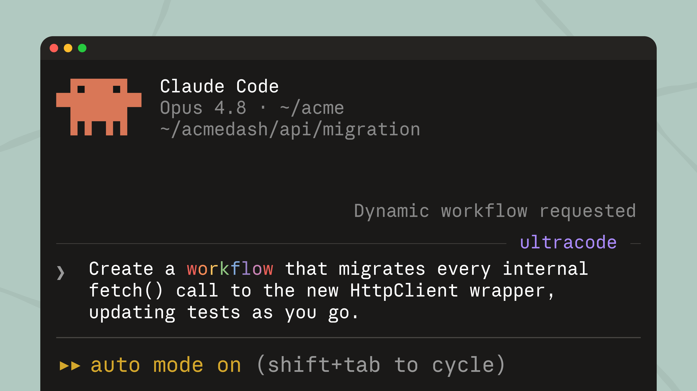
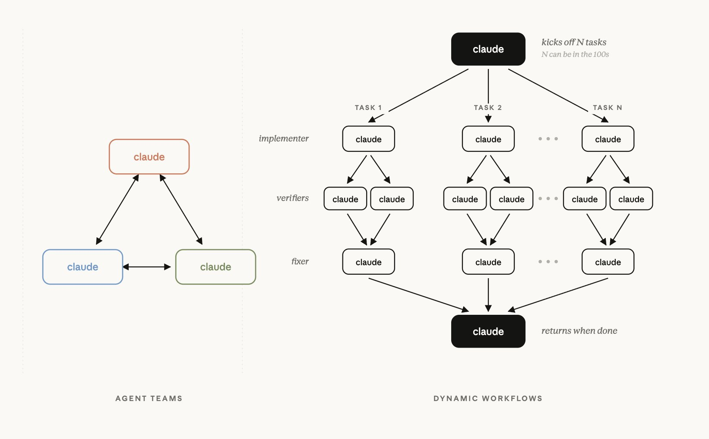

# 從 Code Act 到 Claude Code Dynamic Workflows 深度技術解析

> **來源**：[aihao.tw · 從 Code Act 到 Claude Code Dynamic Workflows 深度技術解析](https://blog.aihao.tw/2026/06/05/code-act-to-dynamic-workflows/)（ihower，2026-06-05）



---

## 技術演進脈絡

「用程式碼當 agent 行動」從 2024/2 的 CodeAct 論文一路推到 2026/6 Claude Code 的 dynamic workflows，是一條完整的研究 → 產品線。本文沿 6 個階段走一遍，最後對照同期推出的 Agent Teams。

> 一句話：**模型動態寫腳本，腳本決定性執行**。動的是「腳本被生出來」這一刻，跑起來就是規規矩矩、可重播的程式。

### 一張表看完整條光譜（程式碼權限演變）

主圖的視覺敘事用文字攤開：每一階段都是「限制了什麼 → 換到什麼穩定性」的取捨。

| 階段 | 生成的程式碼呼叫什麼 | 能開子代理人? | 限制 → 換到的穩定性 |
|---|---|---|---|
| Code Interpreter | 只有 Python 套件、檔案（碰不到 agent 工具） | ✗ | 運算不設限，但**站在 agent loop 外** |
| **CodeAct**（2024/2） | agent 的工具（固定函式） | ✗ | 幾乎不設限：**表達力最大，但最難控管** |
| **Code Mode**（Cloudflare） | 包好的一整套 SDK（= 那套 API） | ✗ | 框在 SDK 內：**用熟悉的程式碼駕馭龐大 API、省上下文** |
| **PTC・Deep Agents Interpreter**（Anthropic / LangChain） | agent tools，甚至開子代理人 | ✓ | 靠 allowlist 開放：**結果留在程式碼、保住控制面** |
| **Dynamic Workflows**（Claude Code 2026/6） | 只有編排函式 `agent()` / `pipeline()` / `parallel()` | ✓ | 只能編排、禁時間亂數：**換到 resume、可重播、決定性** |

---

## 1. CodeAct 的核心洞見

論文：[*Executable Code Actions Elicit Better LLM Agents*](https://arxiv.org/abs/2402.01030)（2024/2）

讓 LLM **直接寫可執行 Python 程式碼**當作行動，而非輸出 JSON function call。兩個關鍵優勢：

1. **訓練分布貼合**：模型在訓練時看過幾百萬個開源專案，對程式碼天生熟悉；工具呼叫用的特殊 token 是合成資料硬訓出來的
2. **組合性內建**：迴圈、條件、變數傳遞、把好幾個工具輸出串起來，程式碼語意天生就有

### 實例：四國手機比價

JSON function calling 寫法（**10+ 次模型往返**）：

```
→ {"tool":"lookup_rate","country":"Germany"}
← exchange_rate=1.1, tax_rate=0.19
→ {"tool":"lookup_phone_price","country":"Germany"}
← 700
→ {"tool":"convert_and_tax","price":700,...}
← 833
→ {"tool":"lookup_shipping_cost","country":"Germany"}
... × 4 國
```

CodeAct 寫法（**1 段程式碼、1 個 action**）：

```python
countries = ["USA","Japan","Germany","India"]
final_prices = {}
for country in countries:
    rate, tax = lookup_rate(country)
    price = lookup_phone_price("CodeAct", country)
    converted = convert_and_tax(price, rate, tax)
    shipping = lookup_shipping_cost(country)
    final_prices[country] = estimate_final_price(converted, shipping)
cheapest = min(final_prices, key=final_prices.get)
```

> **澄清**：CodeAct ≠ Code Interpreter。Code Interpreter 把「跑程式碼」當成眾多工具之一，程式碼**碰不到** agent 的其他工具；CodeAct 是把整個決策過程連同函式呼叫一起寫進同一份程式碼。

開源實作：Hugging Face [smolagents](https://github.com/huggingface/smolagents) 的 `CodeAgent`。

---

## 2. Code Mode 與「組合稅」

Cloudflare 把同樣思路套到 MCP 工具爆炸的問題上：把數千個 API 端點轉成有型別的 TypeScript SDK，模型只用 `search()` 跟 `execute()` 兩個 agent 工具。

| 維度 | 傳統做法 | Code Mode |
|---|---|---|
| Agent 工具數 | 每個端點一個 | 只有 2 個 |
| 上下文成本 | **117 萬 token** | **約 1,000 token** |

### 「組合稅」（composition tax）

> 每次工具呼叫結果都得塞回模型神經網路，再被原封不動抄到下一個呼叫的輸入，白白浪費 token 跟延遲，還多出一次推理。

寫成程式碼可在執行環境裡直接串接，跳過這道稅。

參考：[Cloudflare Code Mode](https://blog.cloudflare.com/code-mode/) / [Code Mode + MCP](https://blog.cloudflare.com/code-mode-mcp/)

---

## 3. Programmatic Tool Calling（PTC）

Anthropic 的做法：在工具定義加 `allowed_callers: ["code_execution_20260120"]`，Claude 不會逐一呼叫工具，而是**寫一段 Python，在容器裡組合執行**。

### 執行機制

1. Claude 在 Anthropic 容器內寫程式碼（含迴圈、條件、多個工具呼叫）
2. 跑到 `result = await query_db(sql)` 時，容器暫停，工具呼叫以 `tool_use` 事件回傳給使用者伺服器
3. 工具仍跑在使用者那邊，結果回到程式碼繼續執行
4. **中間結果完全不進 Claude 的 context window，也不計入 token**
5. 整段程式碼跑完，Claude 只收到最後的 stdout

### 「allowlist」的精神

`allowed_callers` 是**白名單**而非全開 — 你逐個工具點頭「這個能被容器呼叫」。對危險工具（刪資料、付款、發 email）可以**故意不加** allowlist，保留「只能 Claude 直接呼叫一次」，避免被程式碼裡的迴圈意外連發。這就是上面對照表寫的「結果留在程式碼、**保住控制面**」的具體機制：程式碼能組合工具沒錯，但用 allowlist 決定哪些能組合。

對比：

| | 結果走向 | 誰能用工具 |
|---|---|---|
| 一般工具呼叫 | 全塞回 Claude context | 全靠 prompt 約束 |
| Code Execution（無 PTC） | 留在容器 | 碰不到 agent tools |
| **PTC（有 allowlist）** | **留在容器** | **明確白名單** |

### 適用 / 不適用

- ✅ 大量平行分流、結果很大可先在程式碼裡過濾
- ❌ 嚴格循序、每一步都要 Claude 看完上一步才能決定下一步
- ❌ 目前不支援 MCP connector 提供的工具

參考：[Claude PTC 官方文件](https://platform.claude.com/docs/en/agents-and-tools/tool-use/programmatic-tool-calling)

---

## 4. 開源實作：LangChain Deep Agents

### Interpreter vs 沙箱：方向相反的安全模型

| | 預設能力 | 隔離層 |
|---|---|---|
| 沙箱（gVisor / microVM） | 先給整台電腦再往下收 | OS / 硬體層隔離 |
| Interpreter（QuickJS 類） | 預設只有語言執行環境，要什麼明確給 | 跑在 harness 同行程，沒綁主機 API |

> **能力控管（capability scoping）防的是「能碰到什麼」；VM 隔離防的是「會不會逃出去」。**

### Interpreter Skills

開發者把「已知有效的固定流程」寫成 TypeScript 模組註冊成 skill：

- `SKILL.md`：告訴模型何時用
- `index.ts`：寫死的確定性流程

```typescript
const { triage } = await import("@/skills/github-triage");
const result = await triage("langchain-ai/deepagents", {
  issues: true, prs: true, discussions: true,
});
result.toMarkdown();
```

模型只決定**要不要用 / 傳什麼參數 / 結果怎麼處理**；triage 內部怎麼抓資料、怎麼開子代理人，全是寫死的。

參考：[Deep Agents Interpreter](https://www.langchain.com/blog/give-your-agents-an-interpreter) / [Interpreter Skills](https://www.langchain.com/blog/interpreter-skills)

---

## 5. 理論支點：RLM（Recursive Language Models）

由 MIT 的 Alex Zhang、Tim Kraska、Omar Khattab 提出（2025/10 部落格，年底 [arXiv:2512.24601](https://arxiv.org/abs/2512.24601)）。

> 把整段 prompt 當成放在 REPL 裡的「外部物件」。主模型**不把上下文一口氣吞進腦袋**，而是寫程式碼去窺看它、拆解它，對其中片段遞迴呼叫自己或子模型。

關鍵能力：**以程式化方式呼叫 sub-agent，輸出在程式碼裡傳來傳去，不經過主模型上下文**。

研究者公開認領：
- **Omar Khattab**："Claude Code 終於是一個 RLM 了"
- **Alex Zhang**："Opus 4.8 加上 dynamic workflows，大概是第一個被認真訓練成 RLM 的前沿模型實例"

---

## 6. Claude Code Dynamic Workflows

讓模型即時寫出**決定性 JavaScript 編排腳本**，用 4 個原語平行啟動 sub-agent。規模：**同時 16 個、單次最多 1,000 個**。

### 四個編排原語速覽

| 原語 | 一句話 | 具體例子 |
|---|---|---|
| `agent(prompt, {schema, label})` | **派一個 Claude 子代理去做一件事**，回傳結果。給 `schema` 強制結構化 JSON | "把這個問題拆成 5 個搜尋角度" → 回傳 `{angles: [...]}` |
| `pipeline(items, stage1, stage2, ...)` | **流水線、不等齊**（預設首選）。每個項目獨立流過各階段，A 在 stage3 時 B 可能還在 stage1 | 100 個來源「抓網頁 → 抽主張 → 排序」，先抓完的先進下一步，省 idle |
| `parallel(thunks)` | **平行跑、等齊**（barrier 同步點）。等全部跑完才往下 | "3 個驗證 agent 投票，2/3 反駁淘汰" — 必須等齊才能算票 |
| `phase(title)` | **進度分組標籤**，把後續 `agent()` 歸到這個 phase 下，UI 顯示用 | `phase("Verify")` 之後開的 agent 都標 Verify 階段 |

關鍵分辨：**`pipeline` vs `parallel` 的差別就在「等不等齊」** — 不需要等齊就用 pipeline（省時間），下一階段真的需要上一階段全部結果才用 parallel。

### 解決的三大失敗模式（單一 context window 的病）

| 病症 | 表現 |
|---|---|
| **Agentic laziness（偷懶）** | 50 項安全檢查只做了 20 項就宣告完成 |
| **Self-preferential bias（偏袒自己）** | Claude 傾向偏好自己產出的結果，自我審查時偏差最明顯 |
| **Goal drift（目標漂移）** | 多輪 compaction 是有損壓縮，「不要做 X」等邊界約束會慢慢被弄丟 |

把任務拆給**各自擁有獨立、乾淨上下文**的多個 Claude，從結構上避開三個坑。

### 真實案例

**Bun 從 Zig 改寫成 Rust**：約 75 萬行 Rust、99.8% 既有測試通過、從第一個 commit 到 merge **只花 11 天**，靠的就是把任務切成 `map → generate → review → verify → fix loop → cleanup` 的流水線。

### 六種可組合的編排模式

| # | 模式 | 運作 |
|---|---|---|
| 1️⃣ | 分類並執行（classify-and-act） | 先分類，再路由到不同 agent |
| 2️⃣ | 分流並整合（fan-out-and-synthesize） | 拆小步平行跑，最後 barrier 整合 |
| 3️⃣ | 對抗式驗證（adversarial verification） | 每個產出再開一個 agent 拿評分準則「反駁」 |
| 4️⃣ | 生成並篩選（generate-and-filter） | 先生成一堆點子，再篩留品質最高的 |
| 5️⃣ | 錦標賽（tournament） | N 個 agent 不同方法做同一件事，評審兩兩淘汰 |
| 6️⃣ | 迴圈直到完成（loop until done） | 工作量未知，一直開 agent 直到停止條件 |

### 非寫程式的應用實例

| 場景 | Prompt 摘錄 | 模式 |
|---|---|---|
| 抓 1/50 機率的 flaky test | "重現它，提出幾個假設、各自 worktree 對抗式驗證" | loop + 對抗式驗證 |
| 從 50 個 session 煉規則 | "挖出我一再糾正的地方，常見的變成 CLAUDE.md 規則" | 分流並整合 |
| Slack 沒人追的問題 | "翻過去半年 #incidents，找出反覆出現卻沒人開單的根因" | 大規模分流 |
| 商業計畫壓力測試 | "讓 agent 分別站在投資人、客戶、競爭對手角度挑毛病" | 對抗式驗證（非技術） |
| 80 份履歷排序 | "依後端職缺排序，仔細複查前十名，先問我評分標準" | 排序 + 篩選 |
| CLI 工具命名 | "腦力激盪一堆選項，跑一場錦標賽選出前三" | tournament |
| 部落格草稿驗證 | "對照 codebase 驗證裡面每一個技術宣稱" | 深度驗證 |

> ⚠️ 官方提醒：「一般的寫程式任務通常不需要五個審查者的陣仗，別為了用而用。」

---

## 7. Deep Research Workflow 完整剖析

**meta 宣告**：

```javascript
phases: [
  { title: "Scope",      detail: "把問題拆成 5 個搜尋角度" },
  { title: "Search",     detail: "5 個平行 WebSearch agent，一個角度一個" },
  { title: "Fetch",      detail: "URL 去重，抓前 15 個來源，抽出可查證的主張" },
  { title: "Verify",     detail: "每個主張 3 票對抗式驗證，2/3 反駁就淘汰" },
  { title: "Synthesize", detail: "合併語意重複、依信心排序、附上出處" },
]
```

**流水線結構**：

| 階段 | agent 數 | 動作 |
|---|---|---|
| Scope | 1 | 拆 5 個搜尋角度（schema 強制結構化 JSON） |
| Search | 5 平行 | 每角度一個 WebSearch |
| Fetch | ≤15 | 每個來源抽出可查證主張（`pipeline` 不等齊） |
| Verify | 25 × 3 | 每個主張 3 個找碴 agent，2/3 反駁淘汰（`parallel` barrier） |
| Synthesize | 1 | 合併排序、附出處 |

**`pipeline` vs `parallel` 的分工**：
- `pipeline`（Search → Fetch）：角度 A 搜完就先開始抓網頁，不等角度 B
- `parallel`（Verify）：barrier，刻意等齊以便 2/3 投票

**Verify 程式碼示意**：

```javascript
parallel(Array.from({ length: 3 }, (_, v) => () =>
  agent(VERIFY_PROMPT(claim, v), { schema: VERDICT_SCHEMA })
)).then(verdicts => {
  const refuted = verdicts.filter(v => v.refuted).length
  return { ...claim, survives: refuted < 2 }   // 2 票反駁就淘汰
})
```

**程式碼與決定性的分工**：
> 所有「需要判斷」的事（拆角度、搜尋、抽主張、反駁、整合）都包在 `agent()` 裡；所有「不該讓模型亂猜」的事（串接、去重、計票、排序、淘汰）全是寫死的 JavaScript。

---

<details>
<summary><b>8. 決定性執行與 Resume 機制（技術細節，可略讀）</b></summary>

### Resume 怎麼運作？memoization 的比喻

把 workflow 想成函式，每個 `agent()` 想成「**昂貴的純函式**」— resume 就是 [memoization](https://en.wikipedia.org/wiki/Memoization)：

1. 第一次跑：每個 `agent(prompt, opts)` 的結果寫進執行日誌（jsonl 檔）
2. 中途中斷後 resume：harness 從頭重跑腳本，每碰到 `agent(...)` **先去日誌查**
3. `(prompt, opts)` 對得上 → **秒回快取結果，不花 token**
4. 第一個對不上的開始，從那裡往後跑真的

**具體場景**：80 個 agent 的 workflow 跑到第 50 個爆掉 → resume 時前 49 個秒回、第 50 個開始 live。

### 為什麼禁用 `Date.now()` / `Math.random()`

Memoization 的前提是「相同輸入 → 相同 key」。一旦腳本寫：

```javascript
const ts = Date.now()                         // ❌ 每次值不同
const prompt = `任務 ${ts}：分析資料`
await agent(prompt, ...)
```

第二次跑時 `prompt` 字串會變，日誌裡找不到相符的紀錄 → cache 永遠 miss，resume 全廢。`Math.random()`、無參數的 `new Date()` 同理。

替代方案：
- 要時間戳：從 `args` 傳進來（args 也是 cache key 的一部分）
- 要差異化：用 index 變化，例如 `agent(`Verifier #${i}: ${claim}`)` — `i` 是 deterministic 的迴圈變數

### 模型教導 prompt（示意）

```javascript
export const meta = { name, description, phases }   // 純字面值，不能放變數

agent(prompt, { schema, label })          // 開子代理；給 schema 強制結構化 JSON
pipeline(items, stage1, stage2)           // 每個項目獨立流過各階段，不等齊 ← 預設首選
parallel(thunks)                          // 一次跑多個、等全部完成才往下 (barrier)
phase(title) / log(msg)                   // 分組與進度回報

// 規則：
// - 預設用 pipeline，「下一階段真的需要上一階段全部結果」才用 parallel
// - 想更可信用對抗式驗證：每個發現另外開 N 個 agent 試著反駁
// - 不准用 Date.now()、Math.random()、無參數的 new Date()
```

### 現實限制

- **成本**：一次幾十上百個 agent，token 成本明顯高於一般對話
- **不能中途插手**：執行中無法插入使用者輸入；需要人工核准要拆兩個 workflow
- **檔案修改**：sub-agent 預設跑在 `acceptEdits` 模式
- **Resume 限制**：只保證在同一個 Claude Code session 內有效

（程式碼權限五階段對照表已放在文章開頭，與主圖並列）

</details>

---

## 9. Bitter Lesson 的呼應

之前視覺化的 workflow builder 把任務拆解鎖死在固定圖上，模型變強了這張圖也不會自動受益。按 [Bitter Lesson](https://blog.aihao.tw/2026/02/17/bitter-lesson-agent-harness/) 邏輯，把可靠性押在人工鷹架，是把複雜度搬錯方向。

Dynamic Workflows 把「拆解 workflow」這件事**也交給模型**，每個任務都重新寫一份客製的。Claude 為手上的任務即時寫出自己的 harness — 拿到了確定性編排的可靠性（避開偷懶、偏袒、漂移），卻不必付出人工設計鷹架的代價。

> 同方向回顧：ihower [5/19 的 multi-agent 反模式整理](https://blog.aihao.tw/2026/05/19/multi-agent-anti-patterns-and-patterns/) 結尾「動態子代理生成」那一節已預告這個趨勢；本文就是該趨勢落地到產品的具體實現。

---

## 10. 補充比較：Agent Teams vs Dynamic Workflows



同期推出的 [Agent Teams](https://code.claude.com/docs/en/agent-teams)（experimental，需設 `CLAUDE_CODE_EXPERIMENTAL_AGENT_TEAMS` 環境變數才打得開）採點對點通訊、多個**完整** Claude Code 實例並行。

| 維度 | Dynamic Workflows | Agent Teams |
|---|---|---|
| 編排者 | 模型寫的決定性腳本 | team lead 即時協調，隊友自己搶工作 |
| 寫入模型 | 收斂到腳本控管，偏單線 | 多個完整實例可同時寫，**衝突要你自己切檔案** |
| Agent 間通訊 | 不互聊，結果回腳本 | 點對點互相傳訊 |
| Resume | ✓（執行日誌、禁時間亂數） | ✗（experimental） |
| 成本 | 高，但編排層零推理 | 更高，每個隊友是完整實例 |
| 最適合 | 大規模、可決定性編排的覆蓋型任務 | **唯讀**的並行探索（審查 / 研究 / 競爭假設） |

### ihower 對 Agent Teams 的四個疑慮

1. **角色分工陷阱** — 「UX/架構/魔鬼代言人」唯讀審查是健康的並行覆蓋；一旦變成「各認領模組去寫 code」就掉進反模式。LLM 沒有人類的注意力上限，貼角色標籤不會讓它更強，只多出推諉與傳話漂移
2. **並行寫入** — 官方文件自己寫「兩個隊友改同檔案會互相覆蓋，請手動切開」。**避免衝突的責任原封不動丟回給你**
3. **點對點通訊開銷** — agent 一多訊息就多、漂移就多，難觀測。Orchestrator-worker 把溝通收斂到中心反而更穩
4. **成本與可靠性** — 每個隊友是完整 Claude Code 實例，token 線性疊加。Multi-agent 普遍燒 3–10 倍，Anthropic 自家 research 系統甚至 ~15 倍；三個 90% 串起來掉到 72.9%

> 這四點與業界 multi-agent 反模式（[Cognition/Devin · Walden Yan](https://cognition.ai/blog/multi-agents-working)、[Anthropic Coordination Patterns](https://claude.com/blog/multi-agent-coordination-patterns)）的「三省六部反模式」、「寫入單線程」、「Generator-Verifier 不共享 context」**完全同調**。

---

## 11. 我的看法

**為什麼這篇值得關注？**

過去一年「multi-agent 該怎麼做」吵得很兇，業界共識慢慢收斂到「寧可 single-agent + Generator-Verifier，不要三省六部式分工」。Dynamic Workflows 等於把這套共識**包成產品原語**：`agent()` / `pipeline()` / `parallel()` 直接對應「並行覆蓋而非分工」的設計哲學。

**「動態生成 + 決定性執行」**這組搭配很漂亮 — 模型負責「該怎麼拆」的判斷，JS 負責「拆完怎麼接」的可靠性。前者是 LLM 強項，後者是 LLM 弱項，剛好錯開。

對企業內部基礎建設工作（**大規模程式碼遷移**、**跨倉庫的合規掃描**、**fleet-wide 的日誌根因分析**）這類「工作量未知、判斷可平行、結果要收斂」的任務，是 dynamic workflows 的甜蜜點。

**保留判斷**：

- 成本未知 — 一次跑 1000 個 agent 在企業預算下是否能接受？需要實測
- Resume 限定 session 內，跨機器或 CI/CD 流程仍不可靠
- GUI 缺席意味著決策者很難看見它在做什麼（ihower 本人也提到這點），落地說服成本高

**現階段我會怎麼用**：先把 Generator-Verifier 這個最低成本的編排模式用在自己的 PR review 流程，跑通了再考慮要不要往大規模 fan-out 走。**ROI 最高的起手式不是 1000 個 agent，是 1 個 reviewer。**
