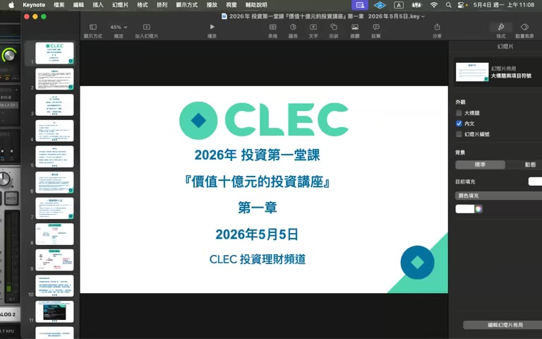
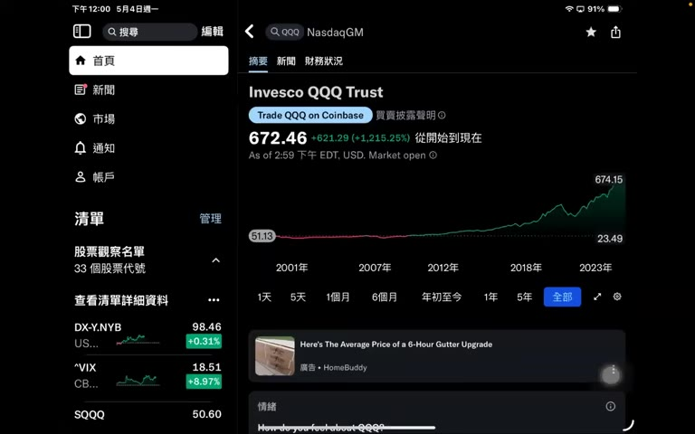

# 2026 年投資第一堂課『價值十億元的投資講座』第一章

> **來源**：YouTube — [CLEC 投資理財頻道 · 2026 年投資第一堂課『價值十億元的投資講座』第一章](https://www.youtube.com/watch?v=UQJhULjHzR4)（00:56:15，2026-05-05 發布）

> 第一章是**世界觀篇**：勞工 vs 資本家二分、富有作為天賦、鼠籠循環，幾乎沒有具體標的或操作。第二章（00695，已整理）才開始講 QQQ / 不要碰的標的等實作。本章 50 分鐘以勵志 / 自我推廣為主，乾貨集中在最後 5 分鐘的 QQQ 26 年走勢預告。
>
> 講者語氣帶情緒、二分強烈、頻繁援引「我做 Acer 多媒體事業群退休」「投資 40 年絕不會害你」做 authority appeal。下方「個人想法」段落整理批判視角。

## TL;DR

- **核心命題**：富有是天賦（人權）；勞工只能換到一輩子百分之一的財富，**99% 的財富來自做資本家（投資）**。
- **二分世界觀**：勞工 = 鼠籠 / 一身病痛 / 一地雞毛；資本家 = 睡到自然醒、用真金白銀支持創新者（Steve Jobs / Elon Musk / Bill Gates）。
- **執行哲學**：第一份薪水就借**信貸**去買指數基金；連刷卡的生活費都借錢付，自有資產一毛不動，credit-card cashback 也拿去再投資。
- **不要買的清單**：房子、保險（壽險 / 年金 / 癌症 / 長照都不要）、大車、家電 / 廚房機器（會變垃圾）。
- **錢的意義**：「錢是垃圾」，要把金錢能量換成精神能量（旅遊、家人聚餐、健康），而非堆累積物質。
- **預告**：第二章開始講指數基金；尾聲快速展示 QQQ 從 1999 年 \$53 → 2026 年 \$672（≈ 12x，年化 ~10%）。

## 重點摘要

### 1. 自我介紹與動機 ([00:00–03:00])

講者 James 自稱：
- 早期在 Acer 美國多媒體事業群，自稱 **Microsoft Multimedia 1 標準與 hypernet（休眠/快速喚醒）的設計者 / 專利持有人**
- 2024 年從 Acer 事業群主管退休（自稱已退休 22 年）— **時間自相矛盾，需查證**（22 年退休 vs 2024 退休，不一致）
- 已**免費教投資 22 年、投資資歷 40 年**
- 標題從「價值一億元」升級到「價值十億元」，因為「學員超過一億的人應該很多了」

### 2. 免責聲明與防詐騙 ([03:09])

- CLEC 是義務教學，不收費、不代操、沒有牌照
- 任何「假借 CLEC 名義拉群、收費、代操」一律是詐騙
- 短期市場波動「不是風險」，**長期回報率低才是風險**（因為別人都富有了你還是窮）

### 3. 勞工 vs 資本家：核心二分 ([04:50])

| | 勞工 / 佃農 / 水牛 | 資本家 / 地主 |
|---|---|---|
| 時間自由 | 早起加班、子女進安親班、朝九晚五 | 睡到自然醒、自然行程 |
| 收入結構 | 5 斗米折腰（為錢工作） | 真金白銀讓金錢自己工作 |
| 對人類貢獻 | 服務有限 | 透過資本支持創業家（Apple/Tesla/Microsoft） |
| 教育目的 | 為了找好工作 | 為了興趣與服務社會 |
| 退休後 | 平均剩 < 10 年壽命，毒素累積 | 自由旅遊、陪家人 |

論點：**「99.999% 的人是勞工」**，連總經理、律師、會計師、護國神山工程師「都是勞工」。學校制度是 18 世紀工業革命後資本家為馴服勞工而設計的（準時到 / 準時下班 / 準時加班）。

### 4. 鼠籠循環 vs 資本家循環 ([34:00])

**鼠籠循環（勞工）**：賣命 → 病痛 → 賺錢 → 繳稅 / 房貸 / 保費 / 車貸 → 買物質 → 變窮 → 祈求老闆加薪 → 壓力更大 → 循環。

**資本家循環**：金錢能量 ↔ 精神能量
- 將金錢能量轉成精神能量（學習、看書、心情平和）
- 精神能量再投資 → 持有更多金錢能量
- 不去買物質垃圾，把錢花在旅遊 / 美食 / 家人時光（會留下記憶）

### 5. 借錢哲學 ([08:00, 47:30])

- 「資本家第一件事情要學會的就是**借錢**」
- 第一份薪水到手，先去銀行做**信貸 100 萬 × 7-10 年**，一次投入指數基金 → 7 年翻倍變 200-250 萬，遠優於分批
- 講者宣稱**自己日常一切開銷（稅金、生活費、旅遊、刷卡）都是借錢付**，自己資產一毛不動
- 連 Apple Card 每月退傭 \$300-400 也再投資
- 「公司不向銀行借錢做不大；個人不借錢只能有錢，不能富豪」

### 6. 不要買的清單 ([15:30, 34:30])

| 物品 | 講者主張 | 理由 |
|---|---|---|
| 房子 | **絕對不要買** | 「30 年繳完只剩破房漏水」「人家寧買新豪宅」「壓得喘不過氣」 |
| 保險 | **任何種類都不要** | 「我只看到買保險的窮人，沒看到買保險的富有人」 |
| 大車 | 不要 | 為了過更好日子買垃圾再加班還貸 |
| 家電 / 料理機 / 咖啡機 / 榨汁機 | 慎買 | 用半年就丟（自身舉例 Espresso、Juicer 都被 recycle） |

例外：旅遊 / 全家美食 / 阿拉斯加郵輪 / 歐洲行 → 留下記憶，「絕對值得」。

### 7. 第二章預告：QQQ ([49:30–end])

- QQQ 1999 年 3 月 1 日上市，價格約 \$53
- 2026 年現價 \$672，累計漲約 12 倍
- 26 年年化報酬約 10%（√12 ≈ 1.10）
- 但**中間波動極大**：2000 dot-com 谷底跌 ~85%，要熬到 2015 年才回本（**15 年套牢期**）
- 警告：在高點退休的人最危險（沒辦法持續定期定額平均成本下來）→ 這也是第二章會展開的主題

## 個人想法 / 後續

### 講者觀點的可疑之處

1. **時間矛盾**：「2024 退休」+「免費教投資 22 年」+「退休 22 年」三者互斥；可能是 Whisper 轉錄誤聽，但即便寬鬆解讀仍有出入，建議比對影片實際口述。
2. **倖存者偏誤 + 後視鏡**：QQQ 1999 → 2026 看起來漂亮，但同期間 SPY/VOO 年化也接近 9%；單講「QQQ 26 年 10%」並不證明它是「致富的鑰匙」，那只是市場長期均值。第一章自己引用的 2000 dot-com → 2015 回本案例其實正反駁了第二章「VT/SPY 都會變窮」的單向結論。
3. **二分謬誤**：把「勞工 vs 資本家」推到極端，忽略了大部分人是 hybrid（高薪工程師同時 max-out 401k 投 ETF）；總經理被打成「勞工」更是定義循環。
4. **借信貸槓桿風險被低估**：第一章只強調「7 年翻倍」，**完全沒提 margin call / 強制斷頭 / 利息成本 / 收入中斷**等場景；第二章才簡述風控，但兩集當作一個系列看時，第一章會誤導年輕觀眾。
5. **「不要買保險」是危險建議**：醫療 / 長照 / 重大傷病險的功能是 risk transfer，不是 ROI 工具；用「投資報酬不如指數基金」否定保險本身就是分類錯誤。
6. **「Acer 多媒體標準 / hypernet 專利我設計」的權威背書**：這類具體技術主張可比對 Microsoft 多媒體規範文件 / 美國 USPTO 紀錄；若無證據支持，應視為 self-aggrandizement。
7. **「精神能量 / 金錢能量」是 pseudo-scientific 術語**：核心訊息「把錢花在體驗而非物質」其實是行為經濟學中 experiential vs material purchase 的成熟結論（Gilovich et al.），但講者用能量術語包裝後變成不可證偽。
8. **教育起源論不準確**：把現代學校制度說成「資本家為馴服勞工發明的」過度簡化；學校的義務化牽涉軍事 / 公共衛生 / 民族國家建構等多重動因。

### 可進 wiki 的概念（純概念，不複製講者論點）

- **資本所得 vs 勞動所得的長期差距**（Piketty *r > g* 的真實學術版本）
- **行為經濟學：experiential vs material purchase** 對 long-term satisfaction 的研究
- **槓桿投資的數學**：定期定額 vs 一次借貸投入的 expected return / drawdown / ruin probability 比較
- **Sequence-of-returns risk**：高點退休 vs 累積期遇到大跌的差異（這點第一章 51:53 自己提到了）

### 待查 / 存疑

- 「Microsoft Multimedia 1 標準是我設計」「hypernet 是我的專利」具體可查的 USPTO / Microsoft 文件
- 講者個人時間線（哪一年從 Acer 退休、哪一年開始 YouTube）

### 素材覆蓋的限制

`prepare.sh` 抽出 33 張幀，但 **5–49 分（核心 44 分鐘）完全沒被 scene-detect 抓到**——這段是講者鏡頭固定 + 同一張 Keynote 投影片，視覺變化不過 0.4 閾值。30 張幀集中在最後 7 分鐘的 iPad / YouTube 介面切換上。

→ 建議下次同類型影片改用 `--scene-threshold 0.2` 或 `0.15`，或分段抽（每 5 分鐘強制一張）。已記錄這個觀察作為 skill 改進方向。

## 延伸閱讀

- [第二章摘要](../2026-05-07-yt-clec-investment-lecture-ch02/summary)
- 原始影片：<https://www.youtube.com/watch?v=UQJhULjHzR4>
