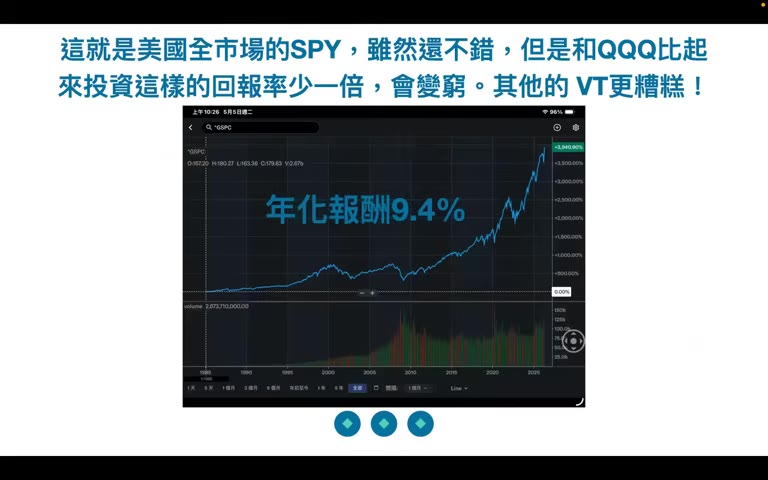
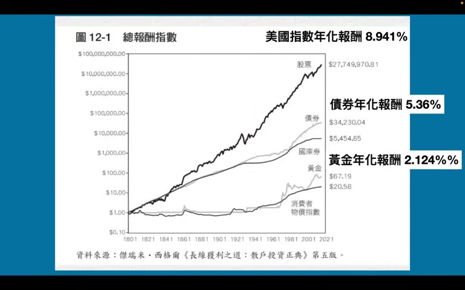
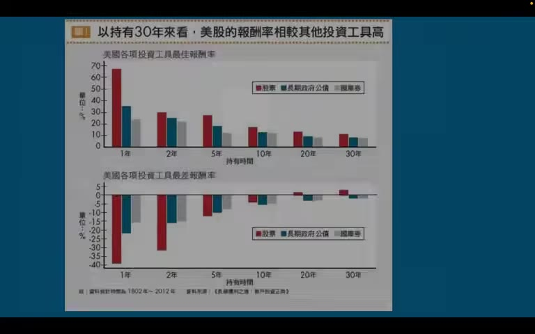
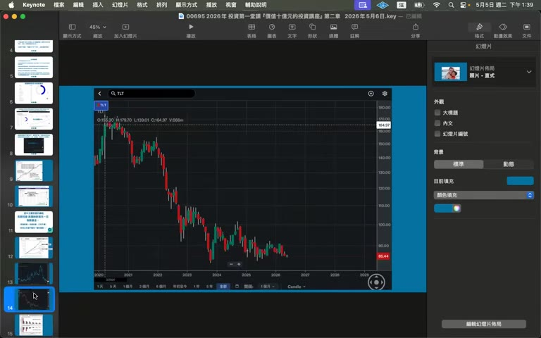
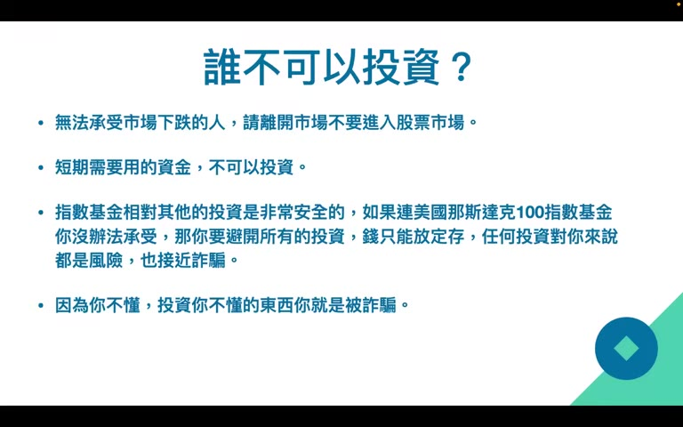

# 2026 年投資第一堂課『價值十億元的投資講座』第二章

> 講者主張極為強烈、語氣帶情緒（「不投資的人會無家可歸」「99.99% 人會變窮」）。本摘要忠實重現主要論點，**個人想法**段提出對應的批判視角；數據未經獨立查證，請以原始資料為準。

## TL;DR

- **核心主張**：長期持有 **QQQ（Nasdaq-100 指數基金）** 是「致富的鑰匙」；其他常見的廣指（VT、VOO、SPY）報酬率都顯著輸 QQQ，講者直接論斷「會變窮」。
- **絕對不要碰**：長期債券（含 TLT、公司債、垃圾債、結構債）、其他國家指數、原物料、房地產；唯一例外是極短期國庫券（BOXX/SGOV/00865B）做為現金替代。
- **AI 典範轉移論**：將 AI 類比手機取代家用電話、數位相機取代底片，主張未來只有「極富 / 極貧」兩種人，中間階級消失。
- **執行紀律**：有錢就買、打死不賣；越早投資複利效應越大（85 美元/月 × 40 年 ≈ 4,300 美元/月 × 10 年 ≈ 100 萬美元）。
- **風險警語**：無法承受市場下跌的人不應投資；別融資借錢，否則「六呎高也會淹死在平均兩呎深的水裡」。

## 重點摘要

### 1. 為什麼選 QQQ 而非 SPY / VT ([06:53])

講者直接拿過去績效圖比較：

- QQQ 從 1999 年到現在 **約漲 12 倍**
- VOO / SPY 同期 **約 5 倍**
- VT（全世界）從 2009 年起 **僅 2.5 倍**

結論：「投資 VT、VOO、SPY 都會變窮」。台灣朋友若要本地配置，0050 / 00662 可接受（沾 AI 與護國群山的邊）。

### 2. 「美國火車頭」供應鏈論 ([11:00])

世界產業鏈像一列火車：美國（品牌、AI 創新）是火車頭，台灣 / 韓國（代工硬體）是第二車廂，中國自成體系，歐洲已掉出 AI 產業鏈、淪為第三世界。論點是：**車尾車廂長期不可能跑贏火車頭**，所以「投資其他地區會失速翻車」。

### 3. 200 年資產報酬比較 ([23:51])

引用《長線獲利之道》(Jeremy Siegel) 圖 12-1，1801→2021 的累計總報酬：

| 資產 | 年化報酬 | 1 元 → |
|------|---------|--------|
| 股票 | 8.94% | $27,749,970 |
| 債券 | 5.36% | $34,230 |
| 國庫券 | — | $5,454 |
| 黃金 | 2.12% | $67 |
| 現金 | — | $20.58 |

> 講者用此圖支持「股票長期遠優於其他資產」。圖示為**名目美元**累計，未扣通膨；現金那條的「縮水」其實已隱含通膨吞噬，這也是為何 CPI 線在最下面。

### 4. 持有時間 vs 風險 ([28:00])

引用 Siegel 另一張圖（1802–2012）：

- **股票**：持有 1 年最差 –40%、最佳 +70%；持有 **15 年以上幾乎不會虧損**；持有 30 年最差也有約 +5% 年化
- **長期公債 / 國庫券**：即使持有 30 年，**仍有可能虧損**（名目 + 實質）

舉具體例：TLT 從 2020 高點到 2026 年下跌約 50%、七年仍未回本，被用來反駁「長期債券是安全資產」。

### 5. 越早投資越好（複利） ([34:30])

達成 100 萬美元退休金的每月投入金額對照：

| 年化報酬 | 40 年 | 10 年 |
|---------|-------|-------|
| 12%（QQQ 假設） | 85 美元 / 月 | 4,300 美元 / 月 |
| 10%（SPY） | 156 美元 / 月 | — |
| 8%（VT） | 500 美元 / 月 | — |

兩組差距都是 **5–6 倍**；用來呼應「選對標的 + 越早開始」的雙重複利效應。

### 6. 誰不該投資 ([32:14])

- 無法承受下跌情緒的人 → 離開市場
- 短期需要用的錢 → 不可投入
- 完全不懂的人 → 任何投資對你都是詐騙風險（連指數基金也會在低點賣掉）

### 7. 紀律 ([40:00])

「以下不要問」：
- 個股、未提到的標的、何時買 / 何時賣、何時漲跌、現在會不會再漲 / 再跌
- **唯一答案：有錢就買 QQQ，打死不賣**

每天起床先模擬「股市跌 80% 我還活著嗎」，活不過就先降槓桿；別融資斷頭。

## 個人想法 / 後續

### 講者主張的可疑之處（需獨立驗證再採信）

1. **倖存者偏誤 + 期間挑選**：QQQ 從 1999 年起算包含 dot-com 谷底（2002 年 NDX 跌 ~78%），用後視鏡看當然贏；若起點挪到 2000-03 高點，QQQ 花了 **15 年**才回本。挑「2009 起」比 VT 也是刻意挑 GFC 谷底。
2. **集中度 = 風險**：QQQ 前十大佔 ~46%；本質上是大型科技股押注，不是「多元化」。和 VOO（前十大 ~30%）、VT（前十大 <20%）的風險屬性不同。
3. **「債券永遠不要碰」過度簡化**：TLT 的下跌是 2020 零利率高點 + 升息週期的特定事件；負相關股票下跌時的 portfolio 防禦角色仍存在（雖近年失靈）。
4. **AI 典範轉移類比的落差**：「手機取代有線電話」是消費品淘汰；「AI 讓 99.99% 人變窮」是社會結構預測，這兩者的因果鏈條完全不同強度。
5. **「賣房子投資」的建議**：忽略居住成本、租金/房貸 cash-flow 比較、家庭風險容忍度；不能 one-size-fits-all。
6. **語氣作為紅旗**：用「無家可歸」「窮酸鬼」「神仙難救」等情緒詞、不斷強調「投資 40 年絕不會害你」是 authority + fear-mongering 行銷話術。

### 可進 wiki 的概念

- **指數基金集中度 vs 多元化**：QQQ / SPY / VT 的 top-10 weights、產業分布比較
- **持有期間 vs 風險（Siegel 框架）**：時間如何「壓平」股票波動
- **複利的雙重來源**：報酬率 × 時間
- **典範轉移（paradigm shift）**：何時這個框架成立、何時被濫用

### 待查 / 存疑

- Siegel 200 年資料的**通膨調整版**數據（實質報酬率）
- QQQ 從 dot-com 高點起算的 15-20 年實際年化
- 「AI 讓中產消失」這類 K-shape 預測的學術文獻

## 延伸閱讀

- [第一章摘要](../2026-05-07-yt-clec-investment-lecture-ch01/summary)
- 原始影片：<https://www.youtube.com/watch?v=XpPkNPiA2dA>
