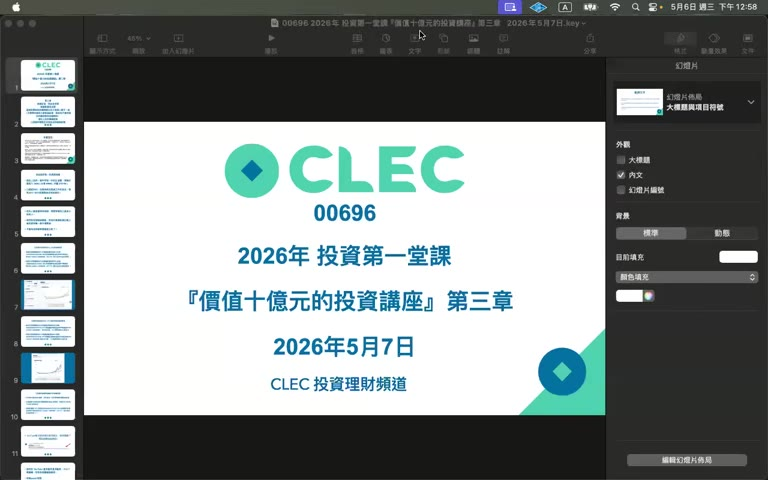
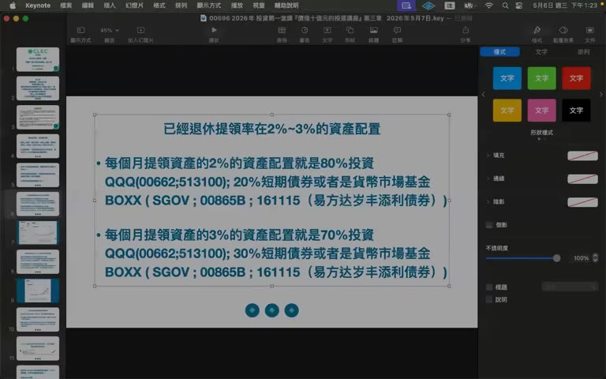
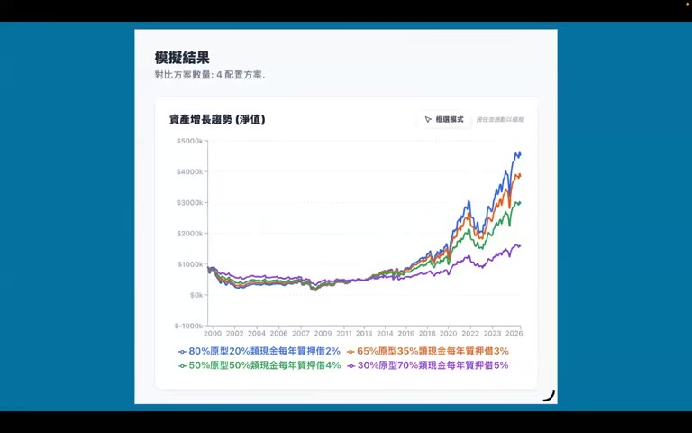
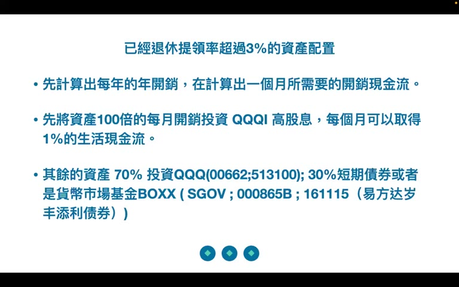

# 2026 年投資第一堂課『價值十億元的投資講座』第三章

> **來源**：YouTube — [CLEC 投資理財頻道 · 2026 年投資第一堂課『價值十億元的投資講座』第三章](https://www.youtube.com/watch?v=kdOpZUir48I)（00:32:30，2026-05-06 發布）

> 第三章是**操作篇**：給出 5 種具體的資產配置方案（上班族 / 退休 2% / 退休 3% / 質押借款 / 高提領率）。相比第一章（世界觀）與第二章（標的選擇），這集乾貨密度最高、最值得對照自己處境調整。
>
> 但講者重要簡化（沒講清楚模擬參數、忽略稅務、忽略匯率與市場風險）需要批判看待，**個人想法**段落整理。

## TL;DR

- **核心原則**：「**現金是空氣**」——不論年齡都要有現金緩衝；不知道意外與明天哪一個先到（舉例：腦中風裝支架要 100 萬台幣）。
- **買進方式**：**立即市價單筆買進**，不要分批；費用 / 溢價 / 手續費都不重要。
- **5 種資產配置**對應 5 種人生情境（見下表），其餘人生決策（夫妻分歧 / 父母擔心）一律「表面說好、私下照做」。
- **再平衡**：每年 1 次，無腦回到目標比例即可；只有有槓桿基金才需要「聰明再平衡」。
- **模擬結論**：8020 借 2% / 6535 借 3% 是甜蜜點；5050 借 4% 與 30/70 借 5% 效率明顯下滑。

## 五種資產配置方案

| 情境 | 條件 | 股票 (QQQ / 0066 / 513100) | 現金 (BOXX / SGOV / 00865B / 161115) | 收入機制 |
|------|------|--------------------------|-----------------------------------|---------|
| **A. 上班族（累積期）** | 還在工作 | 100% 立即市價買進 | **半年到 1 年**生活費 | 薪資 |
| **B. 退休 提領率 2%** | 資產 ≈ 50× 年支出 | 80% | 20% | 賣股或股票質押 |
| **C. 退休 提領率 3%** | 資產 ≈ 33× 年支出 | 70% | 30% | 賣股或股票質押 |
| **D. 股票質押借 3%** | 同 B/C 但用借款而非賣股 | 65% | 35% | 質押借款（中國無此管道） |
| **E. 提領率 > 3%（資產不足）** | 月開銷 × 100 配 QQQI | 月開銷×100 進 QQQI；剩餘 70% QQQ + 30% 現金 | — | QQQI 月配 1% 股息 ≈ 12% 年化 |

> 講者強調 80/20 與 70/30 是「我模擬過活得還不錯」，但模擬參數（時間軸、報酬率假設、Monte Carlo？）只口頭說「2000 年到 2026 年」的期間，沒書面公開。

### 模擬結果圖（1999–2026 淨值比較）

四條線從相同 \$10k 起算，到 2026 年：
- **80/20 借 2%**：≈ \$48k（最佳）
- **65/35 借 3%**：≈ \$42k
- **50/50 借 4%**：≈ \$32k
- **30/70 借 5%**：≈ \$18k（最差）

→ 講者用此圖支持「越保守的配置 + 越高的提領率，效率越差」。

### 高提領率方案 E 的構造

例：月開銷 5 萬台幣 → 5 萬 × 100 = **500 萬放進 QQQI** 領 1% 月股息 ≈ 5 萬月現金流；剩餘資金 70% QQQ + 30% 現金。剩餘部分大概率變遺產（不會動用）。

## 重點摘要

### 1. 不能猶豫，立即市價買進 ([00:25])

當天 QQQ 漲 2%，講者趁機示範「市場一直漲不停」。學術研究已證明分批投入績效差於單筆投入。**重點**：
- 不要等下跌（沒人知道哪天是底）
- 不要計較溢價 / 手續費（最多 0.5% 不重要）
- 不要為了 0.5% 跑去香港開戶（「腳麻仔 sa-mooi」就是多此一舉）

### 2. 「現金是空氣」 ([01:53, 12:12])

不論哪一種配置，現金部位都是必備：
- 上班族 = 半年-1 年生活費
- 退休族 = 20-30% 整體資產
- 緊急醫療（腦中風 100 萬、突發手術）+ 市場下跌時不被迫賣股
- 現金部位**只能放短期國庫券或貨幣市場基金**（BOXX/SGOV/00865B/161115/SWVXX），**不要去買高股息**

### 3. 模糊的正確 vs 過度精確 ([05:22])

來問「老師我這樣配置可不可以」、「我要 4-3-3 還是怎麼配」、「我 30% 槓桿基金要不要等下跌」的人會被**踢回去**。講者類比：「資產配置就像吃牛肉麵加調味料，我只能告訴你辣椒辣、醋酸、糖甜——你要加多少自己決定」。

→ 主菜成長率：QQQ ≈ 12-15% 年化、QQQI 月配股息 1%

### 4. 家庭關係的「表面功夫」 ([08:56])

如果配偶 / 父母對投資反應激烈：
- **不要爭辯**，不要試圖改變他們
- 表面說「好的我會小心 / 我會賣掉」，私下照做
- 等你資產上億，他們也不會再囉嗦

> 這是本集少見的「軟議題」，但主張「對配偶說謊」對家庭信任的影響沒被討論。

### 5. 再平衡 ([26:00])

- **無腦再平衡**：每年一次，回到目標比例即可
- **聰明再平衡**：只有持有槓桿基金的人才需要
- 方案 E 的 70/30 部分（資產增值加速器）**不需要再平衡**，當作遺產池放著

### 6. 錢跟手續費的格局 ([16:50])

> 「要賺幾百億的人幹嘛斤斤計較幾十塊錢？要培養富有的腦袋。」

用錢買快樂、買時間、減輕壓力，比省 1000 台幣旅館費更值得。

## 個人想法 / 後續

### 比前兩集明顯改善的點

1. **真的有可操作的配置表**：A/B/C/D/E 五情境分得乾淨，提領率對應比例清楚，比第一章的口號實在。
2. **承認「模糊的正確」**：講者明確說「資產配置是點綴，重點是現金 + 立即買進」，這是務實的論點。
3. **現金部位的論證合理**：「市場跌 + 意外同時來」是經典的退休風險（sequence-of-returns risk + liquidity gap），這集講對了。

### 仍可疑或需保留的地方

1. **模擬黑箱**：講者口述「我模擬的結果」，但**未公開**：
   - 起訖時間（影片是 1999/3 開始或 2000 高點開始？兩者差很多）
   - 報酬率分布假設（historical bootstrap？Monte Carlo？）
   - 是否含費用、稅、匯率波動
   - 跌 80% 時的 sequence-of-returns 是否在模擬內
   → 沒有原始模擬資料，圖表 \$48k vs \$18k 的差異**僅供參考，不能當決策基礎**。
2. **QQQI 的 1% 月配（12% 年化）**並非穩定承諾——QQQI 是 covered-call 策略 ETF，**犧牲 upside 換高息**；長期 total return 通常會輸 QQQ。把 500 萬月開銷×100 全壓 QQQI 等於放棄股價成長空間，講者沒講清楚這個 trade-off。
3. **「分批績效差於單筆」確實有 Vanguard 等研究**支持期望值結論（lump-sum 平均贏 ~67%），但**忽略 risk-adjusted return**：對風險容忍度低的人，DCA 提供的是 regret-minimization 而非 return maximization。「分批就是輸」是過度簡化。
4. **手續費 0.5% 的「不重要」**：對小額一次性是真的；但若是 \$1M 量級每年複利 30 年，1% 費差會差到 ~30%。對「未來百億」的學員來說反而更該計較，講者邏輯反了。
5. **「對配偶 / 父母說謊」的建議**：把財務分歧處理成 deception 而非 negotiation，會在大額信貸 / 房貸槓桿出問題時變成婚姻信任危機。值得標注為**人際倫理上的紅旗**。
6. **中國稅務 / 匯率風險完全沒提**：513100 是 QDII，A 股投資者買它有溢價問題（講者只說「不要管溢價」），但未談 QDII 額度與監管風險、人民幣匯率長期走弱對「美股暴露」的稀釋。

### 相關概念

- **Sequence-of-returns risk**：退休前後 1-5 年遇到熊市的 portfolio 殺傷力
- **Lump-sum vs DCA 的 expected value vs regret**：Vanguard 研究結論與情境取捨
- **4% 提領率規則（Trinity Study）vs CLEC 的 2-3% 提領率**：講者比 4% 更保守，背後其實是更悲觀的市場假設
- **Covered-call ETF 的 trade-off**：QQQI / JEPQ 月配高股息的 total return 結構
- **Cash drag** 對長期報酬的拖累計算

### 待查 / 存疑

- 講者口中的「模擬」實際資料是否公開（Excel？網站？）—— 影片 19:57 提到 yahoo finance 模擬器，但具體網址沒給
- QQQI 確切 expense ratio + 過去 5 年 vs QQQ total return 比較
- 0066 與 00662 的差異（講者交替使用，可能是 0050、00662、00670 的混用）

### 三集系列觀感

| 集 | 性質 | 乾貨密度 | 推薦保留嗎 |
|----|------|---------|----------|
| 第一章（00694） | 世界觀 / 動機 | 低 | 低 — 概念可選擇性吸收 |
| 第二章（00695） | 標的選擇 | 中 | 中 — Siegel 200 年圖、QQQ vs SPY 比較圖值得留 |
| 第三章（00696） | 操作配置 | 高 | **高** — 5 情境配置表是可直接對照自己情況的 cheat sheet |
