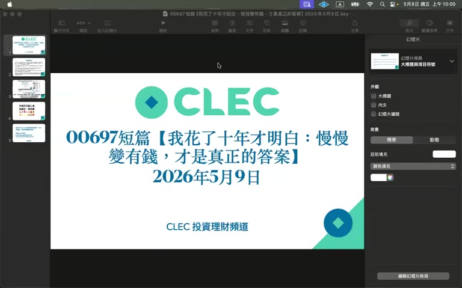
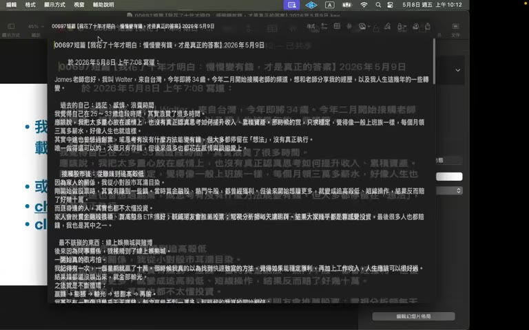
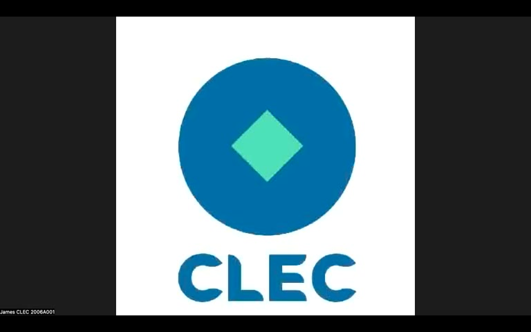

# 00697 短篇：我花了十年才明白——慢慢變有錢，才是真正的答案

> ⚠️ 本影片為 James 個人觀點的投資理財教學內容，論點偏激進（「AI 將漲 1 萬倍」「房子立刻賣」「保險經紀都是詐騙集團」等）。摘要忠實呈現原意，但**不代表認可任何具體投資/財務行動**。

## TL;DR

- **AI 是百倍於 PC 革命的典範轉移**：James 認為這波 AI 才剛開始，10 年可能漲 100 倍，20 年漲 1 萬倍；窗口期會「快速密合」，要趁早大膽進場（推薦標的：00662 90% + 00670 10%）。
- **市場零碎時點不重要**：「有錢就買，打死不賣」、「立即市價、一筆買進」、不要分批、不要做短線、不要操作。
- **觀眾來信主軸**：30 多歲台灣人花了十年在短線、線上賭場、感情迷茫上繞遠路，最終透過 YouTube 投資頻道（槓桿人生、阿良政二、CLEC 等）覺醒，今年改採指數化投資。
- **James 對家人/理專的看法**：理專、保險經紀、銀行、台灣股市、證管會都被他歸類為「資本主義詐騙集團」；建議妹妹**立即停損解約所有投資型保單**（沉沒成本不要救）。
- **能影響的人很少**：「百萬分之一」會聽見並照做；連他自己家人也只影響到妹妹一家四口。**自己變大樹**才是讓家人開始相信的唯一方法。

---

## 重點摘要

### 1. 開場：AI 是 100~1000 倍於 PC 的典範轉移 ([00:20])

James 把過去 40 年股市多頭走過一遍（1990–2000、2003–2007、2009–2022），論點是：

- 1980 年 PC 革命帶動 20 年大多頭。
- **現在的 AI 相當於 1970–1975 年 Apple II 剛問世的階段**。
- 用「炸彈當量」做比喻：PC 網路泡沫如果是 1 磅炸藥，AI 至少是 100~1000 磅。
- 結論：**10 年漲 100 倍、20 年漲 1 萬倍**（你的資產後面加 4 個零）。

對應的行動建議是「立即市價一筆買進」、「窗口期會密合，過一年資產可能差一倍」。

> 提醒：這些倍數是 James 個人預測，**不是有實證的歷史數據**。

---

### 2. 不要做的事情清單

James 在中段反覆強調幾個「立即停止」：

| 動作 | 理由 |
|---|---|
| **房子立即市價賣出** | 「未來是獨資產，不值得持有」；台灣兩地合一稅，繼承後賣掉要繳 40%。 |
| **遠離保險、保險經紀** | 「吃人不吐骨頭」；年輕人買長照險「神經病」。 |
| **遠離理專** | 「年輕理專自己也不懂」、「他為了佣金管你死活」、「當作詐騙集團對待」。 |
| **不要創業** | 「買納斯達克 100 指數基金就等於買到 100 家成功企業」。 |
| **不要短線、不要槓桿、不要操作** | 「操作是罪惡」、「最後都會變賭徒心態」。 |
| **不要分批** | 立即市價一筆買進。 |

解約路徑：**找總公司解約，不要找原本的理專處理**。

---

### 3. 來信主角：十年走過的歪路 ([12:13])

來信者是台灣 30+ 歲男性，今年 2 月接觸 CLEC 頻道。他自述的時間線：

1. **25–33 歲**：感情至上、領 3 萬月薪、覺得「人生就這樣」，存了一些錢但都花在感情上。
2. **股市起步**：金融股、熱門牛股，初期有賺，後來追高殺低，**賠了好幾十萬**（月薪才 2~3 萬）。
3. **線上娛樂城賭博**：同事介紹，第一週贏 10 幾萬就上癮 → 「贏錢、膨脹、輸光、想翻本、再輸錢」的循環。後期改成「每月固定 3000~5000」當娛樂，但仍被一次失控全部吐回。
4. **覺醒**：今年 1 月又輸幾萬後徹底放棄；數學期望值告訴他「賭場本質是負期望值，時間拉長一定輸」。
5. **二次轉折**：YouTube → 槓桿人生、阿良政二、投資翻譯官陳鋒、曼達 → CLEC。看了 James 兩部影片就覺得「**這就是我一直在找的東西**」。
6. **行動**：5 月把原本持股全賣、備好 6 個月緊急備用金、配置 **00662（90%）+ 00670（10%）**，開始練習不看盤。

---

### 4. 家人問題：媽媽聽名牌、妹妹被理專綁

來信者問怎麼影響家人，舉了兩個例子：

- **媽媽**：耳根軟，聽電視分析師、親戚推薦，買主動型基金、高股息 ETF、金融股，最後高買低賣全套吃。曾被推薦摩擋股票，跌到親戚一直道歉。
- **妹妹**：朋友是理專，被推銷一堆保險與**投資型保單**：
  - 醫療險、長照險、兩張投資型保單。
  - 月繳一萬多，其中一張月繳 8 千 + 第一年另繳 9.6 萬。
  - 另一張第一年先繳 3 萬。
  - 「目前帳面雖獲利，但不知被抽多少手續費／管理費」。

James 的回覆很直接：
- **沉沒成本不要救**：立即停損、馬上全部解約、跟理專劃清界線。
- 「**買很多保險的通常都是窮人，越年輕買越窮**」。
- 最有效的方式是「**陪妹妹一起看完《價值十億元的投資講座》三部影片**」（James 自己的播放清單）。

---

### 5. 為什麼影響家人很難 ([29:00])

James 自己花了 25 年做這個頻道、終身教學，最終結論是：

- **「百萬分之一」才聽得進**：宇宙浩瀚，正確聲音渺小，能聽見且能聽進去是「天命」。
- 連他自己的原生家庭：哥哥、弟弟（約三分之二）至今仍是「窮光蛋」，只有妹妹+妹婿+兩個女兒被影響到。
- 給來信者的核心建議：**自己先變成大樹**，家人看見才有可能相信；不要期望太多、太快；溝通是一輩子的事。

---

### 6. 收尾：「資本家什麼事都沒做就賺很多錢」 ([35:15])

引用巴菲特股東會：「我們買了蘋果，賺了 1300 多億，**我什麼事都沒做**」。

James 把指數化投資定位為「成為 100 家頂級公司的老闆」：Elon Musk、黃仁勳、Lisa Su、Google 都在「幫你打工」。AI 雖然會讓員工失業，但你做為股東，公司賺錢就好。

---

## 個人想法 / 後續

### 待查 / 存疑
- **00662（國泰標普 500）+ 00670（富邦 NASDAQ）90/10 配置**是不是 James 的標準推薦？影片裡只是引述來信者的決定，不一定是 James 替別人開的處方。
- 「10 年漲 100 倍、20 年漲 1 萬倍」沒有任何歷史多頭資料能背書（即使 1980 年代 PC 多頭，20 年也沒有達到萬倍）。當口號看就好，**不要當作 financial planning 的數字基礎**。
- 「房子立即市價賣出」這個建議很激進，與一般理財顧問會給的「自住房≠投資商品」論點直接衝突；台灣的兩地合一稅論述也僅針對特定情境。
- James 對「保險經紀＝詐騙集團」是極端化簡化，**醫療險、實支實付**等保障型保險與「投資型保單」是兩件事，不應混為一談。

### 相關概念
- **CLEC / James 的投資哲學**：可與其他指數化投資派（Bogleheads、生命週期投資法）並列比較。
- **指數化投資的三大派系**：純指數（CLEC、阿良政二）、生命週期+槓桿（《槓桿人生》Lifecycle Investing）、Bogleheads。
