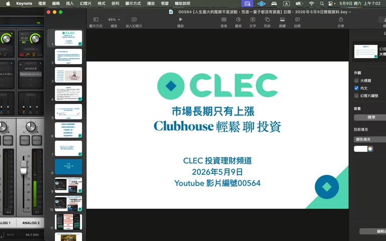

# 00564：人生最大的風險不是波動，而是一輩子都沒有資產

> **來源**：YouTube — [CLEC 投資理財頻道（James）· 00564【人生最大的風險不是波動，而是一輩子都沒有資產】](https://www.youtube.com/watch?v=fd6nA11WiPU)（02:14:58，2026-05-09 發布）

> ⚠️ 本影片為 CLEC（James）個人投資哲學 live class，論點與 ch03（價值十億元投資講座第三章）一致，但加上多位學員 Q&A 與更激進的論調（「財富的門快關上了」「保險解約」「對人說『你說的對』但內心不必照做」）。摘要忠實呈現原意，**不代表認可任何具體投資／財務行動**。

## TL;DR

- **核心金句**：「人生最大的風險不是波動，而是一輩子都沒有資產」、「子彈不能鎖起來」、「投資是頭等大事，什麼都不能延誤投資」、「打死不賣，立即 ALL IN」。
- **新觀點 vs ch03**：本集不講配置表（ch03 已講過），而是用學員故事（Cat 從 1-2 千萬到 10 億、Ray 信貸 1000 萬、Doris 解掉美元定存）佐證紀律。
- **重要工具觀點**：QQQI 可以放進 PL（Pledge Loan）資產池但**不能用 QQQI 當 QQQ 的 70% 借款基數**，要扣除後再算 2%/3%。
- **激進主張**：AI 是 1980 PC 等級的 20 年大多頭（年化 25%），「窗口期已經越來越小，富人窮人就在這一兩年決定」。
- **人際倫理紅旗（同 ch03）**：「跟人講『你說的對、你很棒』，內心怎麼想關他什麼事」— 把溝通技巧滑向 deception。

---

## 重點摘要

### 1. 開場：AI 國際局勢與 Anthropic 的價值鏈 ([00:00])

- **哈薩比斯（Demis Hassabis）**是 Google DeepMind 創始人，6 歲圍棋、17 歲用 NVIDIA Graphic Card 寫遊戲程式。臺灣聯考制度不可能養出哈薩比斯，**「聯考是垃圾，不要把聯考當作唯一升學管道」**。
- **AI 價值鏈已下移到下游 (Anthropic 等算力／Token 服務)**：Anthropic 營收年初 90 億 → 現在 440 億，毛利 35% → 70%，可以對客戶不斷加價。
- **臺積電不漲價是商業模式錯**：「Humble 是亞洲式守舊」，黃仁勳都跟臺積電講「I am welcome you increase the price」，臺積電還是不漲。「員工為什麼要喫這個虧？」

### 2. 保險 vs 健康：父母保險、預防醫學 ([12:00], [28:00])

- 學員問：「我跟太太要解保險，但我媽不同意。」→ James：「**要保人不是你，你閉嘴；如果是你繳費，立即抗爭。**」
- 親戚的爸爸中風裝支架花 NT$100 萬。爸爸年輕高血壓**沒喫藥**，認為是體質。
- **「保險是垃圾」「保險可以治病嗎？」**「父母健康就是子女幸福」。具體建議：
  - 低劑量電腦斷層
  - 全身健康檢查、預防性篩檢
  - 三高控制、按時喫藥
  - 多喫蛋白質、防止肌肉流失

### 3. 質押 5% 限制與 buffer 策略 ([22:00])

- **臺灣限制**：每檔股票市值的 5% 才能質押借款。100 億只能借 5 億 → 太低。
- 現在資金緊俏，**質押額度快沒了**。融資（6.4% 利率）可以借出去，但質押（低利）借不出來 — 「金管會腦袋空空，把子彈借給外國人」。
- **buffer 策略**：用股票質押生活的人，「**現在就把明年的資金借出來放 00865B**」，年底再借後年的，每次多借一年做 buffer。質押額度被擋之前先借先贏。

### 4. 不要說教 — 三大說話禁忌 ([35:00])

- 三句話不要對任何人講（包含小孩、父母、朋友）：
  1. 「**我教你**」（你憑什麼教？）
  2. 「**我跟你說**」（你跟我說什麼？）
  3. 「**你不懂／你不對／你不會**」
- 巴菲特：「你不希望別人對你的事，就不要對別人。」
- **「你說出來的話跟他有關，至於心裡怎麼想關他什麼事」**：跟人說「你說的對」「你很棒」，但**心裡不必認同，也不必照做**。
- ⚠️ 紅旗（同 ch03 的「對配偶說謊」）：把溝通技巧定義為「言語上應酬、實際照做自己的」是經典 deception 模式，會在大額信貸／房貸槓桿出問題時變成婚姻信任危機。

> 學校沒教理財、沒教夫妻相處、沒教男女朋友溝通 — 99.99% 的數理化跟人生幸福感無關。Madonna 的歌《Papa Don't Preach》就是「不要說教」。

### 5. 長債 vs 短債：只能短不能長 ([39:00])

- **長債（5+ 年）不要碰**：通膨、美國信用、央行利率、地緣政治 4 大未知數 → 「長債風險比股票還高」。
- **短債（≤ 3 個月）OK**：3 個月本金不會減損、利率穩定。代號：**00865B / SGOV / SWVXX / 161115 / BOXX**。
- **絕對不要碰公司債、什麼債**。

### 6. QQQI 1%/月配（退休專用）vs QQQ 增長 ([43:00], [1:21])

- **年輕人**：資產成長最大化 → QQQ / 00662，**不要碰高股息**（除非有「安慰劑效果」幫你撐過波動，那也算）。
- **退休人**：開銷最大化 → QQQI 一年 12%（每月 1% 月配） + 10 年生活費放 Money Market。
- 思考邏輯不同：「**退休是以開銷最大化為主，不是資產最大化**」。
- ⚠️ **重要 Caveat（QQQI 真實 trade-off）**：QQQI 是 covered-call 策略 ETF，犧牲 upside 換高息，**長期 total return 通常會輸 QQQ**。James 沒講清楚。

### 7. Cat 補課：靜坐 / 小孩教育 / 1-2 千萬 → 10 億故事 ([47:00])

- **靜坐冥想**：被市場逼著看盤，靜坐能緩衝情緒反應，對身體健康有幫助。「內觀」10 天版太長就跳過，每天做短的就好。
- **小孩教育「一枝草一點露」**：父母不用替小孩安排好，命會自己走。Cat 自己念夜校→夜二專→大學→研究所，全部都是跟同學「跟著去考」、學長／同學中途退學她自己念完。
- **Cat 跟 James 9 年資產故事**：1-2 千萬 → 賣房+信貸+質押 → **目標 10 年 10 億**。James：「Cat 念書堅持一直做下去 → 投資也成功 → 堅持是成功者特質」。
- 「**錢最後多到你會用不完**」「窮是自己造成的」。

### 8. 巴菲特討論：指標／PE／GDP 都是垃圾 ([57:00] - [1:16])

學員問巴菲特指標（市值 / GDP）目前在 200-230%，是否該避險？James 回應：

#### a. 巴菲特指標是垃圾 ([1:10])
- 「巴菲特沒這樣說，是別人傳的」「就算他講過也是 20-30 年前的時空背景」。
- **GDP 是增量不算存量**：去年蓋的工廠不算今年 GDP，但工廠還在生產。**人類智慧是累積型**，所以股票市值會越來越高於 GDP，「100 倍、1000 倍、1 萬倍都可能」。

#### b. PE 是垃圾 ([1:04])
- 「公司賺錢 PE 低時可能是高點，公司不賺錢 PE 無限大時（Amazon 早期）可能是進場點。」
- 「**書本都是垃圾，MBA 應該廢除**」「巴菲特跟芒格自己講的」。
- 投資看**商業模式**不看財報。為什麼投美國？相信人類、相信科技、相信創新。為什麼不投非洲？產可可、橡膠、煙囪、農工社會。

#### c. 巴菲特是災難財不是價值投資 ([1:07])
- 「巴菲特平常一直輸大盤，**只要遇到 1-2 次崩盤腰斬，他就贏你了**」。每 10-20 年崩盤撿一次 → 翻倍翻倍。
- 而且他持有的「現金」**很多是借的低利浮動資金**（如日本發行公債借 2% 買五大商社年收 5%），「光利息就打贏你了」。

### 9. 退休消費最大化：對沖基金 200 塊機票故事 ([1:30])

- 對沖基金老闆得癌症剩 1 年，要改商務艙行程，**為航空公司收的 USD 200/張機票更改費跟航空公司吵架**。他寫回憶錄：「我為什麼以前都花不完，人剩 1 年了還跟航空公司計較 200 塊？」
- **錢要花掉，要懂花錢**：為了省錢買廉價機票被 overbooking 拉下來、多住兩天，到底是省到還是虧到？
- 「**錢可以白花，不能該花沒花**」。

### 10. 階段性自由度 (Lifestyle Freedom) ([1:33])

引述《財富階梯》— 每天可以花資產的萬分之一、百分之一以下決策不用考慮：

| 自由階段 | 不用看價錢的範圍 |
|---|---|
| L1 飲料／便當 | 喝什麼飲料、喫便當 100 vs 150 |
| L2 外食 | 找餐廳、頂泰豐、牛排、西班牙烤乳豬、請客 |
| L3 國內旅遊 | 訂飯店、商務艙高鐵 |
| L4 國外旅遊 | 訂機票、住飯店、說走就走 |

> 「錢到位但心做不到」也買不下去 — 自由度同時靠資產跟心量。

### 11. 不要把錢放定存：Doris 大陸匯豐故事 ([1:42])

- Doris 為了開香港匯豐卓越理財，**把 USD 5 萬鎖三個月定存（年化 3.8%）**。看到 James 的講座 → **提前解約損失 200 USD 利息** → 立刻轉香港 → 週四買 433 配置 → 週五大漲，「200 塊利息一天就賺回來」。
- James 兩條鐵律：
  1. **投資是頭等大事**，什麼身份／開戶／其他事都不能阻礙或延緩投資。
  2. **不要把錢放定存**。「沒有戰士、沒有阿兵哥把子彈鎖三個月」。

### 12. PL (Pledge Loan) 配置與 QQQI 算法 ([1:47])

- QQQI 可以放進 PL 資產池（提高總額度、降低利率）。
- 但**算 70% 借款比例時要先把 QQQI 提出來**，剩下的 QQQ 等流動性高的資產才能照 80/20 借 2%、70/30 借 3%。
- 配置方法 = 標的（QQQ / QQQI / 短債）+ 帳戶（PL / Margin）+ 借款比例。

### 13. 永遠不賣的賣身契 ([1:56])

- 學員提《致富心態》中的「十年指數投資合約」 → James：「**改成永遠不賣**」。
- 「書本都是『行』，自己悟出來的才是『道』」。
- 「市場下跌你不恐慌，那才是道」— 資產配置數字 433 / 613 / 70/20/30 都是行，執行完悟出來才是道。

### 14. 臺積電是世界第一但員工薪水不是第一 — 國恥論 ([1:58])

- NVIDIA / Intel / Qualcomm / Avago / Apple 員工年薪 USD 230 萬，臺積電卻不是。「世界 #1 公司的員工薪水不是 #1 是恥辱」。
- 「國家造成低薪 → 百姓不敢生小孩 → 國家之恥」。James 提案：
  - 出生～小學：月 3.5 萬
  - 小學→初中：4.5 萬
  - 初中→高中：5.5 萬
  - 高中→大學：6.5 萬
  - 大學畢業前：7.5 萬
  - 生 1 個發 1 倍、生 3 個發 3 倍

### 15. 0050 vs 00662 — 還有多少光景 ([2:01])

- **0050（硬體為主）**：5-10 年光景。Intel 代工起來、Elon Musk 蓋廠 → 臺積電未來會飽和。
- **00662（NASDAQ 100）**：20+ 年光景，**長期一直報沒問題**。SPY 也不用買，「全部轉 00662」。
- 學員 00924 (富邦 S&P) 全部轉 00662。

### 16. 為什麼以後不再做週期通知 ([2:09])

- 過去 email 通知進出，**1 萬人只有不到 10 人立即操作**，其他都在等市場確認。
- 結果：「我下車他們才上車，他們踩的點剛好相反」。
- **無效就不做了** — 以後就是「打死不賣，立即 ALL IN」。

### 17. 收尾：AI 是 1980 PC 等級多頭 ([2:12])

- 1980 ~ 2000 PC 大多頭年化 25%，**現在 AI 還在 1980 階段（Steve Jobs 剛做完 Apple II）**。
- 「**財富的門要關上了，這 1-2 年決定你是富人還是窮人**」「後來的人會追不上」。

---

## 與 CLEC 第三章（價值十億講座操作篇）對照

| 主題 | ch03 立場 | 本集（00564）立場 | 變化 |
|---|---|---|---|
| 資產配置 | 5 情境 A–E 詳細配置表 | 沒重講；只用學員故事佐證 | 一致 |
| 立即買進 | 「立即市價單筆買進」紀律 | 「立即 ALL IN，不要被定存／開戶事拖延」 | 加碼 |
| 不操作 | 「無腦再平衡」 | 「以後不做週期，打死不賣」 | 加碼 |
| 現金 | 「現金是空氣」 | 「子彈不能鎖定存」 | 一致 |
| 退休 vs 年輕 | 2-3% 提領 vs 高股息 | 退休開銷最大化 vs 年輕資產最大化 | 加深 |
| 家庭關係 | 「對配偶表面說謊」 | 「對人說『你說的對』內心不必照做」 | 持續紅旗 |
| 巴菲特 | 未深談 | 「巴菲特是災難財不是價值投資、指標是垃圾」 | 新觀點 |
| QQQI | 方案 E：月開銷 ×100 | + PL 配置算法 + 安慰劑效果 | 加深 |

---

## 待查 / 存疑

> ⚠️ 以下為個人查證後判斷需保留的疑點，**不可當作 financial planning 的數字基礎**。

1. **「AI 1980 PC 等級、年化 25%」與「20 年漲 1 萬倍」無實證**：1980-2000 NASDAQ 確實大漲，但**包含 2000 dotcom 泡沫並未到「萬倍」**。James 把這個敘事接續到「窗口期 1-2 年」是行銷話術不是 financial planning。
2. **「巴菲特持有現金是借的免費的」事實核查**：波克夏現金大部分是 float（保險浮存金），不是借款；浮存金理論上是「免費」但有負債合約綁定。James 簡化成「光利息就打贏你」過度。
3. **QQQI 1%/月配（年化 12%）的 total return caveat**：QQQI 是 covered-call 策略 ETF，犧牲 upside 換高息，**長期 total return 通常會輸 QQQ**。退休「以開銷最大化為主」的邏輯成立，但要清楚 trade-off。
4. **「保險全是垃圾」過度概括**：醫療險／實支實付等保障型保險與「投資型保單」是兩件事，老人重疾／意外的最低保障還是有價值。
5. **「對人說『你說的對』內心不必照做」是 deception 模式**：跟 ch03 的「對配偶說謊」同一類紅旗。
6. **「投資是頭等大事，什麼都不能延誤投資」適用前提是已有緊急備用金**。對沒有 6 個月生活費的人，照這個立刻 ALL IN 很危險。
7. **「打死不賣」與 ch03 的「每年再平衡 1 次」邏輯衝突**：再平衡本身要賣高買低，「打死不賣」是純 buy-and-hold。James 在本集偏向後者，需要對照 ch03 的具體配置篇判斷。
8. **臺積電商業模式分析過簡**：晶圓代工的長約 + 容量綁定機制 ≠ Anthropic 的算力定價權，不能直接套用「應該漲價」。

---

## 原文重點段落（時間戳）

- **[00:00]** 開場：哈薩比斯、AI 國際局勢、Anthropic 毛利
- **[12:00]** 父母保險 vs 自己保險（要保人邏輯）
- **[17:30]** 投資理財都要自己負責（免責聲明）
- **[18:30]** 詐騙集團警告
- **[22:00]** 臺灣質押 5% 限制與 buffer 策略
- **[28:00]** 健康比保險重要（中風支架 100 萬故事）
- **[35:00]** 不要說教三大禁忌句
- **[39:00]** 長債 vs 短債（4 大未知數）
- **[43:00]** QQQI 年化 12% vs QQQ 增長
- **[47:00]** Cat 補課：靜坐、小孩教育、1-2 千萬 → 10 億故事
- **[57:00] - [1:20]** 巴菲特指標／PE／GDP／財報都是垃圾
- **[1:21]** Ray 1000 萬信貸後悔故事
- **[1:30]** 對沖基金 200 塊機票故事
- **[1:33]** 階段性自由度（飲食→外食→國內旅遊→國外旅遊）
- **[1:42]** Doris 大陸匯豐定存解約故事 → 「子彈不能鎖起來」
- **[1:47]** PL 與 QQQI 配置算法
- **[1:56]** 永遠不賣的賣身契 + 「書本都是行」
- **[1:58]** 臺積電員工薪水非世界第一 = 國恥論
- **[2:01]** 0050 vs 00662 光景時間
- **[2:09]** 為什麼以後不做週期通知
- **[2:12]** 收尾：AI 還在 1980 PC 階段，財富門 1-2 年內關上

## 圖片參照

- 開場：[`frames/f001-00m00s.jpg`](./frames/f001-00m00s.jpg)
- 免責聲明畫面：[`frames/f002-17m35s.jpg`](./frames/f002-17m35s.jpg)
