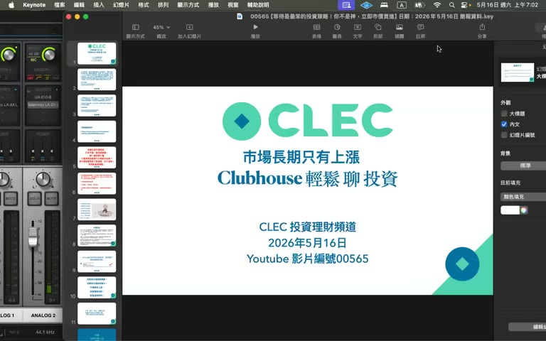

# 00565：等待是最笨的投資策略！你不是神，立即市價買進

> **來源**：YouTube — [CLEC 投資理財頻道（James）· 00565【等待是最笨的投資策略！你不是神，立即市價買進】](https://www.youtube.com/watch?v=VlpV0ziSUAE)（02:19:23，2026-05-16 發布）

> ⚠️ 本影片為 CLEC（James）個人投資哲學 live class（2 小時 19 分），與 ch03 + 00564 同調但加碼，並有多位學員（含中國大陸杭州、上海）Q&A。摘要忠實呈現原意，**不代表認可任何具體投資／財務行動**。

## TL;DR

- **新觀點：be-do-have 心態論**（潛意識催眠自己是富有的人）— 並非物質先到位才能稱富有，而是腦中先 pretend，才會驅動執行
- **新觀點：「多活 20 年勝過 beta 1.2」**— 健康／長壽是 compound 報酬的最大因子，比所有技術分析、槓桿、配置都重要
- **新觀點：唯一可保的險是 Term Life**（且只到資產 > 保額前），其他全部解約。如果在美國加上 Social Security 給孤兒/監護人，連 Term Life 都可省
- **新觀點：「對的事情就馬上做」**— Steve Jobs 一線神經癌沒開刀做自然療法（8-9 個月擴散到肝臟）是「聰明一世糊塗一世」反面教材
- **大陸學員專屬**：投美股不一定要美國券商開戶，買中國 ETF 比較簡單但溢價別超過 5%；中國「滬深 300」「科創 100」可配，但「全球 10 大市值 9+1 都是美國」→ 投美國為主，「等美國少於 5 家再轉」

## 重點摘要

### 1. 開場：iCloud/Google Drive 檔案分享 ([00:00] - [09:30])

- 教學資料、簡報、理財聖經、納指 100 全球指南、父母自己保健清單放 iCloud + Google Doc 兩處
- 大陸學員上不了 Google，先用 iCloud
- 詐騙集團警告：不認識 Email/簡訊不點不回

### 2. 等待是投資最笨策略 ([09:30] - [11:30])

> 「**有錢立即市價買進，打死不賣**」「不要再問可不可以分批、要不要等下跌、能不能換標的」

「等什麼下跌？我怎麼知道什麼時候下跌？等待其實是投資裡面最笨的策略。」

「**簡單才是正確的答案**」「一生二、二生三、三生無窮，你的人生就毀了」

### 3. 保險立即解約 + QQQ 當遺產 ([11:30] - [14:00])

- 「壽險就是等到你死了當遺產，那你乾脆把這筆錢拿去買 QQQ，QQQ 當遺產不是更多嗎？」
- 「**資產一輩子會增長四個零**」— 你拿回 10 萬，你就有 10 億
- 不要找原本的保險經紀，直接找附近靈貴去解約
- 「不要再跟我談保險了，不然不要做朋友」

### 4. 父母與自己健康保健清單 ([28:00] - [32:00])

Steve Jobs 一線神經癌**初期不開刀做自然療法**，拖 8-9 個月擴散到肝臟。Intel CEO Andy Grove 還打電話罵他混蛋。**「聰明一世，糊塗一世」**

具體健檢項目：
- **眼睛、牙齒、低劑量肺部 CT、三高抽血**
- **大腸鏡、攝護腺檢查、乳房攝影**
- **腦部斷層掃描**（看血管健康 → 預防腦溢血）
- **頸動脈、冠狀動脈 CT**（預防中風 / 心肌梗塞）
- **靜動脈 99 塊錢檢查**（學員推薦）
- 美國加醫科不開單做低劑量電腦斷層 → 推薦回台灣教學醫院做國際醫療

「**父母的健康，是子女的幸福**」「等到生病才治療，太晚了」

### 5. 「對的事情馬上做，錯的事情不要做」 ([33:00] - [36:00])

- 對的事 = 健康檢查、立即投資；錯的事 = 短線、保險、自然療法治癌
- **「公司是永恆的，你的生命不是」**：Intel、Apple、Microsoft、台積電可能百年企業，人類工作就 30-40 年
- LinkedIn 裁 5%、Cisco 裁 5%、5/20 Facebook 裁 2 萬人 → **「你何必用友情去貼無情的臉」**
- 「未來公司都是 AI 機器人，人類早晚被淘汰 → 要當資本家，不當勞工」
- 台積電員工薪水不是世界一流 → 應該對嗆公司「為什麼一流公司三流薪水」

### 6. 穩定現金流的判斷 ([37:00] - [40:00])

可借貸的「穩定現金流」來源：
- 薪水
- 退休金 / Social Security
- 租金（打七折，因可能無房客）
- 高股息（打七折，因可能變動）

**不要當保人**、**不要借錢給人**：
- 要借錢給朋友 → 「我直接 50 萬給你不用還」（你有能力）
- 你沒有能力 → 「那就什麼都不要做」
- 「沒有所謂借錢給人家這件事，從來沒發生在我身上」

### 7. 資本主義社會的窮人敵意 ([40:00] - [42:00])

- 「貧窮會世襲」— 小時候父母為錢吵 → 子女把家庭不幸怪到錢頭上 → 對錢產生厭惡 → 後天短線輸光、把存款當罪惡
- 「99.999% 的勞工合理化自己當勞工是神聖的」「不要試圖說服反對者」

### 8. Cat 補課：be-do-have 心態 ([43:00] - [58:00])

學員焦慮「老師發 10 億講座，我才一月薪水」。Cat 回應：

#### a. 不是 do-have-be，是 be-do-have
- 「以前我們活成 do-have-be — 工作 → 才有錢 → 才是有錢人」
- 「應該活成 **be-do-have** — 先認定自己是有錢人 → 自然做長期投資、學習 → 就會變有錢」

#### b. 潛意識催眠
- James：「**我對自己的催眠是『華爾街都是我的』**」
- 「現在只有 10 萬台幣 → 放下去不要再加 → 60 年後就有 10 億」
- 「**算數隨便算就知道**：10 萬 × 1.17^60 ≈ 10 億」
- 「你想了就高興，這就是富有」

#### c. 「多活 20 年勝過 beta 1.2」
- 巴菲特資產多是因為他 **11 歲就開始投資**，不是因為他厲害
- 「你比巴菲特多活 20 年，績效不用比他好，你財產一定超過他」
- 「**健康才是財富，不要擔心，因為擔心會造成疾病**」
- 「我 beta 0.8 多活你 20 年 → 績效還是勝過 beta 1.2」

#### d. 焦慮源自擔憂，擔憂源自不確定
- 死亡面前所有擔憂都會停止 → **「平常就要有那種無所謂的態度」**
- 「擺爛活著，你能怎麼樣？」「**死賴活著**」

### 9. 乃馨：CLEC 社群安全 + 老師為何陪伴大家 ([55:00] - [1:11:00])

#### a. CLEC 社群安全守則
- 不可私底下加 LINE / 不透露隱私 / 不單獨被帶出去
- 第三第四社群不見得要參加（「最重要訊息在一群二群」）
- 「**CLEC 全世界沒有官方群組，CLEC 名號可能掛羊頭賣狗肉**」
- 「絕不會幫人操作、絕不介紹其他投資方式、絕不數位貨幣 → 超過 NASDAQ-100 範圍就是詐騙」

#### b. 老師沒有偉大目標，眾生度佛
- 「**沒有目標就可以一直做。有目標達到了，再來呢？**」
- 印度哲學家 Krishna：「**喜歡花就去當園丁** — 做自己喜歡的事沒有恐懼、比較、野心，只有愛」
- 「2004 年退休前我跟人講投資沒一個成功（連兄弟姐妹都沒成功）→ 真的很難 → 但這資訊很簡單，分享出去」
- 「**眾生度佛 you do me a favor**」「**一個人願意聽我就講**」

### 10. Tboss 退休 + 賣房後 QQQ 等不到回頭故事 ([1:13:00])

- 2023 年賣房，當時 QQQ $280-290。Tboss 想立刻 ALL IN，老公等「回到 $280」→ 一等到現在 **$700**
- 「**那個東西再也等不回來，永遠不會回到那個地步**」
- 兒子今年上大學，所有 Roth account 全配 QQQ
- 老公後來「我跟他說『現在 $700，以後是 $7000，你買不買？』他就不說話」

### 11. Peter（上海大陸學員）學區房 + 大陸 ETF 困境 ([1:18:00] - [1:25:00])

#### a. 學區房 vs 投資衝突
- 「**買學區房不要太大**」滿足太太需求 + 小孩就學
- 月薪 1/3 用於房貸 + 20-10% 用於投資（信貸補貼也可）
- 「**1000 塊人民幣 60 年 → 1000 萬**」「**現在有 10 萬 → 10 億**」
- 「房 + 投不背離，但會延遲退休年限」

#### b. 中國 ETF 配置（科創 100、滬深 300）
- 「**全球 10 大市值，9 個美國 + 1 個台積電**」→ 投美國正確
- 「**等到美國 10 大市值少於 5 家，再考慮其他地區**」
- 中國/美國是現在全球最好的兩個經濟體
- **歐洲會東南亞化**（成長率低 + 福利政策拖累 + 天然資源不夠）→ 亞洲反而會興起

### 12. 花玄：兒子洛杉磯車禍 USD 14k → 85k 索賠 ([1:28:00] - [1:42:00])

- 花玄兒子 Progressive 保險訓犬撞車事故 → Progressive 不賠 work-related → 自費修
- 對方 Mercury 保險 + 第三方 subro IQ 兩年內漲價：14000 → 85000
- James 第一反應：**「電話索賠不要理，就是詐騙」**
- 真的不是詐騙 → **「交給你的保險公司處理，保險公司有律師」「Liability 在保險範圍內，保險公司會付律師費」**
- 自己經驗：Las Vegas 租車 Full Coverage 後車禍非己責 → 一年後對方索賠來電 → 全不理 → 「除非寄正式 legal letter，否則不私下和解」
- 個人原則：去國外/Arizona/Las Vegas 租車**一定 Full Coverage**，多花 USD 100-200 換 worry-free

### 13. Doris：PL Pledge Loan + QQQI 算法 ([1:46:00] - [1:50:00])

- **QQQI 不算在 PL 借款基數**內，因為 QQQI 下跌跟 QQQ 一樣，但上漲不如 QQQ → 質押風險不對等
- 算法：總資產 500 萬 → 扣掉 50 萬 QQQI → 剩 450 萬 → 70/30 借 3% = 13.5 萬，80/20 借 2% = 9 萬
- Roth conversion 可以用 PL 借款支付
- **HSA 一輩子可一次從 IRA 轉錢進去免稅**（家庭 $9750/年），但**錢被限制只能花在醫療** → James 不推薦（「我的錢被限制花不可以」）

#### Doris 個人感悟：「借錢過生活我還要學習階段」
- 「賺錢後變守財奴 vs 借錢的恐懼」是兩個對稱的學習
- James 反駁：「**花別人的錢真爽**，我每次借錢都很高興，我看 1 塊錢就看到 10 萬，為什麼要把 10 萬花掉？」
- 「我的 cash 帳戶幾乎是 zero，pair 的欠款很多」「**越欠越多越高興**」

### 14. 納指（杭州大陸學員）三個故事 ([1:50:00] - [1:57:00])

#### a. 姐姐妹妹（不懂）vs 姐夫（懂）
- 三人都在半年前最高點買 → 姐夫天天看新聞（中東戰局、巴菲特囤現金、聯儲利率、PE 過高）→ 跌時自己賣掉 → 漲回來不敢買
- 姐姐妹妹「什麼都不懂」買完就放 → 反而賺錢
- 「**真正賺錢的是無知和無為的人 — 因為無知不會自嚇自，因為無為不會亂操作**」
- 「**很多人不是輸給市場，而是輸給以為自己很懂**」

#### b. 父母從反對到主動問
- 父母覺得「投資 = 賭博」，James 老師當時跟他講「**先把自己活成大樹，別人才會相信你**」
- 10 個月後賺 RMB 250 萬 → 父母現在主動問
- 「不用拼命說服別人，做出結果就好」

#### c. 為什麼免費分享
- 「**靠投資賺錢，不是靠收費賺錢**」
- 「孔子徒地三千，七十二弦 → 希望成為老師七十二弦之一」

#### d. 大陸朋友：要不要開美國券商？
- 中國 ETF 跟 QQQ 的差距：匯率損失、管理費、手續費
- 但**未來會有遺產稅 / 跨境繼承問題**
- 「**投資不是一個人的遊戲，是一個家庭未來幾十年的規劃**」
- 大陸朋友回應：「人都死了還管那麼多？密碼告訴家人就好啊」→ James：「**真正重要的不是賺錢，是傳承下去**」

#### e. 寶寶與算命「來世界享福」
- 「我累積資產不是為自己，是為小孩可以做不喜歡的事不被迫」
- 「**人很多時候不要把眼前痛苦看成全世界，幾年後回頭只是人生中的一個階段**」

### 15. James 收尾：活著就是償命 + 保險全部解約 ([1:57:00] - [2:14:00])

#### a. 為什麼頻道乾淨：道一以貫之
- 6-7 年 2000+ 部影片，「**始終如一，妖魔鬼怪挑戰無從說服**」
- 對個人留言：第一次認真回答，第二次不受教就封鎖
- 「**左派右派、基督教回教都無法說服對方，不要試**」

#### b. 「活著」電影/小說感悟
- 主角賭光家產 → 父親跌入糞坑死 → 變佃農 → 經歷苦難 → 母親生病要趕回給他找醫生 → 「**活著就是意義，沒有別的**」
- **「活著就是償命，償命就是最富有的」**「人生比氣長」「Beta 不重要」

#### c. 杭州學員（公爵）保險解約「一年兩千換兩百萬」槓桿是錯
- James：「**一年 2000 RMB × 1.16^60 = 2 千萬**」
- 「**一年 2000 給保險公司，60 年才換 200 萬，差距 10000 倍**」
- QQQ 七百塊 → **60 年後 700 萬一股**（年化 17%，60 年 = 1 萬倍）
- 「保險公司吃人不吐骨頭，連一根毛都沒給你」

#### d. Doris 補充：Term Life 例外
- 意外險 / Term Life：一年 USD 100-200 換 200 萬保障 → **資產 < 保額時才有意義**
- 「資產 500 萬已超過 200 萬保額 → 不用再買」
- 美國 **Social Security 給孤兒+監護人約 USD 3000-4000/月** → 自己有資產又有 SS → Term Life 都不必
- **「Term Life 以年算，每年繳一次，明年不保就不保」**— 最低 burden 的保險

---

## 與 00564（上週影片）對照

| 主題 | 00564 立場 | 00565（本集）新增 |
|---|---|---|
| 立即買進 | 「立即 ALL IN」 | 同左 + 「等待是最笨策略」(明確標題) |
| 不操作 | 「打死不賣」 | 同左 + 納指三人案例（無知無為 = 賺錢） |
| 保險 | 「保險是垃圾」 | 同左 + **Term Life 例外**（資產 < 保額時可考慮） |
| 健康 | 「健康比保險重要」 | 同左 + **具體健檢項目清單**（睡眠呼吸/頸動脈/腦部CT） |
| 心態 | 「資本家 vs 勞工」 | + **be-do-have 潛意識催眠** |
| 巴菲特 | 「災難財不是價值投資」 | + 「**多活 20 年贏巴菲特**」 |
| 中國配置 | （未談） | + **中國 ETF 溢價 < 5% 才買 + 等美國 10 大少於 5 家再轉移** |
| 家庭關係 | 「對配偶說謊」 | + 「**先把自己活成大樹，別人才會相信**」 |
| PL 借款 | （未談） | + **QQQI 不算在 PL 借款基數**（因下跌跟 QQQ 一樣但上漲不如） |
| HSA 轉 | （未談） | + 一輩子可一次從 IRA 轉錢進 HSA 免稅（但 James 不推薦，錢被限制） |
| 老師動機 | （未談） | + **「眾生度佛、沒有偉大目標、一個人聽我就講」** |

---

## 待查 / 存疑

> ⚠️ 以下為個人查證後判斷需保留的疑點，**不可當作 financial planning 的數字基礎**。

1. **「60 年 1 萬倍、年化 16-17%」誇大**：NASDAQ-100 過去 30 年 CAGR 約 14%（含 2008 + 2022 兩次熊市）；連續 60 年保持 17% 從未在歷史上出現過。James 把指數平均報酬簡化成「**未來必然發生**」過度。
2. **「Term Life 一年 USD 100-200 換 200 萬」過度簡化**：實際 USD 200 萬 30 年期 term life 對 35 歲健康男性 ≈ USD 60/月 × 12 ≈ USD 720/年；女性稍便宜。James 的數字嚴重低估保費。
3. **「Social Security 給孤兒 + 監護人 USD 3000-4000/月」**：實際 Survivor Benefit 受配偶當時的 income 影響，可能少於這個。應該指 average case，不是普遍適用。
4. **「2 千塊變 2 千萬，年化 16%」算數沒問題，但忽略**：(a) 終身壽險不只給 200 萬死亡金、還有現金價值；(b) 保險的本意是 risk pooling，不是 expected value 比較。James 用 expected value 反駁 risk-mitigation 邏輯不對等。
5. **「投資是頭等大事」適用前提**：必須先有緊急備用金、必須有 stable cash flow。對沒有的 35 歲第一胎家庭，「保險全部解約 + ALL IN」是非常危險的建議。
6. **「全球 10 大市值 9 個美國 + 1 個台積電」**：2026 年實際還包括 NVIDIA、Apple、Microsoft、Google、Amazon、Meta、Tesla、Berkshire、台積電 — 美國比例的確高，但「歐洲會東南亞化」是激進預測。
7. **「先把自己活成大樹」與 ch03 的「對配偶說謊」內在矛盾**：前者是 inspire by example，後者是 deception by performance。James 在不同集中切換使用，建議只採前者。
8. **「眾生度佛、做花就當園丁」哲學包裝過厚**：對「我為什麼免費分享」的回答其實簡單就是「我享受教學」+「YouTube 廣告收益」。哲學化的說法可能讓粉絲過度推崇。

---

## 原文重點段落（時間戳）

- **[00:00]** 開場：iCloud/Google Drive 檔案分享問題
- **[09:30]** 等待是最笨策略 / 立即市價買進
- **[11:30]** 保險立即解約 + QQQ 當遺產
- **[14:38]** 免責聲明
- **[15:20]** 詐騙集團警告
- **[20:30]** 鼓勵生二胎 + 小孩眼中的 CLEC
- **[26:00]** 「活著就是償命」
- **[28:00]** Steve Jobs 一線神經癌反例 + 健檢清單
- **[33:00]** 對的事情馬上做 / 公司是無情的
- **[37:00]** 穩定現金流的 4 個來源 + 不要當保人/不要借錢
- **[40:00]** 資本主義社會的窮人敵意
- **[43:00]** Cat：be-do-have 心態
- **[51:00]** 巴菲特 11 歲開始 → 多活 20 年贏他
- **[55:00]** 乃馨：社群安全 + 老師為何陪伴
- **[1:05:00]** 「眾生度佛 you do me a favor」
- **[1:13:00]** Tboss：賣房後 QQQ 等不回頭故事
- **[1:18:00]** Peter（上海）：學區房 + 中國 ETF
- **[1:23:00]** 全球 10 大市值 9+1 美國 / 歐洲會東南亞化
- **[1:28:00]** 花玄：洛杉磯車禍 USD 14k → 85k 索賠
- **[1:42:00]** Doris：PL + QQQI 算法 + HSA
- **[1:46:00]** 「花別人的錢真爽」 vs「借錢過生活我還在學」
- **[1:50:00]** 納指：姐姐妹妹 vs 姐夫 / 父母從反對到主動問
- **[1:57:00]** James：頻道乾淨 = 道一以貫之 / 不要試圖說服反對者
- **[1:58:00]** 《活著》電影：「活著就是意義」
- **[2:00:00]** 公爵（杭州）：保險解約「一年 2000 換 2 千萬」算數
- **[2:13:00]** Doris：Term Life 例外 + Social Security 補充
- **[2:18:00]** 收尾

## 圖片參照

- 開場：[`frames/f001-00m00s.jpg`](./frames/f001-00m00s.jpg)
- 免責聲明：[`frames/f004-14m39s.jpg`](./frames/f004-14m39s.jpg)
- 詐騙警告：[`frames/f005-15m24s.jpg`](./frames/f005-15m24s.jpg)
- 鼓勵生二胎：[`frames/f007-21m06s.jpg`](./frames/f007-21m06s.jpg)
