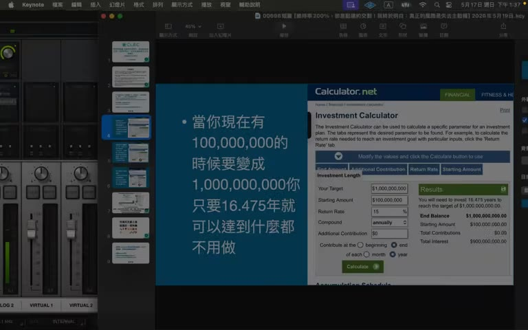
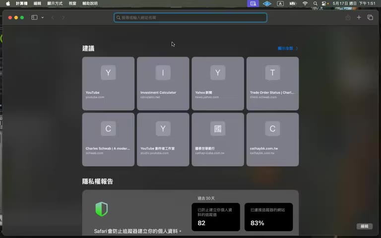

# 00698 短篇：維持率 200% 卻差點違約交割 — 真正風險是失去主動權

> **來源**：YouTube — [CLEC 投資理財頻道（James）· 00698 短篇【維持率 200%，卻差點違約交割！我終於明白：真正的風險是失去主動權】](https://www.youtube.com/watch?v=t-gDVefxOJk)（00:19:42，2026-05-19 發布）

> ⚠️ 本影片為 CLEC（James）20 分鐘短篇，與前幾集「立即 ALL IN / 借錢買 / 打死不賣」激進論調**互為平衡**，講風險控管。本頁忠實呈現原意，**不代表認可任何具體投資／財務行動**。

## TL;DR

- **新觀念：30% 現金 + 真正風險不是市場跌 50%，是「市場規則改變 → 流動性失去」**
- 質押資產絕對不能全部劃撥到一家政券商/銀行 — 留外面足夠多的現金跟未質押股票
- **維持率 200% 看似安全，實際代表「借了一半」是高槓桿**；800% 才算保守
- 「**股票即現金**」的迷思 — 信用緊縮時股票無法立即變現
- **計算 worst case 從「最高點」跌 80% 是否活著**（不是從現在跌）
- 「**市場要長得久，不要長得快**」「一輩子只會碰到一次 80% 大跌 — 一次破產就是永遠破產」

## 重點摘要

### 1. 主題一：財富自由後是否還要上班 ([00:00] - [06:30])

假設你已有 NT$ 1 億，年化報酬 15%：

| 情境 | 達到 10 億的時間 | 提早多少？ |
|---|---|---|
| 完全不上班、不再投資 | 16.5 年 | — |
| 繼續上班 + 每年再投 150 萬 | 15.86 年 | 提早 **0.5 年** |
| 高薪族 + 每年再投 400 萬 | ~15 年 | 提早 **1.5 年** |

> 「你為了提早半年達到 10 億，要再做牛做馬 15 年。**晚個半年達到 10 億，你這 15 年都不用工作，不是很好嗎**？」

「除非你跳著踢踏舞去上班」否則 base 夠大時繼續工作沒意義。



### 2. 主題二：維持率 200% 差點違約交割 ([06:30] - [19:30])

#### a. 案例背景
朋友：「好的資產就打死不賣」→ 一路用質押放大投資（標的 0050、0050正二、00646 標普）。

維持率高達 200% 看似安全，**但他差點違約交割**。

#### b. 流動性風險爆發
- 台灣建商縮減質押額度（金管會找喝咖啡）
- 即使維持率 200% 仍**無法再動用額度**
- 交割日營業員聯絡不上 → 來不及申請不限用途借款
- 才意識到：**「股票即現金」是迷思 — 信用緊縮時股票未必能立刻變流動性**

#### c. 為什麼維持率 200% 是高槓桿
- 200% = 100 萬借 100 萬 → **借了一半**
- 真正安全 = 100 萬借 20 萬 = 維持率 **800%**
- 「800% 都已逼近臨界點 — 因為從高點跌 80% 就破產」

#### d. James 的回覆：30% 現金 + 不全部劃撥

```
你 1000 萬資產，借了 100 萬
銀行說：「我們資金不足不能再借」
你要還？ 你的股票都已劃撥過去，手上沒股票可賣
你要再借？ 借不到
→ 你完全沒流動性，連賣股票的能力都失去
```

紅旗操作：「我有 1 億，全部劃撥到一家銀行去質押借錢過日子」。

**正確操作**：
1. **30% 現金留外面**（00865B / SGOV / SWVXX）
2. **不要 1 億全劃撥到 1 家** — 留 70% 在自己手上、外面其他建商可借
3. 借不出來時，可用外面的股票去其他建商再借
4. 真的需要時可賣 00865B 過日子

#### e. 「真正風險」的新定義
- 不是市場跌 50%
- 不是 paper loss
- 是「**市場規則改變 + 失去流動性 + 失去主動權**」
- 朋友 quote：「**以前投資最重要是報酬率，現在覺得長期投資最重要是『活著並保有主動權』**」



#### f. Worst case 計算 — 從「最高點」跌 80%

```
QQQ 最高 $720 → 跌 80% → $144
00662 最高 $120 → 跌 80% → $24
```

**「你不是從現在跌 80%，是從『最高點』跌 80%**」。

「市場風暴可能會從高點跌 80%，而且持續 3 年」「**一輩子一定會碰到一次，只要碰到一次破產，你就永遠破產**」。

如果跌到 worst case 還活著（保留 30% 現金、800% 維持率），才算安全。

#### g. 「市場要長得久，不要長得快」
- 「不要 1 次將資金全部劃撥到 1 家銀行」
- 「**從最高點跌 80% 你還活著嗎？這是要永遠問自己的事**」

---

## 與 CLEC 同系列對照 — 激進 vs 控管

| 主題 | 00564/565（激進派） | 00698（控管派） | 衝突點 |
|---|---|---|---|
| 立即買進 | 「ALL IN、立即市價、立即解保」 | 「30% 現金、不全部劃撥」 | 全 ALL IN 違反 30% 留存 |
| 槓桿 | 「我欠很多錢越欠越高興」「花別人錢真爽」 | 「維持率 200% 是借了一半」 | 同一個事情兩種敘事 |
| 風險 | 「打死不賣」 | 「市場規則改變才是真風險」 | 控管派更實在 |
| 1 億 → 10 億 | 「16 年自然達到」 | 「**繼續上班只提早半年**」 | 一致 |
| 「股票即現金」 | （未明說但暗示） | 「**這是迷思**」 | 控管派駁斥 |

> **關鍵**：00564/565 的「立即 ALL IN + 借錢買」必須加上 00698 的「30% 現金 + 不集中 1 家 + worst case 計算」才不會在市場規則改變時破產。**這集才是真正可採行的版本**。

---

## 待查 / 存疑

> ⚠️ 以下為個人查證後判斷需保留的疑點。

1. **「年化 15% × 16.5 年 = 10 億」**：基於 NASDAQ 100 過去長期 CAGR ~14-15%（但**未必每個 16 年區間都達標**，例如 2000-2008 區間負報酬）。對「一定會發生」的論調保留。
2. **「市場高點跌 80%」**：NASDAQ-100 歷史上 2000-2002 dot-com 跌 ~83%、2008-2009 跌 ~50%、2022 跌 ~36%。**「會跌 80% 持續 3 年」是極端情境，不是 base case**。但用作 stress test 是合理的。
3. **「800% 維持率才安全」**：是個保守界限，實際 600-800% 區間都算保守。是 stress test 的反推值。
4. **「市場規則改變」風險**：台灣金管會 5% 質押限制是真實存在的；中國 QDII 與外匯管制更嚴。**美國的 PL pledge loan 沒這個問題**（不存在類似的「總額管制」）。對台灣/中國投資者要注意，美國/海外用 PL 投資者可以放寬。
5. **「股票即現金」迷思 vs PL pledge loan**：在美國，PL 借出來的錢 < 70% 抵押品時通常即時可動用；但在台灣，建商可以片面縮減額度 → 此 caveat **僅適用台灣/中國管制金融體系**。

---

## 原文重點段落（時間戳）

- **[00:00]** 開場：兩個主題介紹
- **[00:30]** 主題 1：財富自由後上班的邊際效用幾乎為零
- **[04:00]** 1 億 16 年 vs 上班 15.86 年（提早 0.5 年）
- **[06:30]** 主題 2：維持率 200% 案例介紹
- **[07:30]** 維持率 200% = 借了一半 = 高槓桿
- **[08:30]** 台灣建商縮減額度 → 即使 200% 也借不出
- **[12:00]** James 回覆：30% 現金 + 不全部劃撥到一家
- **[14:00]** 「真正風險是失去主動權，不是 paper loss」
- **[14:30]** 「不要一次將資金全部劃撥」
- **[15:00]** 「市場要長得久，不要長得快」
- **[15:30]** 維持率 800% 才安全 — 100 萬借 20 萬
- **[16:00]** Worst case 計算：從「最高點」跌 80%（不是從現在）
- **[17:00]** QQQ $720 → 跌到 $144、00662 $120 → 跌到 $24
- **[18:30]** 「一輩子一定會碰到一次 80% 跌」
- **[19:30]** 收尾

## 圖片參照

- 開場：[`frames/f001-00m01s.jpg`](./frames/f001-00m01s.jpg)
- 1 億算盤：[`frames/f002-04m00s.jpg`](./frames/f002-04m00s.jpg)
- 00662 高點：[`frames/f007-17m26s.jpg`](./frames/f007-17m26s.jpg)
