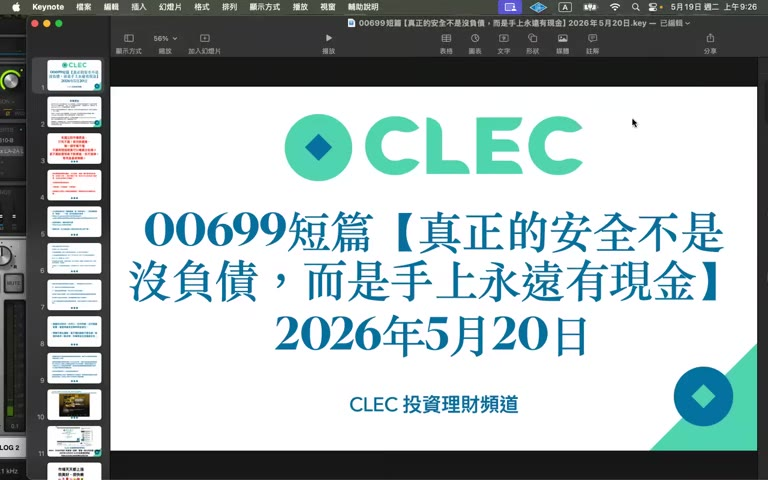

# 00699 短篇：真正的安全不是沒負債，而是手上永遠有現金

> **來源**：YouTube — [CLEC 投資理財頻道（James）· 00699 短篇【真正的安全不是沒負債，而是手上永遠有現金】](https://www.youtube.com/watch?v=iQytALnfUj4)（00:19:19，2026-05-19 發布）

> ⚠️ 本影片為 CLEC（James）19 分鐘短篇，是 00698（維持率 200% 案例）的姊妹篇 — 從另一個角度說明**「有借錢又留現金不是脫褲子放屁，是正解」**。本頁忠實呈現原意，**不代表認可任何具體投資／財務行動**。

## TL;DR

- **「有借錢又留現金 = 脫褲子放屁」**的論調是不懂金融的人講的
- **能不還的錢就不要還，能借的錢早借出來，現金留在身上最安全**
- 「**真正的安全不是沒負債，而是手上永遠有現金**」
- 壓力測試三件套：**房子倒了 + 失業 + 股票跌 80%** → 還活著嗎？
- 不同地區的質押門檻：**台灣 1000 萬台幣 / 中國 250 萬人民幣 / 香港 150 萬港幣 / 美國 USD 80 萬**
- 留現金的標準：無質押者 = 緊急備用金；**有質押者 = 至少 30%**

## 重點摘要

### 1. 開場：脫褲子放屁論的反駁 ([00:00] - [01:30])

> 「有很多人認為『你有借錢又留現金，那不是脫褲子放屁嗎？沒用啊，欠錢要繳利息，又留一堆現金做什麼？』」

James 反駁：「這個就是對於金融操作跟風險控管完全不了解的人」。

「**全世界資產都跌光了，房子都火燒光了，你手上還有現金 → 中午晚上、這個月、下個月、今年、明年都還有便當吃**」

### 2. 留現金的目的：預防風險，不是逢低買進 ([01:30] - [02:30])

- 「**留現金的目的是為了預防風險，不是為了下跌可以逢低買進**」
- 可投資的錢 → 立即市價買進
- 該留現金的錢 → 必須留住
- 兩者分開，不要混淆

### 3. 香港朋友的保險詐騙故事 ([02:30] - [04:30])

朋友剛買 5 年保險，繳了第一年要退保 → 保險經紀說「第一年繳的全部歸零」。

朋友動搖：「是不是繼續繳，至少可以保住那 20% 第一年繳的錢？」

James 回應：
- 「沉沒成本不要救」「**再繳就是肉包子打狗**」
- 跟詐騙集團一樣：詐騙集團要你「再匯 100 萬可以拿回前面被詐騙的錢」
- 「為了已經損失的，再損失更多 → 全部 5 年都被詐騙光」
- 「第 2-5 年保費投入 QQQ 年化 10%，就賺回來了」

### 4. 案例一：房地產投資者 甲 vs 乙 ([05:00] - [08:30])

| 對比 | 甲（積極還款） | 乙（積極借淨值） |
|---|---|---|
| 房產原值 | NT$ 3000 萬 | NT$ 3000 萬 |
| 借款剩餘 | 200 萬 | 1500 萬 |
| 手上現金 | **0** | 1300 萬（含股票 + 現金） |

**災難：火災 + 失業**

- **甲**：失業沒收入繳貸款 → 房子倒了 → 銀行拍賣土地賠不夠 → 破產 + 信用毀 + 薪水被扣押 → **「這輩子不只破產，還失去信用」**
- **乙**：失業可慢慢找工作 → 房子倒了，他繼續用 1300 萬還貸款 → **從容度過難關**

### 5. 案例二：股票投資者 甲 vs 乙 ([08:30] - [11:00])

| 對比 | 甲（100% 持股） | 乙（有質押 + 30% 現金） |
|---|---|---|
| 股票市值 | NT$ 3000 萬 | NT$ 3500 萬（質押借出 500 萬投資） |
| 現金部位 | **0** | 約 1100 萬（30% 比例） |
| 質押借款 | 0 | 800-1000 萬 |

**災難：80% 跌 + 失業**

- **甲**：3000 萬 → 600 萬，又失業要過日子 → **必須殺低賣股票** → 等不到反彈就破產
- **乙**：30% 現金 = 1000+ 萬 → 即使股票跌掉 80%，現金能撐 5-6 年 → 慢慢等市場回來，或開 Uber 過日子

### 6. 壓力測試三件套 ([11:00] - [13:30])

> 「**想想看最糟狀況：房子倒了 + 你又失業了 + 股票又跌 80% → 你還活著嗎？**」

如果答案是「不行」→ 必須增加現金部位。

- 不是來問 James「我應該留多少現金」
- 每個人狀況不同：房貸 / 上有老下有小 / 就業環境 / 地區
- **自己回答上面三件套的問題**

### 7. 各地區職業切換的應變能力 ([13:30] - [16:00])

- **美國**：失業立即可開 Uber、有 Social Security → 緩衝較大，可留少現金
- **台灣**：失業要考職業駕照（限額）、外送可能 OK 但工資少 → 需留 1-2 年生活費
- **中國**：開 Uber 限制不明 → 風險較大

### 8. 質押建議門檻（各地區）([16:00] - [17:00])

| 地區 | 開始考慮質押的資產 | 等值約 |
|---|---|---|
| 台灣 | NT$ 1000 萬 | — |
| 中國 | RMB 250 萬 | ~NT$ 1000 萬 |
| 香港 | HKD 150 萬 | ~NT$ 600 萬 |
| 美國 | USD 80 萬 | ~NT$ 2500 萬 |

> 達到這個門檻 → **「盡量盡早質押」**，讓薪資更多投入市場

### 9. 留現金的標準 ([17:00] - [18:30])

- **無質押者**：現金 = 緊急備用金（按地區 6 個月 ~ 2 年生活費）
- **有質押者**：**現金至少 30%**（不只是緊急備用金，要應對市場 80% 跌）

「市場跌 80% 你還活著嗎？無質押者 — 至少擔心房租 + 生活費 + 失業 → 留 1-2 年；有質押者 — 必須 30%+」

### 10. 收尾：「市場要長得久，不要長得快」 ([18:30] - [19:15])

「**我們不是要積極投資回報高，而是要長長久久**」「**比活得久，比長得快重要**」

「能不還的錢就不要還，能借的錢早一點借出來，現金在身邊最安全」

「**留現金很重要，不要聽外面的妖魔鬼怪說『有欠款又留現金是脫褲子放屁』— 那是他不了解，因為他自己也沒借錢**」

---

## 與 00698 + 前集對照 — 完整 risk-control 框架

| 主題 | 00564/565（激進派） | 00698（流動性） | 00699（現金）| 整合視角 |
|---|---|---|---|---|
| 立即買進 | 「ALL IN、立即市價」 | — | 「可投資錢立即」 | 與 30% 現金不衝突，前者是「投資錢」、後者是「現金」 |
| 留現金 | 「現金是空氣」（短債） | 「30% 現金」 | 「30% 現金，沒質押也要」 | **30% 是質押者必備** |
| 槓桿 | 「越欠越爽」 | 「維持率 800% 才安全」 | 「能借早借，能不還不還」 | 加槓桿沒問題，但配套必須 30% 現金 |
| 風險 | 「打死不賣」 | 「市場規則改變」 | 「房倒 + 失業 + 跌 80%」 | **壓力測試是真正的安全感** |
| 質押門檻 | （未談） | （未談） | **台 1000 萬 / 中 250 萬 RMB / 港 150 萬 HKD / 美 80 萬 USD** | 達到就盡量質押 |
| 「沒負債最安全」 | — | — | 「**這是不懂金融的人講的**」 | 房產案例：積極還款 + 失業 = 破產 |

> **完整 CLEC 操作核心** = 立即 ALL IN（可投資錢） + 30% 現金留外（質押者） + 不全部劃撥一家 + worst case 跌 80% 還活著 + 早借早投資。

**單看 00564/565 容易被誤用為「保險解約全 ALL IN」 → 必須加上 00698+00699 的風險控管才完整**。

---

## 待查 / 存疑

> ⚠️ 以下為個人查證後判斷需保留的疑點。

1. **「房子倒了」假設**：火災、地震是低概率事件，但對應到「**失業 + 大跌**」同時發生的合成情境是合理的 stress test。
2. **「質押門檻」是模糊正確**：實際門檻取決於借款條件、貸款利率、稅務環境。台灣 1000 萬與中國 250 萬 RMB 對應的不一定是同樣的可借比例。
3. **「能不還的錢就不要還」與一般理財建議衝突**：傳統建議是「先還高息債」（信用卡 18%、房貸 2-3%）。James 的「不要還」前提是利息夠低且不影響現金流。**對信用卡卡債仍應優先還清**。
4. **「保險繳第一年要退」損失 100%**：在台灣這通常是真的（投資型保單除外）；但**台灣終身險繳費期內退保有「解約金」**，不會 100% 損失，要看保單條款。
5. **「30% 現金」是規則**：對非質押者可以更低（6 個月生活費即可）；對 800%+ 維持率質押者，30% 是上限。實際數字應該根據「壓力測試三件套」計算。
6. **「美國 80 萬 USD 是質押門檻」**：對應 Schwab/IBKR 的 portfolio margin / Pledged Asset Line（PL），實際 PL 最低資產通常 USD 25 萬，James 給的是「應用」門檻，不是「開戶」門檻。

---

## 原文重點段落（時間戳）

- **[00:00]** 開場：脫褲子放屁論的反駁
- **[01:30]** 留現金的目的：預防風險，不是逢低買進
- **[02:30]** 香港朋友保險詐騙 / 沉沒成本
- **[05:00]** 案例一：房地產 甲（積極還款）vs 乙（借淨值留現金）
- **[06:30]** 房子倒 + 失業 → 甲破產 + 信用毀 / 乙還活著
- **[08:30]** 案例二：股票 甲（100% 持股）vs 乙（30% 現金）
- **[11:00]** 壓力測試三件套：房倒 + 失業 + 跌 80%
- **[13:30]** 各地區職業切換差異（美國 vs 台灣 vs 中國）
- **[16:00]** 質押門檻：台 1000 萬 / 中 250 萬 RMB / 港 150 萬 HKD / 美 80 萬 USD
- **[17:00]** 無質押 = 緊急備用金；有質押 = 30%+ 現金
- **[18:30]** 收尾：「真正的安全是手上永遠有現金」

## 圖片參照

- 開場：[`frames/f001-00m00s.jpg`](./frames/f001-00m00s.jpg)
